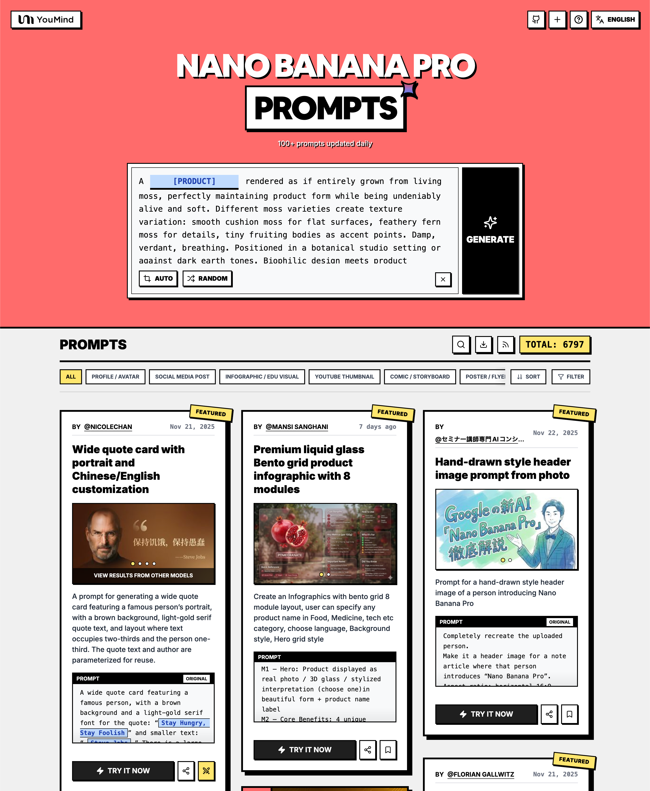

<a href="https://youmind.com/en-US/nano-banana-pro-prompts">
  
</a>

<a href="https://github.com/YouMind-OpenLab/awesome-gpt-image-2">
  
</a>

> 💡 🎨 Check out our GPT Image 2 Prompts Collection — the next-generation image model, updated daily 👉 [awesome-gpt-image-2](https://github.com/YouMind-OpenLab/awesome-gpt-image-2)
# 🚀 Awesome Nano Banana Pro Prompts

[](https://github.com/sindresorhus/awesome)
[](https://github.com/YouMind-OpenLab/9898048483-prompts)
[](https://creativecommons.org/licenses/by/4.0/)
[](https://github.com/YouMind-OpenLab/9898048483-prompts/actions)
[](docs/CONTRIBUTING.md)

> 🎨 A curated collection of creative prompts for Google's Nano Banana Pro

> ⚠️ **Copyright Notice**: All prompts are collected from the community for educational purposes. If you believe any content infringes on your rights, please [open an issue](https://github.com/YouMind-OpenLab/9898048483-prompts/issues/new?template=bug-report.yml) and we will remove it promptly.

---

[](README.md) [](README_zh.md) [](README_zh-TW.md) [](README_ja-JP.md) [](README_ko-KR.md) [](README_th-TH.md) [](README_vi-VN.md) [](README_hi-IN.md) [](README_es-ES.md) [-Click%20to%20View-lightgrey)](README_es-419.md) [](README_de-DE.md) [](README_fr-FR.md) [](README_it-IT.md) [-Click%20to%20View-lightgrey)](README_pt-BR.md) [](README_pt-PT.md) [](README_tr-TR.md)

---

## 🌐 View in Web Gallery

<div align="center">



</div>

**[👉 Browse on YouMind Nano Banana Pro Prompts Gallery](https://youmind.com/en-US/nano-banana-pro-prompts)**

Why use our gallery?

| Feature | GitHub README | youmind.com Gallery |
|---------|--------------|---------------------|
| 🎨 Visual Layout | Linear list | Beautiful Masonry Grid |
| 🔍 Search | Ctrl+F only | Full-text search with filters |
| 🤖 AI One-Click Generation | - | AI one-click generation |
| 📱 Mobile | Basic | Fully responsive |
| 🏷️ Categories | - | Category browsing |


### 🏷️ Browse by Category

- **Use Cases**
  - [Profile / Avatar](https://youmind.com/en-US/nano-banana-pro-prompts?categories=profile-avatar)
  - [Social Media Post](https://youmind.com/en-US/nano-banana-pro-prompts?categories=social-media-post)
  - [Infographic / Edu Visual](https://youmind.com/en-US/nano-banana-pro-prompts?categories=infographic-edu-visual)
  - [YouTube Thumbnail](https://youmind.com/en-US/nano-banana-pro-prompts?categories=youtube-thumbnail)
  - [Comic / Storyboard](https://youmind.com/en-US/nano-banana-pro-prompts?categories=comic-storyboard)
  - [Product Marketing](https://youmind.com/en-US/nano-banana-pro-prompts?categories=product-marketing)
  - [E-commerce Main Image](https://youmind.com/en-US/nano-banana-pro-prompts?categories=ecommerce-main-image)
  - [Game Asset](https://youmind.com/en-US/nano-banana-pro-prompts?categories=game-asset)
  - [Poster / Flyer](https://youmind.com/en-US/nano-banana-pro-prompts?categories=poster-flyer)
  - [App / Web Design](https://youmind.com/en-US/nano-banana-pro-prompts?categories=app-web-design)
- **Style**
  - [Photography](https://youmind.com/en-US/nano-banana-pro-prompts?categories=photography)
  - [Cinematic / Film Still](https://youmind.com/en-US/nano-banana-pro-prompts?categories=cinematic-film-still)
  - [Anime / Manga](https://youmind.com/en-US/nano-banana-pro-prompts?categories=anime-manga)
  - [Illustration](https://youmind.com/en-US/nano-banana-pro-prompts?categories=illustration)
  - [Sketch / Line Art](https://youmind.com/en-US/nano-banana-pro-prompts?categories=sketch-line-art)
  - [Comic / Graphic Novel](https://youmind.com/en-US/nano-banana-pro-prompts?categories=comic-graphic-novel)
  - [3D Render](https://youmind.com/en-US/nano-banana-pro-prompts?categories=3d-render)
  - [Chibi / Q-Style](https://youmind.com/en-US/nano-banana-pro-prompts?categories=chibi-q-style)
  - [Isometric](https://youmind.com/en-US/nano-banana-pro-prompts?categories=isometric)
  - [Pixel Art](https://youmind.com/en-US/nano-banana-pro-prompts?categories=pixel-art)
  - [Oil Painting](https://youmind.com/en-US/nano-banana-pro-prompts?categories=oil-painting)
  - [Watercolor](https://youmind.com/en-US/nano-banana-pro-prompts?categories=watercolor)
  - [Ink / Chinese Style](https://youmind.com/en-US/nano-banana-pro-prompts?categories=ink-chinese-style)
  - [Retro / Vintage](https://youmind.com/en-US/nano-banana-pro-prompts?categories=retro-vintage)
  - [Cyberpunk / Sci-Fi](https://youmind.com/en-US/nano-banana-pro-prompts?categories=cyberpunk-sci-fi)
  - [Minimalism](https://youmind.com/en-US/nano-banana-pro-prompts?categories=minimalism)
- **Subjects**
  - [Portrait / Selfie](https://youmind.com/en-US/nano-banana-pro-prompts?categories=portrait-selfie)
  - [Influencer / Model](https://youmind.com/en-US/nano-banana-pro-prompts?categories=influencer-model)
  - [Character](https://youmind.com/en-US/nano-banana-pro-prompts?categories=character)
  - [Group / Couple](https://youmind.com/en-US/nano-banana-pro-prompts?categories=group-couple)
  - [Product](https://youmind.com/en-US/nano-banana-pro-prompts?categories=product)
  - [Food / Drink](https://youmind.com/en-US/nano-banana-pro-prompts?categories=food-drink)
  - [Fashion Item](https://youmind.com/en-US/nano-banana-pro-prompts?categories=fashion-item)
  - [Animal / Creature](https://youmind.com/en-US/nano-banana-pro-prompts?categories=animal-creature)
  - [Vehicle](https://youmind.com/en-US/nano-banana-pro-prompts?categories=vehicle)
  - [Architecture / Interior](https://youmind.com/en-US/nano-banana-pro-prompts?categories=architecture-interior)
  - [Landscape / Nature](https://youmind.com/en-US/nano-banana-pro-prompts?categories=landscape-nature)
  - [Cityscape / Street](https://youmind.com/en-US/nano-banana-pro-prompts?categories=cityscape-street)
  - [Diagram / Chart](https://youmind.com/en-US/nano-banana-pro-prompts?categories=diagram-chart)
  - [Text / Typography](https://youmind.com/en-US/nano-banana-pro-prompts?categories=text-typography)
  - [Abstract / Background](https://youmind.com/en-US/nano-banana-pro-prompts?categories=abstract-background)

---

## 📖 Table of Contents

- [🌐 View in Web Gallery](#-view-in-web-gallery)
- [🤔 What is Nano Banana Pro?](#-what-is-nano-banana-pro)
- [📊 Statistics](#-statistics)
- [🔥 Featured Prompts](#-featured-prompts)
- [📋 All Prompts](#-all-prompts)
- [🤝 How to Contribute](#-how-to-contribute)
- [📄 License](#-license)
- [🙏 Acknowledgements](#-acknowledgements)
- [⭐ Star History](#-star-history)

---

## 🤔 What is Nano Banana Pro?

**Nano Banana Pro** is Google's latest multimodal AI model featuring:

- 🎯 **Multimodal Understanding** - Process text, images, and video
- 🎨 **High-Quality Generation** - Photorealistic to artistic styles
- ⚡ **Fast Iteration** - Quick edits and variations
- 🌈 **Diverse Styles** - From pixel art to oil paintings
- 🔧 **Precise Control** - Detailed composition and lighting
- 📐 **Complex Scenes** - Multi-object, multi-character rendering

📚 **Learn More:** [Nano Banana Pro: 10 Real Cases](https://youmind.com/blog/nano-banana-pro-10-real-cases)

### 🚀 Raycast Integration

Some prompts support **dynamic arguments** using [Raycast Snippets](https://raycast.com/help/snippets) syntax. Look for the 🚀 Raycast Friendly badge!

**Example:**
```
A quote card with "{argument name="quote" default="Stay hungry, stay foolish"}"
by {argument name="author" default="Steve Jobs"}
```

When used in Raycast, you can dynamically replace the arguments for quick iterations!

---

## 📊 Statistics

<div align="center">

| Metric | Count |
|--------|-------|
| 📝 Total Prompts | **15088** |
| ⭐ Featured | **9** |
| 🔄 Last Updated | **Friday, August 7, 2026 at 12:12:45 PM UTC** |

</div>

---

## 🔥 Featured Prompts

> ⭐ Hand-picked by our team for exceptional quality and creativity

### No. 1: Wide quote card with portrait and Chinese/English customization


#### 📖 Description

A prompt for generating a wide quote card featuring a famous person’s portrait, with a brown background, light-gold serif quote text, and layout where text occupies two-thirds and the person one-third. The quote text and author are parameterized for reuse.

#### 📝 Prompt

```
A wide quote card featuring a famous person, with a brown background and a light-gold serif font for the quote: “{argument name="famous_quote" default="Stay Hungry, Stay Foolish"}” and smaller text: “—{argument name="author" default="Steve Jobs"}.” There is a large, subtle quotation mark before the text. The portrait of the person is on the left, the text on the right. The text occupies two-thirds of the image and the portrait one-third, with a slight gradient transition effect on the portrait.
```

#### 🖼️ Generated Images

##### Image 1

<div align="center">

</div>

##### Image 2

<div align="center">

</div>

##### Image 3

<div align="center">

</div>

##### Image 4

<div align="center">

</div>

#### 📌 Details

- **Author:** [Nicolechan](https://x.com/stark_nico99)
- **Source:** [Twitter Post](https://x.com/stark_nico99/status/1991718646570426763)
- **Published:** November 21, 2025
- **Languages:** zh

**[👉 Try it now →](https://youmind.com/en-US/nano-banana-pro-prompts?id=151)**

---

### No. 2: Premium liquid glass Bento grid product infographic with 8 modules


#### 📖 Description

Create an Infographics with bento grid 8 module layout, user can specify any product name in Food, Medicine, tech etc category, choose language, Background style, Hero grid style

#### 📝 Prompt

```
Input Variable: [insert product name]
Language: [insert language]

System Instruction:
Create an image of premium liquid glass Bento grid product infographic with 8 modules (card 2 to 8 show text titles only).
1) Product Analysis:
→ Identify product's dominant natural color → "hero color"
→ Identify category: FOOD / MEDICINE / TECH
2) Color Palette (derived from hero):
→ Product + accents: full saturation hero color
→ Icons, borders: muted hero (30-40% saturation, never black)
3) Visual Style:
→ Hero product: real photography (authentic, premium), 3D Glass version [choose one]
→ Cards: Apple liquid glass (85-90% transparent) with Whisper-thin borders and Subtle drop shadow for floating depth and reflecting the background color
→ Background stays behind cards and high blur where cards are [choose one]:
  - Ethereal: product essence, light caustics, abstract glow
  - Macro: product texture close-up, heavily blurred
  - Pattern: product repeated softly at 10-15% opacity
  - Context: relevant environment, blurred + desaturated
→ Add subtle motion effect
→ Asymmetric Bento grid, 16:9 landscape
→ Hero card: 28-30% | Info modules: 70-72%
4) Module Content (8 Cards):
M1 — Hero: Product displayed as real photo / 3D glass / stylized interpretation (choose one)in beautiful form + product name label
M2 — Core Benefits: 4 unique benefits + hero-color icons
M3 — How to Use: 4 usage methods + icons
M4 — Key Metrics: 5 EXACT data points
Format: [icon] [Label] [Bold Value] [Unit]
FOOD: Calories: [X] kcal/100g, Carbs: [X]g (fiber [X]g, sugar [X]g), Protein: [X]g, [Key Vitamin]: [X]mg ([X]% DV), [Key Mineral]: [X]mg ([X]% DV)
MEDICINE:Active: [name], Strength: [X] mg, Onset: [X] min, Duration: [X] hrs, Half-life: [X] hrs 
TECH:Chip: [model], Battery: [X] hrs, Weight: [X]g,[Key spec]: [value], Connectivity: [protocols]
M5 — Who It's For: 4 recommended groups with green checkmark icons | 3 caution groups with amber warning icons
M6 — Important Notes: 4 precautions + warning icons
M7 — Quick Reference:
→ FOOD: Glycemic Index + dietary tags with icons
→ MEDICINE: Side effects + severity with icons
→ TECH: Compatibility + certifications with icons
M8 — Did You Know: 3 facts (origin, science, global stat) + icons
Output: 1 image, 16:9 landscape, ultra-premium liquid glass infographic.
```

#### 🖼️ Generated Images

##### Image 1

<div align="center">

</div>

##### Image 2

<div align="center">

</div>

#### 📌 Details

- **Author:** [Mansi Sanghani](https://x.com/MansiSanghani1)
- **Source:** [Twitter Post](https://x.com/MansiSanghani1/status/2013550795224961492)
- **Published:** January 20, 2026
- **Languages:** en

**[👉 Try it now →](https://youmind.com/en-US/nano-banana-pro-prompts?id=6847)**

---

### No. 3: Hand-drawn style header image prompt from photo


#### 📖 Description

Prompt for a hand-drawn style header image of a person introducing Nano Banana Pro

#### 📝 Prompt

```
Completely recreate the uploaded person.
Make it a header image for a note article where that person introduces “Nano Banana Pro”.
Aspect ratio: horizontal 16:9.
Style and colors: simple, hand-drawn style, italic, with a blue and green gradient.
Title text: “In-depth explanation of Google’s new AI ‘Nano Banana Pro’”.
```

#### 🖼️ Generated Images

##### Image 1

<div align="center">

</div>

##### Image 2

<div align="center">

</div>

#### 📌 Details

- **Author:** [セミナー講師専門AIコンシェルジュ｜工藤 晶](https://x.com/akirakudo_ai)
- **Source:** [Twitter Post](https://x.com/akirakudo_ai/status/1992096860765561190)
- **Published:** November 22, 2025
- **Languages:** ja

**[👉 Try it now →](https://youmind.com/en-US/nano-banana-pro-prompts?id=498)**

---

### No. 4: Watercolor map of Germany with labeled states


#### 📖 Description

A German prompt to generate a watercolor-style map of Germany where all federal states are labeled in ballpoint pen, useful for educational or infographic-style maps.

#### 📝 Prompt

```
Generate a map of Germany in watercolor style, on which all federal states are labeled in ballpoint pen.
```

#### 🖼️ Generated Images

##### Image 1

<div align="center">

</div>

#### 📌 Details

- **Author:** [Florian Gallwitz](https://x.com/FlorianGallwitz)
- **Source:** [Twitter Post](https://x.com/FlorianGallwitz/status/1991796624646091091)
- **Published:** November 21, 2025
- **Languages:** de

**[👉 Try it now →](https://youmind.com/en-US/nano-banana-pro-prompts?id=380)**

---

### No. 5: New Year's Day Special: Four-Panel Puzzle for 2026 Blessing


#### 📖 Description

A detailed multi-panel prompt for Nano Banana Pro, creating a 2x2 grid photo collage where a single female character, in four different outfits and settings, pieces together a puzzle that spells '2026 New Year's Day Happy' in the center. The prompt specifies precise facial feature retention, clothing details, background elements, and photographic parameters for a fashion magazine style.

#### 📝 Prompt

```
[Key: Maintain precise facial features, retain original face structure, the character in the image must be completely consistent with the uploaded reference image] High-end photo studio 2x2 grid photo. Top-left panel (Navy Blue background): The character wears a navy blue uniform-style dress, decorated with gold buttons, vintage curls with a blue beret and pearl earrings. She holds up a huge puzzle piece (top-left piece, with the number "20" on it) with both hands, moving it towards the center of the frame. Her eyes are focused on the central puzzle area, her expression is serious, with a slight smile. The background features navy stripes, an anchor, and the text "Set Sail for the New Year". Top-right panel (Cherry Blossom Pink background): The same woman wears a pink lace dress, a pearl necklace, a princess hairstyle with a pink rose hairpin and crystal earrings. She holds up the top-right puzzle piece (with the number "26" on it) with both hands, moving it towards the center to connect with the top-left piece. Her eyes look at the puzzle seam, her expression is focused and expectant, and her body leans forward. The background features pink cherry blossoms, the text "Beautiful Encounter", butterflies, and petals. Bottom-left panel (Mint Green background): The same woman wears a mint green cotton and linen dress, in an artistic style, with natural long hair, a green hairband, and wooden earrings. She holds up the bottom-left puzzle piece (with the text "New Year's Day" on it) with both hands, moving it upwards to connect with the top-left piece. Her eyes look at the puzzle, her expression is serious, and her mouth is slightly pursed. The background features green plants, the text "Hope Grows", new sprouts, and leaves. Bottom-right panel (Lemon Yellow background): The same woman wears a yellow dress with a sunflower pattern, pigtails with yellow bows. She pushes in the last bottom-right puzzle piece (with the text "Happy" on it) to complete the puzzle. The four pieces perfectly form the complete pattern "2026 New Year's Day Happy" in the center of the frame. She tilts her head back, looking at the completed puzzle, her face beaming with a successful, joyful smile. The center of the frame bursts with golden light and confetti. The background features a yellow sun, the text "Complete Success", smiley faces, and sunflowers. The puzzle pieces converge from the four corners to the center to form a complete picture. Clear makeup, bright ring light, 85mm lens, f/1.8 aperture, four-panel composition with puzzle interaction, fashion magazine style.
```

#### 🖼️ Generated Images

##### Image 1

<div align="center">

</div>

#### 📌 Details

- **Author:** [松果先森](https://x.com/songguoxiansen)
- **Source:** [Twitter Post](https://x.com/songguoxiansen/status/2005822648027091031)
- **Published:** December 30, 2025
- **Languages:** zh

**[👉 Try it now →](https://youmind.com/en-US/nano-banana-pro-prompts?id=4031)**

---

### No. 6: Vintage Patent Document for an Invention


#### 📖 Description

A prompt designed to generate an image of a vintage United States patent document from the late 1800s. It specifies details like precise technical drawings, handwritten annotations, aged paper texture, foxing stains, an embossed seal, and a wax stamp, making it ideal for historical or archival aesthetics.

#### 📝 Prompt

```
A vintage patent document for {argument name="invention" default="INVENTION"}, styled after late 1800s United States Patent Office filings. The page features precise technical drawings with numbered callouts (Fig. 1, Fig. 2, Fig. 3) showing front, side, and exploded views. Handwritten annotations in fountain-pen ink describe mechanisms. The paper is aged ivory with foxing stains and soft fold creases. An official embossed seal and red wax stamp appear in the corner. A hand-signed inventor's name and date appear at the bottom. The entire image feels like a recovered archival document—authoritative, historic, and slightly mysterious.
```

#### 🖼️ Generated Images

##### Image 1

<div align="center">

</div>

##### Image 2

<div align="center">

</div>

##### Image 3

<div align="center">

</div>

##### Image 4

<div align="center">

</div>

#### 📌 Details

- **Author:** [Alexandra Aisling](https://x.com/AllaAisling)
- **Source:** [Twitter Post](https://x.com/AllaAisling/status/2004212035333365763)
- **Published:** December 25, 2025
- **Languages:** en

**[👉 Try it now →](https://youmind.com/en-US/nano-banana-pro-prompts?id=3438)**

---

### No. 7: Chalkboard-style AI news summary


#### 📖 Description

A Japanese prompt for turning AI news content into a hand-drawn, teacher-style chalkboard diagram with explanations.

#### 📝 Prompt

```
Using the following content, summarize the news in a chalkboard-style, hand‑written look, and break it down with diagrams and easy‑to‑understand expressions as if a teacher had written it.
—-
Search results from Grok
```

#### 🖼️ Generated Images

##### Image 1

<div align="center">

</div>

##### Image 2

<div align="center">

</div>

#### 📌 Details

- **Author:** [ひでもん | AI開発@ニュース発信](https://x.com/okknews)
- **Source:** [Twitter Post](https://x.com/okknews/status/1992173611520868372)
- **Published:** November 22, 2025
- **Languages:** ja

**[👉 Try it now →](https://youmind.com/en-US/nano-banana-pro-prompts?id=509)**

---

### No. 8: Detailed mirror-selfie otaku room scene


#### 📖 Description

A very detailed Nano Banana prompt describing a female mirror selfie in a blue-toned otaku computer corner, with full specifications for character, environment, lighting, camera, and negative prompts.

#### 📝 Prompt

```
### Scene
Mirror selfie in an otaku-style computer corner, blue color tone.

### Subject
* Gender expression: female
* Age: around 25
* Ethnicity: East Asian
* Body type: slim, with a defined waist; natural body proportions
* Skin tone: light neutral tone
* Hairstyle:
    * Length: waist-length hair
    * Style: straight with slightly curled ends
    * Color: medium brown
* Pose:
    * Stance: standing in a slight contrapposto pose
    * Right hand: holding a smartphone in front of her face (identity hidden)
    * Left arm: naturally hanging down alongside the torso
    * Torso: body leaning slightly back; waist and abdomen exposed
* Clothing:
    * Top: light blue cropped knit cardigan, top two buttons fastened; a blue French-style bra faintly visible
    * Bottom: denim ultra-short shorts, with a blue satin ribbon bow on each side of the hips
    * Socks: blue and white horizontal striped over-the-knee socks
    * Accessory: a blue cute mascot phone case

### Environment
* Description: bedroom computer corner seen through a wall-mounted mirror
* Furnishings:
    * White desk
    * Single monitor showing a soft blue wallpaper (no readable text)
    * Mechanical keyboard with white keycaps on a blue desk mat
    * Mouse on a small blue mouse pad
    * PC tower on the right side with blue case lighting
    * Three anime figures on or near the PC tower
    * A poster of a pagoda on the wall
    * Cat-shaped desk lamp with blue accents
    * A transparent glass of water
    * A tall green leafy plant by the window (on the left side of the frame)
* Color replacement: replace all originally pink elements (clothes and room decor) with blue tones (baby blue to sky blue/periwinkle blue).

### Lighting
* Light source: daylight coming from a large window on the left side of the camera, through sheer curtains
* Light quality: soft, diffused light
* White balance (K): 5200

### Camera
* Mode: smartphone rear camera shooting via the mirror (no portrait/bokeh mode)
* Equivalent focal length (mm): 26
* Distances (m):
    * Subject to mirror: 0.6
    * Camera to mirror: 0.5
* Exposure:
    * Aperture (f): 1.8
    * ISO: 100
    * Shutter speed (s): 0.01
    * Exposure compensation (EV): -0.3
* Focus: focus on the torso and shorts in the mirror image
* Depth of field: natural smartphone deep depth of field; background clearly visible with no artificial blur
* Composition:
    * Aspect ratio: 1:1
    * Crop: from the top of the head to mid-thigh; include the desk, monitor, PC tower, and plant in the frame
    * Angle: slightly high angle from the mirror’s point of view
    * Composition note: keep the subject centered; to avoid wide-angle edge distortion, have her stand a bit further away and crop to a square later.

### Negative prompts
* Any appearance of pink/magenta anywhere
* Beauty filters/over-smoothed skin; poreless skin look
* Exaggerated or distorted anatomy
* NSFW, see-through fabrics, wardrobe malfunctions
* Logos, brand names, or readable user interface text
* Fake portrait-mode blur, CGI/illustration feel
```

#### 🖼️ Generated Images

##### Image 1

<div align="center">

</div>

#### 📌 Details

- **Author:** [宝玉](https://x.com/dotey)
- **Source:** [Twitter Post](https://x.com/dotey/status/1976485558319722711)
- **Published:** October 10, 2025
- **Languages:** zh

**[👉 Try it now →](https://youmind.com/en-US/nano-banana-pro-prompts?id=553)**

---

### No. 9: Edo-period Ukiyo-e reinterpretation of a modern scene


#### 📖 Description

A highly-structured image prompt to depict a modern-day scene reimagined as an Edo-period Japanese Ukiyo-e woodblock print, with detailed guidance on anachronistic tech, composition, texture, and color.

#### 📝 Prompt

```
A Japanese Edo-period Ukiyo-e woodblock print. The overall feeling is a surreal collaboration between masters like Hokusai and Hiroshige, reimagining modern technology through an ancient lens.

**The scene:** {argument name="modern scene" default="a busy Shibuya scramble crossing"}

**Edo transformation logic:**
Characters wear Edo-era kimono but perform modern actions. All technology is transformed into surreal Edo equivalents:
* Smartphones are glowing, illustrated paper scrolls being read intently.
* Metro stations and trains are giant articulated wooden centipede carriages shuffling through crowds.
* Skyscrapers are reimagined as endless, towering wooden pagodas reaching into dramatic clouds.
* Robots and mecha appear as giant, armored woodblock golems.

The composition uses a flattened perspective with large, bold, hand-carved ink outlines. The background features heavily stylized Ukiyo-e wave patterns and dramatic, swirling clouds, with a distant Mt. Fuji visible on the horizon.

The image must look like a physical print, not a digital painting.
* Texture: strong visible wood grain texture and rough paper fibers throughout the piece.
* Printing imperfections: pigment bleeding is evident. Simulate hand-pressed plates with slight color misalignment for authenticity.
* Color palette: strictly limited to traditional mineral pigments, with dominant use of Prussian blue, vermilion red, and muted yellow ochre.
* Lighting: soft, flat, shadow-free lighting with no digital gradients.

Aspect ratio is 3:4 vertical poster. Include vertical Japanese calligraphy describing the scene and a traditional red artist seal stamp in a corner.
```

#### 🖼️ Generated Images

##### Image 1

<div align="center">

</div>

#### 📌 Details

- **Author:** [VoxcatAI](https://x.com/VoxcatAI)
- **Source:** [Twitter Post](https://x.com/VoxcatAI/status/1995497350543110411)
- **Published:** December 1, 2025
- **Languages:** en

**[👉 Try it now →](https://youmind.com/en-US/nano-banana-pro-prompts?id=811)**

---

## 📋 All Prompts

> 📝 Sorted by publish date (newest first)

### No. 1: Profile / Avatar - Underwater Macro Face Portrait


#### 📖 Description

A hyper-realistic prompt for a macro portrait of a face partially submerged in water, featuring caustic light reflections and air bubbles.

#### 📝 Prompt

```
Hyper-realistic, ultra-detailed macro portrait capturing only the {argument name="subject part" default="left half"} of a {argument name="subject" default="human face"} partially submerged {argument name="environment" default="underwater"}. One eye in sharp focus near the far-left edge of the frame. Light rays create dynamic caustic reflections across the skin, emphasizing pores, wet lips, eyelashes, and fine textures with lifelike subsurface scattering. Suspended droplets and air bubbles add depth and motion. Cinematic underwater lighting with soft shadows and crisp highlights enhances the surreal, dreamlike atmosphere. Extremely shallow depth of field, photorealistic rendering, 4:5 aspect ratio.
```

#### 🖼️ Generated Images

##### Image 1

<div align="center">

</div>

##### Image 2

<div align="center">

</div>

#### 📌 Details

- **Author:** [Aatif J](https://x.com/aatif_j)
- **Source:** [Twitter Post](https://x.com/aatif_j/status/2083627392866627587)
- **Published:** August 1, 2026
- **Languages:** en

**[👉 Try it now →](https://youmind.com/en-US/nano-banana-pro-prompts?id=30545)**

---

### No. 2: Profile / Avatar - Vintage Mustard Dress Portrait


#### 📖 Description

A fine-art oil painting style portrait with dramatic Rembrandt lighting, featuring a woman in a vintage lace dress.

#### 📝 Prompt

```
A fine-art oil painting style portrait of a young woman with a classic updo hairstyle and soft, wavy tendrils framing her face, featuring expressive {argument name="eye color" default="hazel-green"} eyes, light freckles across her nose and cheeks, and a thoughtful expression. She is wearing a {argument name="dress style" default="vintage-style mustard-yellow"} long-sleeve dress accented with delicate lace panels on the bodice and sleeves, layered amber-gemstone pendant necklaces, and small gold hoop earrings, set against a {argument name="background" default="moody, dark-toned textured backdrop"} with dramatic Rembrandt-style lighting.
```

#### 🖼️ Generated Images

##### Image 1

<div align="center">

</div>

##### Image 2

<div align="center">

</div>

##### Image 3

<div align="center">

</div>

##### Image 4

<div align="center">

</div>

#### 📌 Details

- **Author:** [Minahil](https://x.com/Minahil42298354)
- **Source:** [Twitter Post](https://x.com/Minahil42298354/status/2083555046906638841)
- **Published:** August 1, 2026
- **Languages:** en

**[👉 Try it now →](https://youmind.com/en-US/nano-banana-pro-prompts?id=30552)**

---

### No. 3: Profile / Avatar - Candid Portrait at Golden Hour


#### 📖 Description

A warm and dreamy close-up portrait of a young woman in a cozy bedroom setting, featuring natural lighting and a film-like texture.

#### 📝 Prompt

```
Close-up portrait of a {argument name="subject" default="young Asian woman"} with dark hair in a {argument name="hairstyle" default="messy bun"} with loose face-framing strands, winking one eye playfully while blowing a kiss toward the camera with an outstretched hand. Soft candid smile, warm golden-hour sunlight streaming through blinds in the background, cozy bedroom setting with polaroid photos pinned to a beige wall and a potted plant softly blurred in the background. She wears an {argument name="outfit" default="oversized cream/off-white t-shirt"} and a thin gold necklace. Shallow depth of field, warm and dreamy color grading, natural film-like texture, soft diffused lighting, intimate and candid mood, shot on 50mm lens, shallow bokeh
```

#### 🖼️ Generated Images

##### Image 1

<div align="center">

</div>

#### 📌 Details

- **Author:** [Ahmad Faraz](https://x.com/iamahmedfaraz66)
- **Source:** [Twitter Post](https://x.com/iamahmedfaraz66/status/2083542009042915719)
- **Published:** August 1, 2026
- **Languages:** en

**[👉 Try it now →](https://youmind.com/en-US/nano-banana-pro-prompts?id=30551)**

---

### No. 4: Profile / Avatar - Painterly Studio Portrait


#### 📖 Description

A timeless, painterly portrait of an elegant woman with amber eyes, captured with soft warm studio lighting.

#### 📝 Prompt

```
A cinematic, high-detail portrait of a young woman with a classic, elegant appearance, captured with {argument name="lighting" default="soft, warm studio lighting"}. She has {argument name="hair" default="light blonde hair with darker roots"}, styled in an updo with loose strands framing her face. Her striking amber-brown eyes gaze thoughtfully off to the side, and her expression is gentle and contemplative. She wears a {argument name="outfit" default="muted mauve-pink lace dress"}, paired with a matching fabric choker and delicate silver necklaces and earrings. The background is a dark, moody, and textured studio backdrop, enhancing the timeless, painterly quality of the shot.
```

#### 🖼️ Generated Images

##### Image 1

<div align="center">

</div>

#### 📌 Details

- **Author:** [Minahil](https://x.com/Minahil42298354)
- **Source:** [Twitter Post](https://x.com/Minahil42298354/status/2083510252150849639)
- **Published:** August 1, 2026
- **Languages:** en

**[👉 Try it now →](https://youmind.com/en-US/nano-banana-pro-prompts?id=30556)**

---

### No. 5: Profile / Avatar - Dark Cinematic Skin Portrait


#### 📖 Description

A highly detailed, cinematic prompt focusing on extreme skin realism and forensic-level texture in a dark, obsessive aesthetic with dramatic lighting.

#### 📝 Prompt

```
Same face as reference. Same dark, obsessive aesthetic. New pose, new angle, new visual narrative.

**{argument name="pose and angle" default="Pose & Angle:"}** Sharp 45° three-quarter turn. Nose crosses into the light; one eye fully illuminated, the other dissolving into shadow. Far cheekbone briefly catches light before vanishing. Shadow-side jaw disappears entirely. The angle exposes the face's underlying structure — brow ridge, nose bridge, cheekbone, jawline — as distinct planes of light and dark.

**Head Tilt:** Chin lowered a few degrees, gaze lifted toward camera through the brows — heavy-lidded, intense, quietly vulnerable. Slightly raised brows add natural forehead creasing. The tilt sharpens the jaw and lengthens the neck line.

**{argument name="expression" default="Expression:"}** Lips parted about 3mm — a subtle exhale, not an emotional cue. The effect should feel candid and unguarded, like a private moment caught rather than staged.

**Skin Rendering:** Same forensic-level detail, applied to new areas revealed by the angle — nose wing texture in raking light, under-eye skin from a fresh perspective, lit-side jaw stubble pattern, forehead topography under top light, and partial ear detail. Neck and collarbone edge just visible at the bottom, fading into darkness.

**{argument name="lighting" default="Lighting:"}** A single hard light source, positioned higher and more to the side than before, producing a narrow, surgical beam. Lit skin rendered with cold clarity; shadow side pure black. A thin blue-white rim light traces the far cheekbone. Near eye has a crisp single catchlight; far eye shows only a rim-lit iris edge and sliver of white.

**Background:** Solid black, no elements — silhouette shaped purely by the new angle.

**Color & Texture:** Crushed blacks, cool skin tones with warm undertone contrast, blue-white rim accent, 10% Ilford HP5 grain. Fully unretouched — pores, texture, and imperfections preserved.
```

#### 🖼️ Generated Images

##### Image 1

<div align="center">

</div>

#### 📌 Details

- **Author:** [Ozair AI](https://x.com/Ozayrr_irl)
- **Source:** [Twitter Post](https://x.com/Ozayrr_irl/status/2083464925851074742)
- **Published:** August 1, 2026
- **Languages:** en

**[👉 Try it now →](https://youmind.com/en-US/nano-banana-pro-prompts?id=30557)**

---

### No. 6: Profile / Avatar - Supergirl Themed Studio Selfie


#### 📖 Description

An ultra-realistic selfie-style prompt that generates a fashion portrait of a woman in a Supergirl-themed swimsuit inside a cluttered Kryptonian-themed bedroom.

#### 📝 Prompt

```
Ultra-realistic selfie-style fashion portrait of blonde posing confidently in {argument name="room" default="Supergirl home room"}. She wears a fitted {argument name="swimsuit" default="white Super-Girl style one-piece swimsuit"} with thin spaghetti straps, deep V-neckline, iconic red-and-yellow Super-Girl 'S' shield symbol, plus a small 'Keor' embroidery, and {argument name="stockings" default="red stockings"}. High ponytail, soft flirtatious expression, one arm extended for a POV selfie. Soft natural daylight, detailed bedroom with Krypton and House of El posters and cluttered desk in the background. Photorealistic, 8K, sharp focus, natural skin texture.
```

#### 🖼️ Generated Images

##### Image 1

<div align="center">

</div>

##### Image 2

<div align="center">

</div>

##### Image 3

<div align="center">

</div>

#### 📌 Details

- **Author:** [KeorUnreal](https://x.com/KeorUnreal)
- **Source:** [Twitter Post](https://x.com/KeorUnreal/status/2082929558794150359)
- **Published:** July 30, 2026
- **Languages:** en

**[👉 Try it now →](https://youmind.com/en-US/nano-banana-pro-prompts?id=30347)**

---

### No. 7: Profile / Avatar - Spider-Man Rooftop Suit Portrait


#### 📖 Description

A structured prompt for generating photorealistic composite portraits of Spider-Man on a city rooftop, focusing on costume texture and cinematic lighting.

#### 📝 Prompt

```
Create hyper-realistic rooftop Spider-Suit portraits {"style_prompt_name": "Rooftop Spider-Suit Portrait — Photorealistic Composite", "subject": {"identity_source": "Person_Name/Upload Image", "instruction": "Take the face, skin tone, hairstyle, and identifying features exactly from the uploaded reference photo (or the named public figure) and realistically composite them onto the body/pose described below. Preserve the subject's real facial structure, expression style, and likeness with high fidelity — do not alter or stylize the face."}, "wardrobe": {"costume": "Classic red-and-blue Spider-Man suit (Sam Raimi trilogy-style webbed design)", "condition": "Pristine, complete, and undamaged — no rips, tears, frays, or exposed threads anywhere on the suit; fabric appears brand-new, clean, and perfectly fitted", "material_detail": "Textured spandex/lycra fabric with raised stitched web-lines, matte-yet-slightly-sheen finish, deep red chest and limbs, navy-blue sides and legs, large black spider emblem centered on chest", "accessories": "Full-face or half-removed mask optional per pose (mask held in hand if partially removed), gloves and boots fully intact matching suit pattern"}, "pose_and_composition": {"framing": "Medium-to-full body shot, subject seated on the ledge/parapet of a rooftop", "pose": "Relaxed seated crouch on the edge, one leg bent up, some elbows resting on knee, hands loosely clasped or holding the mask, head turned toward camera with a calm, confident, slightly serious expression", "camera_angle": "Slightly low-to-eye-level angle looking up at subject, shallow depth of field", "aspect_ratio": "3:4 vertical portrait"}, "environment": {"setting": "Urban rooftop with HVAC units, vents, and antenna structures in the midground", "background": "Dense city skyline of high-rise buildings, softly blurred (bokeh) to keep focus on subject", "sky": "Overcast, moody cloud cover with soft diffused daylight"}, "lighting": {"type": "Improved cinematic soft lighting", "key_light": "Large soft key light from upper-front-left, mimicking diffused daylight through clouds, gently wrapping around the face and suit to bring out fabric texture without harsh shadows", "fill_light": "Subtle cool-toned fill from the right to lift shadow side of the face and suit, avoiding flat lighting", "rim_light": "Faint rim/edge light along shoulders and hair to separate subject from the background skyline", "color_grade": "Neutral-cool cinematic grade, slightly desaturated blues and grays in the environment, with the suit's red and blue kept rich and saturated as the focal color contrast", "mood": "Clean, high-end editorial lighting — crisp highlights on suit texture, soft shadow falloff, no muddy or underexposed areas"}, "photographic_style": {"realism": "Hyper-photorealistic, shot-on-camera aesthetic (as if captured with a full-frame DSLR, 85mm lens, f/2.0)", "texture_detail": "High micro-detail on fabric weave, skin pores, and hair strands", "post_processing": "Subtle film-like grain, natural color balance, no over-saturation or artificial HDR look"}, "inset_element": {"include": true, "description": "Small rounded-square inset photo in the bottom-right corner showing the real, unaltered reference photo/headshot of the subject for identity comparison", "style": "White rounded border, drop shadow, placed at bottom-right corner without obscuring the main subject's face"}, "negative_prompt": "no torn or ripped suit fabric, no visible skin through suit tears, no cartoonish rendering, no extra limbs, no distorted hands, no harsh flat lighting, no blurry face, no mismatched identity"}
```

#### 🖼️ Generated Images

##### Image 1

<div align="center">

</div>

##### Image 2

<div align="center">

</div>

##### Image 3

<div align="center">

</div>

##### Image 4

<div align="center">

</div>

#### 📌 Details

- **Author:** [SaaS Junction ✦ Daily AI News & Prompts](https://x.com/SaasJunctionHQ)
- **Source:** [Twitter Post](https://x.com/SaasJunctionHQ/status/2082895718520705269)
- **Published:** July 30, 2026
- **Languages:** en

**[👉 Try it now →](https://youmind.com/en-US/nano-banana-pro-prompts?id=30340)**

---

### No. 8: Profile / Avatar - Fine Art Oil Portrait of a Young Woman


#### 📖 Description

A detailed prompt for generating a Renaissance-style oil portrait featuring dramatic chiaroscuro lighting and elegant details.

#### 📝 Prompt

```
Dramatic, fine art oil portrait of a {argument name="subject" default="young woman"} with {argument name="hair color" default="light brown hair"} styled in an elegant updo, featuring loose strands framing her face. She is captured in a three-quarter profile pose with a thoughtful expression, wearing a {argument name="outfit" default="high-collared dark lace dress"} and ornate dangling earrings. The scene uses chiaroscuro lighting, with a soft light source illuminating the right side of her face, nose, and lips, while casting the rest of her features and the textured dark background into deep, moody shadow. The digital painting style emphasizes visible brushstrokes and a rich, classical texture reminiscent of Renaissance portraiture.
```

#### 🖼️ Generated Images

##### Image 1

<div align="center">

</div>

#### 📌 Details

- **Author:** [Minahil](https://x.com/Minahil42298354)
- **Source:** [Twitter Post](https://x.com/Minahil42298354/status/2082887338514944046)
- **Published:** July 30, 2026
- **Languages:** en

**[👉 Try it now →](https://youmind.com/en-US/nano-banana-pro-prompts?id=30330)**

---

### No. 9: Profile / Avatar - Studio Portrait Heart Gesture


#### 📖 Description

Generates a professional studio portrait featuring a friendly heart gesture, designed to preserve the subject's identity from an uploaded photo.

#### 📝 Prompt

```
Professional studio portrait, using the face and likeness from the uploaded photo, subject making a {argument name="gesture" default="finger heart gesture"} with one hand raised near chest height, thumb and index finger forming a small heart shape, warm friendly smile, {argument name="outfit" default="casual black outfit"}, soft even studio lighting, {argument name="background" default="clean neutral gray background"}, sharp focus on face and hand, natural skin texture, high-end editorial photography, consistent facial identity preserved from the uploaded photo, vertical portrait format, high resolution
```

#### 🖼️ Generated Images

##### Image 1

<div align="center">

</div>

##### Image 2

<div align="center">

</div>

#### 📌 Details

- **Author:** [Maddox](https://x.com/Maddox_Digital)
- **Source:** [Twitter Post](https://x.com/Maddox_Digital/status/2082858197099171976)
- **Published:** July 30, 2026
- **Languages:** en

**[👉 Try it now →](https://youmind.com/en-US/nano-banana-pro-prompts?id=30345)**

---

### No. 10: Profile / Avatar - Expressive Mixed-Media Sketch Portrait


#### 📖 Description

An artistic prompt for creating semi-abstract, gestural portraits that blend sketch lines with painterly strokes on textured paper.

#### 📝 Prompt

```
Expressive mixed-media portrait style on reddish-brown toned paper, rough textured background resembling warm sepia kraft paper, loose and gestural sketch lines combined with painterly strokes, visible construction lines and scribbles, semi-abstract rendering, face and neck highly refined with layered brushwork and subtle color blending, while the rest of the body remains unfinished and loosely suggested, fragmented edges and fading outlines, dynamic linework with pencil and ink feel, soft diffused lighting with warm and cool tonal contrasts, raw artistic process aesthetic, imperfect and organic, with visible strokes, cross-hatching, and color blocking, contemporary expressive realism style.
```

#### 🖼️ Generated Images

##### Image 1

<div align="center">

</div>

##### Image 2

<div align="center">

</div>

#### 📌 Details

- **Author:** [zayan](https://x.com/HustleXR)
- **Source:** [Twitter Post](https://x.com/HustleXR/status/2082819355273015723)
- **Published:** July 30, 2026
- **Languages:** en

**[👉 Try it now →](https://youmind.com/en-US/nano-banana-pro-prompts?id=30332)**

---

### No. 11: Profile / Avatar - Auburn Hair Outdoor Portrait


#### 📖 Description

A series of two photorealistic portraits of a woman with curly auburn hair in a natural outdoor setting with dappled sunlight.

#### 📝 Prompt

```
A series of two photorealistic outdoor portraits featuring the same young woman with distinctive {argument name="hair color" default="curly auburn hair"}, light freckles, and a gentle, warm expression. She is wearing a {argument name="outfit" default="textured, long-sleeved maroon or rust-colored blouse"} with a lace-trimmed neckline and a simple, dark-corded pendant necklace. The first image is a front-facing close-up, where she looks directly at the camera with her hands clasped in front of her, bathed in {argument name="lighting" default="soft, dappled sunlight"} filtered through trees, creating a natural bokeh background of green foliage. The second image is a side profile portrait, showing her smiling broadly upwards and to the side against a blurred, darker, textured wall background, with sunlight highlighting the curls and contours of her face. The lighting throughout is natural and flattering. The images have a consistent, warm, and natural feel.
```

#### 🖼️ Generated Images

##### Image 1

<div align="center">

</div>

##### Image 2

<div align="center">

</div>

#### 📌 Details

- **Author:** [Minahil](https://x.com/Minahil42298354)
- **Source:** [Twitter Post](https://x.com/Minahil42298354/status/2082704825620255075)
- **Published:** July 30, 2026
- **Languages:** en

**[👉 Try it now →](https://youmind.com/en-US/nano-banana-pro-prompts?id=30204)**

---

### No. 12: Profile / Avatar - Yellow Silk Studio Portrait


#### 📖 Description

A series of three photorealistic studio portraits of a woman wearing a yellow silk blouse, utilizing low-key dramatic lighting.

#### 📝 Prompt

```
A series of three photorealistic studio portraits featuring the same young woman. The central subject has dark hair styled in a low bun, {argument name="eye color" default="striking blue eyes"}, and full lips. She is wearing a distinct, {argument name="outfit" default="high-necked, long-sleeved yellow silk blouse"} with gathered fabric details. In the first image, she is in a three-quarter profile looking directly at the camera. In the second image, she is in a sharper profile, looking to the right of the frame. The third image is a more dramatic, close-up profile view, also looking to the right. The {argument name="lighting" default="lighting is low-key and dramatic"}, with a soft, warm key light illuminating one side of her face and the yellow fabric, creating deep shadows on the dark, textured background. The focus is sharp on her face and the texture of the silk. The overall aesthetic is elegant and mysterious.
```

#### 🖼️ Generated Images

##### Image 1

<div align="center">

</div>

##### Image 2

<div align="center">

</div>

##### Image 3

<div align="center">

</div>

#### 📌 Details

- **Author:** [Minahil](https://x.com/Minahil42298354)
- **Source:** [Twitter Post](https://x.com/Minahil42298354/status/2082669642313535801)
- **Published:** July 30, 2026
- **Languages:** en

**[👉 Try it now →](https://youmind.com/en-US/nano-banana-pro-prompts?id=30206)**

---

### No. 13: Profile / Avatar - Editorial Digital Portrait Painting


#### 📖 Description

A prompt for creating premium semi-realistic digital portraits with expressive brushwork and refined fine-art aesthetics.

#### 📝 Prompt

```
A premium semi-realistic digital portrait painting with refined editorial illustration aesthetics, combining expressive painterly brushwork and polished realism. Smooth yet visible layered brush strokes define every facial plane, with subtle painterly texture replacing photographic sharpness. Rich volumetric lighting and carefully blended color transitions create sculptural depth while preserving handcrafted artistic character. A {argument name="color palette" default="warm, elegant color palette featuring cream, ivory, warm beige, light sand, soft peach, burnt orange, terracotta, muted sienna, warm brown, charcoal navy, slate blue, and delicate desaturated teal accents"}. The background consists of abstract painterly brush strokes, soft watercolor washes, dry-brush textures, and subtle paint splatters, creating an airy fine-art atmosphere without distracting from the portrait. Soft cinematic lighting with luminous skin highlights, gentle ambient shadows, and balanced medium-to-high contrast. Hair is rendered using layered flowing brush strokes with natural volume and individual strand definition. Clothing combines broad painterly strokes with selective detail, emphasizing {argument name="clothing style" default="elegant simplicity"} rather than excessive texture. A clean contemporary fine-art illustration style inspired by high-end editorial portrait paintings, museum-quality digital artwork, ultra-detailed yet painterly, crisp edges with soft organic transitions, premium matte finish, expressive handcrafted brushwork, harmonious composition, vertical composition (9:16), no text, no typography, no signature, no initials, no logo, no watermark, no frame.
```

#### 🖼️ Generated Images

##### Image 1

<div align="center">

</div>

##### Image 2

<div align="center">

</div>

##### Image 3

<div align="center">

</div>

##### Image 4

<div align="center">

</div>

#### 📌 Details

- **Author:** [zayan](https://x.com/HustleXR)
- **Source:** [Twitter Post](https://x.com/HustleXR/status/2082666471910707616)
- **Published:** July 30, 2026
- **Languages:** en

**[👉 Try it now →](https://youmind.com/en-US/nano-banana-pro-prompts?id=30207)**

---

### No. 14: Profile / Avatar - Taj Mahal Travel Portrait


#### 📖 Description

A hyper-realistic travel portrait prompt that places a subject in front of the Taj Mahal while preserving their exact facial features from a reference image.

#### 📝 Prompt

```
Generate a hyper-realistic image of a man whose facial features perfectly match the uploaded reference image. He is standing in front of the Taj Mahal, dressed in {argument name="outfit" default="semi-formal attire: white LILEN shirt BLUE JEANS"}, {argument name="shoes" default="brown loafers"}. Pose: hands in front {argument name="pose" default="RESTING POSITION"}, slight head tilt, calm expression. Mood: peaceful and elegant. Lighting: soft morning light highlighting face and architectural details. Background: Taj Mahal with reflecting pool and gardens, subtle depth of field. Include authentic textures, shadows, and ambient lighting. Match the reference image facial features exactly. Do not alter his face — use the exact facial structure, expression, and proportions from the uploaded image, maintaining 100% accuracy.
```

#### 🖼️ Generated Images

##### Image 1

<div align="center">

</div>

#### 📌 Details

- **Author:** [Alex Prompts](https://x.com/AlexPromptsAI)
- **Source:** [Twitter Post](https://x.com/AlexPromptsAI/status/2082542625576395261)
- **Published:** July 29, 2026
- **Languages:** en

**[👉 Try it now →](https://youmind.com/en-US/nano-banana-pro-prompts?id=30201)**

---

### No. 15: Profile / Avatar - Submerged Underwater Skin Portrait


#### 📖 Description

A highly descriptive prompt for a dark, cinematic underwater portrait focusing on forensic-level skin detail and complex water surface interactions.

#### 📝 Prompt

```
Use the exact same face from the reference image and generate a dark cinematic {argument name="concept" default="obsessive skin portrait"} with a completely new concept — the face {argument name="pose" default="partially submerged or emerged from water"}, skin meeting liquid at the frame, the most unexpected and visually devastating skin portrait in the entire series. The face tilted slightly backward, chin angled upward, the lower half of the face — jaw, lips, chin — submerged beneath perfectly still dark water, only the upper half visible above the surface. Eyes open and staring directly upward into the lens from below the camera position — that specific otherworldly gaze of eyes looking straight up, whites slightly visible at the lower iris, the gaze simultaneously vulnerable and magnetic and completely alien. The water surface cutting precisely across the face at the upper lip level — a perfect horizontal liquid boundary separating the visible world from the submerged. The water surface itself rendered at obsessive physical accuracy — completely still and mirror-like directly around the face, the surface tension visible as a very subtle meniscus where the water meets the skin at the lip line and cheeks. The skin at the waterline showing the specific way water clings to human skin — a very thin film of water remaining on the skin just above the surface, catching the light with a delicate sheen. A few individual water droplets sitting on the upper cheek and nose surface — each droplet a perfect lens catching and refracting the light source above, each one rendering the key light as a tiny distorted reflection within its curved surface. Below the water surface — the submerged lower face visible through the water with the specific optical distortion of looking through still water. The jaw and chin slightly displaced from their true position by water refraction. The lips just below the surface catching refracted light in complex caustic patterns — moving light patterns dancing across the submerged skin from water surface refraction above. The water itself not blue not green but a deep dark almost black — dark water, the same void as the background above. Skin above the waterline at full forensic biological obsession — every individual pore with unique depth and shadow, every fine hair catching the {argument name="lighting" default="cold overhead light"}, natural skin texture across the nose bridge cheekbones and forehead rendered at 150 megapixel detail. The skin at the waterline specifically — the way skin texture changes at the boundary with water, the slight pore swelling from moisture exposure, the water film clinging to the skin surface in complex thin-film patterns. Lighting is a single cold narrow spotlight from directly above — shining straight down into the water and onto the face simultaneously. The light hitting the still water surface and creating complex caustic light patterns that dance across the upper face and forehead — the specific moving gr
```

#### 🖼️ Generated Images

##### Image 1

<div align="center">

</div>

#### 📌 Details

- **Author:** [Ozair AI](https://x.com/Ozayrr_irl)
- **Source:** [Twitter Post](https://x.com/Ozayrr_irl/status/2082539616381649032)
- **Published:** July 29, 2026
- **Languages:** en

**[👉 Try it now →](https://youmind.com/en-US/nano-banana-pro-prompts?id=30209)**

---

### No. 16: Profile / Avatar - Moody Painterly Portrait


#### 📖 Description

A dramatic profile portrait with warm side-lighting and a textured, painterly background.

#### 📝 Prompt

```
A dramatic, medium-shot portrait of a {argument name="subject" default="woman with dark hair styled in a messy updo"}, loose strands framing her face. She is captured in profile, looking back over her shoulder with a thoughtful expression. She wears a {argument name="clothing" default="textured mustard-yellow button-down shirt"}, and the {argument name="lighting" default="warm side-lighting"} highlights her features against a dark, moody textured background, creating a cinematic and painterly atmosphere.
```

#### 🖼️ Generated Images

##### Image 1

<div align="center">

</div>

#### 📌 Details

- **Author:** [Minahil](https://x.com/Minahil42298354)
- **Source:** [Twitter Post](https://x.com/Minahil42298354/status/2082514750559465830)
- **Published:** July 29, 2026
- **Languages:** en

**[👉 Try it now →](https://youmind.com/en-US/nano-banana-pro-prompts?id=30192)**

---

### No. 17: Profile / Avatar - Moody Cinematic Woman Portrait in Grass


#### 📖 Description

A cinematic and melancholic portrait of a woman in a tall grass field at dusk, featuring a teal-green color grade and soft wind-swept motion blur.

#### 📝 Prompt

```
moody cinematic portrait, {argument name="subject" default="lone young woman"} in {argument name="setting" default="tall grass field"} at {argument name="time of day" default="dusk"}, overcast sky, teal-green color grade, wearing white buttoned shirt, matte silver over-ear headphones, side profile, head tilted back toward sky, eyes closed, arms open and slightly back, wind-swept grass blades in foreground creating soft motion blur, shallow depth of field with creamy bokeh, natural ambient light, soft rim light on hair, melancholic freedom vibe, minimal contrast, subtle grain
```

#### 🖼️ Generated Images

##### Image 1

<div align="center">

</div>

#### 📌 Details

- **Author:** [Aatif J](https://x.com/aatif_j)
- **Source:** [Twitter Post](https://x.com/aatif_j/status/2082474325781684444)
- **Published:** July 29, 2026
- **Languages:** en

**[👉 Try it now →](https://youmind.com/en-US/nano-banana-pro-prompts?id=30199)**

---

### No. 18: Profile / Avatar - Dramatic Chiaroscuro Studio Portrait


#### 📖 Description

A series of contemplative studio portraits using dramatic shadows and black lace textures for a moody aesthetic.

#### 📝 Prompt

```
A dramatic series of dark-toned studio portraits featuring a {argument name="subject" default="young woman with long, dark hair styled in loose tendrils"}, wearing a {argument name="outfit" default="high-necked black lace and sheer patterned top"}. Set against a moody, textured dark background with {argument name="lighting style" default="chiaroscuro lighting"} that accentuates her facial features, she strikes various contemplative poses with her hands gently framing her face or delicately touching her chin.
```

#### 🖼️ Generated Images

##### Image 1

<div align="center">

</div>

##### Image 2

<div align="center">

</div>

##### Image 3

<div align="center">

</div>

##### Image 4

<div align="center">

</div>

#### 📌 Details

- **Author:** [Minahil](https://x.com/Minahil42298354)
- **Source:** [Twitter Post](https://x.com/Minahil42298354/status/2082467855975542864)
- **Published:** July 29, 2026
- **Languages:** en

**[👉 Try it now →](https://youmind.com/en-US/nano-banana-pro-prompts?id=30197)**

---

### No. 19: Profile / Avatar - Neon City Cyber-Noir Portrait


#### 📖 Description

A moody cyber-noir portrait of a woman on a city street at night, illuminated by vibrant neon lights and bokeh.

#### 📝 Prompt

```
A cinematic medium shot of a {argument name="subject" default="young woman with short dark hair and vibrant blue eyes"}, standing on a bustling city street at night illuminated by glowing neon lights. She is wearing a {argument name="outfit" default="dark grey textured wool coat over a grey turtleneck sweater"}. The scene features a shallow depth of field with a beautifully blurred background of colorful {argument name="bokeh colors" default="blue and magenta"} bokeh lights. Vibrant neon glow casts highlights on her face and hand, creating a moody, atmospheric ambiance with sharp focus, realistic textures, and dramatic cyber-noir lighting.
```

#### 🖼️ Generated Images

##### Image 1

<div align="center">

</div>

##### Image 2

<div align="center">

</div>

##### Image 3

<div align="center">

</div>

##### Image 4

<div align="center">

</div>

#### 📌 Details

- **Author:** [Minahil](https://x.com/Minahil42298354)
- **Source:** [Twitter Post](https://x.com/Minahil42298354/status/2082396899168997827)
- **Published:** July 29, 2026
- **Languages:** en

**[👉 Try it now →](https://youmind.com/en-US/nano-banana-pro-prompts?id=30193)**

---

### No. 20: Social Media Post - Train-ad style book advertisement image


#### 📖 Description

A detailed Japanese prompt for generating a 16:9 business-book-style advertisement featuring a specific book image with Japanese copy points.

#### 📝 Prompt

```
Please generate an advertisement image.

==== Ad specifications ===
- Aspect ratio: 16:9 (horizontal)
- Product to advertise: the book in the first attached image
- Main eye-catcher: place the book from the first attached image in a three-dimensional way
- Language: Japanese
- Taste: advertisement for a business book

# Text to include:
- Pre-head copy: 【New print run decided about one week after release】

Book “{argument name="book_title_en" default="Designing from Zero with AI"}” now on sale and doing well.

Amazon Best Seller Ranking
Ranked No.1 in commercial design sales (as of 10/15)
https://t.co/QxbYpfFVj6
```

#### 🖼️ Generated Images

##### Image 1

<div align="center">

</div>

#### 📌 Details

- **Author:** [KAWAI](https://x.com/kawai_design)
- **Source:** [Twitter Post](https://x.com/kawai_design/status/1992142466255114727)
- **Published:** November 22, 2025
- **Languages:** ja

**[👉 Try it now →](https://youmind.com/en-US/nano-banana-pro-prompts?id=532)**

---

### No. 21: Social Media Post - Urban Luxury Streetwear Portrait


#### 📖 Description

An editorial fashion portrait of a person in high-end luxury streetwear, set against an urban raw concrete wall.

#### 📝 Prompt

```
Ultra-realistic editorial fashion portrait of the {argument name="subject" default="person in refrence"}, standing casually against a {argument name="background" default="smooth raw concrete wall in an urban setting"}. Hands in jacket pockets, relaxed confident expression, looking directly at the camera. Wearing a {argument name="outfit" default="black oversized leather bomber jacket over a black hoodie and black t-shirt"}, loose black cargo pants with subtle faded texture, silver chain accessory, black-and-white low-top sneakers. Soft overcast daylight, muted grey color palette, minimal background, luxury streetwear aesthetic, high-end fashion campaign, clean composition, natural skin tones, realistic fabric textures, shallow depth of field, full-body shot, 85mm lens, photorealistic, ultra-detailed, cinematic lighting, Vogue editorial quality, 8K.
```

#### 🖼️ Generated Images

##### Image 1

<div align="center">

</div>

#### 📌 Details

- **Author:** [Weinberg](https://x.com/weiinberg)
- **Source:** [Twitter Post](https://x.com/weiinberg/status/2083776018763157835)
- **Published:** August 2, 2026
- **Languages:** en

**[👉 Try it now →](https://youmind.com/en-US/nano-banana-pro-prompts?id=30558)**

---

### No. 22: Social Media Post - First Person POV Unusual Scenes


#### 📖 Description

A simple yet creative prompt for generating unique first-person perspective images of unusual or rarely-seen subjects, perfect for storytelling or concept art.

#### 📝 Prompt

```
first person pov of {argument name="subject" default="something you don't normally see"}
```

#### 🖼️ Generated Images

##### Image 1

<div align="center">

</div>

##### Image 2

<div align="center">

</div>

##### Image 3

<div align="center">

</div>

#### 📌 Details

- **Author:** [fofr](https://x.com/fofrAI)
- **Source:** [Twitter Post](https://x.com/fofrAI/status/2083747614840045928)
- **Published:** August 2, 2026
- **Languages:** en

**[👉 Try it now →](https://youmind.com/en-US/nano-banana-pro-prompts?id=30564)**

---

### No. 23: Social Media Post - Identity Preserving Cartoon Mural


#### 📖 Description

A complex prompt designed to preserve facial identity from a reference image while recreating a specific scene with an anime/chibi mural background.

#### 📝 Prompt

```
Use the separately supplied face reference image ONLY to preserve the exact facial identity of the person. Keep the face 100% identical to the face reference while matching the hairstyle, facial proportions, eyes, nose, lips, smile and overall identity perfectly.

Recreate this scene as close as humanly possible with no creative changes.

A {argument name="subject description" default="young woman standing beside a colorful outdoor cartoon mural wall"}. She is wearing a {argument name="outfit" default="light blue oversized striped shirt over a white crop top, loose cream jogger pants, white sneakers and a matching blue shoulder bag"}. Her left arm is raised touching the mural exactly like the reference while her right hand rests naturally inside her pocket. Her body stance, leg position, foot placement, arm angle, shoulder position, head tilt, facial expression, eye direction and overall pose must match the reference exactly.

The {argument name="mural background" default="mural behind her is a giant cute anime/chibi illustration of the same girl sitting on a rainbow while winking"}. The cartoon character must wear the same outfit and have the exact same hairstyle. The cartoon character's pose, hand placement, body position and expression must match the reference exactly.

The wall is filled with identical colorful doodles including rainbow, clouds, flowers, stars, paper airplanes, butterflies, smiley faces, mountains, balloons and decorative illustrations arranged exactly like the reference.

Soft natural daylight, realistic outdoor lighting, vibrant pastel colors, eye-level camera, full body composition, 50mm lens, shallow depth of field, ultra detailed, photorealistic, HDR, masterpiece, premium fashion photography, 8K.

ABSOLUTE REQUIREMENTS:
- Face must match the supplied face reference exactly.
- Keep the exact same composition.
- Keep the exact same pose.
- Keep the exact same camera angle.
- Keep the exact same framing.
- Keep the exact same mural concept.
- The cartoon illustration must copy the girl's pose exactly.
- No additional objects.
- No removed objects.
- No different outfit.
- No different expression.
- No different perspective.
- No redesign.
- No artistic interpretation.
- Recreate the reference scene as faithfully as possible while replacing only the face with the supplied face reference identity.
```

#### 🖼️ Generated Images

##### Image 1

<div align="center">

</div>

#### 📌 Details

- **Author:** [Aiza](https://x.com/AizaAi12)
- **Source:** [Twitter Post](https://x.com/AizaAi12/status/2083724715496243703)
- **Published:** August 2, 2026
- **Languages:** en

**[👉 Try it now →](https://youmind.com/en-US/nano-banana-pro-prompts?id=30562)**

---

### No. 24: Social Media Post - Cyberpunk Surrealism Dali Style


#### 📖 Description

A stylistic fusion prompt combining cyberpunk aesthetics with the surrealist techniques of Salvador Dali.

#### 📝 Prompt

```
{argument name="style one" default="Cyberpunk"} {argument name="style two" default="Surrealism"} {argument name="artist" default="Salvador Dali"}
```

#### 🖼️ Generated Images

##### Image 1

<div align="center">

</div>

#### 📌 Details

- **Author:** [クラリネットクラリオンNOBU](https://x.com/NOBU79834619)
- **Source:** [Twitter Post](https://x.com/NOBU79834619/status/2083699176945405953)
- **Published:** August 1, 2026
- **Languages:** ja

**[👉 Try it now →](https://youmind.com/en-US/nano-banana-pro-prompts?id=30565)**

---

### No. 25: Social Media Post - Floating Schoolgirl in Dark


#### 📖 Description

A simple atmospheric prompt for a schoolgirl floating in a dark environment, highlighting character beauty.

#### 📝 Prompt

```
{argument name="action" default="floatin'"} in the {argument name="lighting" default="dark"}
```

#### 🖼️ Generated Images

##### Image 1

<div align="center">

</div>

#### 📌 Details

- **Author:** [元荒川ちゃん❤](https://x.com/mtArakawa)
- **Source:** [Twitter Post](https://x.com/mtArakawa/status/2083685009299570866)
- **Published:** August 1, 2026
- **Languages:** en

**[👉 Try it now →](https://youmind.com/en-US/nano-banana-pro-prompts?id=30568)**

---

### No. 26: Social Media Post - Red and Gold Saree Portrait


#### 📖 Description

This prompt generates a photorealistic image of a woman in a gold sequined blouse and red satin saree, using a reference image for facial identity while changing all other stylistic elements.

#### 📝 Prompt

```
Use only the woman's facial identity from the reference image. Preserve her facial features, skin tone, eye shape, eyebrows, nose, lips, and overall facial proportions. Do not copy the hairstyle, pose, clothing, jewelry, background, lighting, or composition from the reference.\n\nOutfit: A {argument name="blouse style" default="shimmering gold sequined"} blouse paired with a {argument name="saree color" default="rich deep-red"} satin saree featuring elegant flowing drapes and a modern silhouette. The fabric has a luxurious satin sheen with subtle folds that catch the light naturally.\n\nHairstyle: {argument name="hair style" default="Long, softly wavy dark hair"}.\n\nGenerate a highly photorealistic image with natural skin texture, realistic lighting, and cinematic detail. Only the facial identity should match the reference; all other elements should follow this prompt.
```

#### 🖼️ Generated Images

##### Image 1

<div align="center">

</div>

##### Image 2

<div align="center">

</div>

#### 📌 Details

- **Author:** [ANKIT PATEL 🇮🇳 | AI](https://x.com/Ankit_patel211)
- **Source:** [Twitter Post](https://x.com/Ankit_patel211/status/2083650206424514969)
- **Published:** August 1, 2026
- **Languages:** en

**[👉 Try it now →](https://youmind.com/en-US/nano-banana-pro-prompts?id=30544)**

---

### No. 27: Social Media Post - Monochromatic Red Carpet Tuxedo Portrait


#### 📖 Description

A sophisticated monochromatic prompt for a red carpet event, emphasizing high-contrast lighting and facial feature retention.

#### 📝 Prompt

```
A {argument name="subject" default="man"} stands centrally composed in a medium shot, his body angled in a 45 degree turn with level shoulders and a balanced weight distribution, dressed sharply in a {argument name="outfit" default="black double breasted tuxedo over a crisp white shirt and collar"}. His hair is styled in a {argument name="hairstyle" default="pompadour with three inches of top volume"}, tight faded sides, and visible texture from strong hold product, complete with minor natural flyaways. His expression is candid and serious, featuring a closed neutral mouth, furrowed eyebrows, and an intense downward gaze. Caught mid motion in a tense gesture, his left hand extends forward with an exposed wrist and slightly curled fingers adorned with two rings, while his right hand firmly pinches the left shirt cuff with his thumb and index finger to adjust the sleeve. In the blurred foreground at the bottom left, the top of a woman's styled dark pulled back hair is visible, leading into a layered red carpet event setting with shallow spatial depth. Behind the man, a solid light gray carpet grounds the scene, while the deeply out of focus background reveals patchy dark gray silhouettes of a bustling crowd, worn telephoto camera lenses clustered in the top right, and the obscured legs of a bystander in the mid right. A dramatic, high contrast monochromatic black and white color palette infuses the scene with tense glamour. Highly directional hard light from multiple top front sources casts bright, preserved highlights across the man's forehead, nose bridge, and the knuckles of his adjusting hands, while casting harsh, short, deep black shadows with sharply defined edges beneath his chin, along his jawline, and deep within the folds of his tuxedo, balanced by a neutral ambient fill. Captured with straight on perspective digital photography utilizing a fast shutter speed, an open f/2.8 aperture, and ISO 400 to achieve tack sharp focus on the subject amidst minimal digital noise. The realistic, paparazzi influenced editorial style is enhanced in post processing through stark black and white conversion, crushed blacks, and high clarity, culminating in a sophisticated image framed in a 9:16 aspect ratio.
```

#### 🖼️ Generated Images

##### Image 1

<div align="center">

</div>

#### 📌 Details

- **Author:** [Aatif J](https://x.com/aatif_j)
- **Source:** [Twitter Post](https://x.com/aatif_j/status/2083631160740196806)
- **Published:** August 1, 2026
- **Languages:** en

**[👉 Try it now →](https://youmind.com/en-US/nano-banana-pro-prompts?id=30549)**

---

### No. 28: Social Media Post - Botanical Rebellion Editorial Prompt


#### 📖 Description

A highly structured editorial surrealism prompt featuring a giant moss crocodile snout in a pink studio setting.

#### 📝 Prompt

```
{  "vibe_title_en": "Botanical Rebellion",  "master_prompt": "The Protagonist, an editorial archetype with perfect, high-gloss dewy skin, shot in a tight-mid composition from the mid-chest up. They wear a crisp, pastel-pink tailored silk blazer, maintaining a confident posture with hands kept entirely out of frame to emphasize a striking jawline. Their expression features a challenging, direct gaze and a slight, rebellious smirk. The individual is leaning against the massive, hyper-realistic snout of a giant crocodile made entirely of dense, wet terrarium moss and blooming pink flora. This surreal element feels like a high-budget practical effect with dripping water and intricate organic weight. The setting is a sterile, matte pastel-pink seamless studio cyclorama. Lighting is a harsh, direct ring-flash style that creates intense specular highlights on the sweaty skin, combined with subtle Rembrandt directional fill to carve out facial features. Captured on a Hasselblad H6D-100c with a 70mm lens at f/5.6. Authentic Kodak Portra 400 film stock look, showcasing raw pore details and analog grain. No neon, hyper-tactile, uncanny editorial realism.",  "meta": {    "intent": "Editorial Surrealism",    "priorities": "Hyper-realistic moss textures, glossy skin specular highlights, strict tight-mid framing, practical effect illusion.",    "device_profile": "Hasselblad H6D-100c Medium Format"  },  "frame": {    "aspect": "4:5",    "composition": "The Editorial Tight-Mid (mid-chest up)",    "layout": "Subject centered, massive moss crocodile snout dominating the lower foreground and side.",    "camera_angle": "Eye-level direct",    "tilt_roll_degrees": "0"  },  "subject": {    "gender": "Female",    "identity": "The Protagonist, an androgynous or universal editorial model",    "demographics": "Ageless, universal",    "face": "High-gloss perfect skin, sweaty and dewy, prominent specular highlights, striking jawline",    "hair": "Slicked back, slightly damp, tightly controlled",    "body": "Confident posture, chest open, leaning slightly forward",    "expression": "Challenging direct gaze, slight rebellious smirk",    "pose": "Leaning against the surreal creature, hands completely out of frame to leave the jawline unobstructed"  },  "wardrobe_accessories": {    "garments": [      {        "item": "Tailored blazer",        "material": "Silk blend",        "color": "Pastel pink",        "fit": "Sharp, structured shoulders"      }    ],    "accessories": [      {        "item": "Thick-framed optical glasses",        "color": "Pastel pink",        "material": "Acetate",        "brand_style": "High-fashion avant-garde"      }    ]  },  "environment": {    "setting": "Matte pastel-pink seamless studio cyclorama",    "surfaces": "Wet dense terrarium moss, smooth pink paper backdrop",    "depth": "Shallow depth of field separating the hyper-detailed subject from the flat
```

#### 🖼️ Generated Images

##### Image 1

<div align="center">

</div>

##### Image 2

<div align="center">

</div>

#### 📌 Details

- **Author:** [timedoctor.eth](https://x.com/timedoctor_nft)
- **Source:** [Twitter Post](https://x.com/timedoctor_nft/status/2083613945743413744)
- **Published:** August 1, 2026
- **Languages:** en

**[👉 Try it now →](https://youmind.com/en-US/nano-banana-pro-prompts?id=30559)**

---

### No. 29: Social Media Post - East Asian Woman on Seawall


#### 📖 Description

A full-body photorealistic prompt of a young woman in casual attire sitting by the coast, emphasizing natural textures, lighting, and landscape details.

#### 📝 Prompt

```
A realistic photograph of a {argument name="subject" default="young East Asian woman with long, straight, glossy black hair cascading over her shoulders and back"}, sitting casually on a low white concrete seawall. She is wearing a {argument name="outfit" default="plain white short-sleeve t-shirt, light gray denim mini shorts with frayed hems, and white New Balance sneakers with green accents"}, black N logos, and orange details on the soles. Her legs are bent with feet resting on the grass, body slightly turned toward the camera, head tilted, eyes softly closed in a gentle, relaxed smile.

{argument name="scenery" default="Foreground shows patchy green grass and the textured white concrete barrier. Background features a rocky shoreline with dark gray stones, gentle ocean waves under an overcast cloudy sky, distant green forested hills and mountains, and large palm fronds and leafy green trees framing the upper left."} Soft natural daylight, slightly muted tones from the cloudy weather, photorealistic style, full-body shot from a slightly low angle, high detail, natural skin texture, sharp focus on the subject.
```

#### 🖼️ Generated Images

##### Image 1

<div align="center">

</div>

##### Image 2

<div align="center">

</div>

##### Image 3

<div align="center">

</div>

##### Image 4

<div align="center">

</div>

#### 📌 Details

- **Author:** [Feyber | AI Creator](https://x.com/woleswoosh)
- **Source:** [Twitter Post](https://x.com/woleswoosh/status/2083613737282679171)
- **Published:** August 1, 2026
- **Languages:** en

**[👉 Try it now →](https://youmind.com/en-US/nano-banana-pro-prompts?id=30561)**

---

### No. 30: Social Media Post - Infinite Mirror World Concept


#### 📖 Description

A conceptual prompt using infinite mirrors to test the model's spatial reasoning and character placement.

#### 📝 Prompt

```
{argument name="theme" default="world beyond the mirror2"} with {argument name="object" default="infinite mirror"}
```

#### 🖼️ Generated Images

##### Image 1

<div align="center">

</div>

#### 📌 Details

- **Author:** [元荒川ちゃん❤](https://x.com/mtArakawa)
- **Source:** [Twitter Post](https://x.com/mtArakawa/status/2083612377116016680)
- **Published:** August 1, 2026
- **Languages:** en

**[👉 Try it now →](https://youmind.com/en-US/nano-banana-pro-prompts?id=30567)**

---

### No. 31: Social Media Post - Stylish Man Garden Path


#### 📖 Description

A sophisticated editorial-style prompt for a man walking through a luxury garden, featuring detailed descriptions of clothing textures, accessories, and atmospheric lighting.

#### 📝 Prompt

```
A {argument name="subject" default="stylishly dressed man"} walks confidently forward toward the camera, his weight naturally shifted and shoulders relaxed as he steps along a {argument name="setting" default="landscaped garden path"}. His short hair, about one to two inches on top, is styled back with a natural-finish product, intricately detailed with natural growth patterns, slight texture variations, and minor flyaways to avoid an artificially flat look, while the sides are neatly trimmed without a deep fade. He wears a {argument name="clothing" default="dark navy, almost black, long-sleeve quarter-zip knit sweater that contrasts sharply against his crisp, bright white tailored trousers"} and dark leather dress shoes. His serious, candid expression features a closed, neutral mouth and relaxed eyebrows, his eyes completely obscured by dark aviator-style sunglasses catching subtle, soft reflection highlights on the lenses. His left hand is tucked cleanly into his trouser pocket so that only his wrist, bearing a silver watch, and the edge of his hand are minimally visible, while his organically relaxed right hand is raised to his ear, lightly holding a white smartphone with fingers naturally curled around its back and edges, catching a faint highlight along the top edge of the device. He is grounded in the foreground on weathered, rough-hewn rectangular light gray stone slabs set directly into medium green grass, casting short, faint, soft-edged shadows directly beneath his shoes and slightly behind the pavers. In the midground, a dense, thriving dark green manicured boxwood hedge forms a neatly squared horizontal band, punctuated on the right by two distinct, tall Italian cypress trees projecting vertically into the sky. The deep, slightly blurred background opens up to a sprawling landscape where a calm body of desaturated blue-gray water meets a sweeping, sloping mountain range faintly dotted with small white structures. The environment is bathed in cool, soft, diffused natural daylight from a single overhead overcast sky, casting a calm, moody, and sophisticated atmosphere of quiet luxury. The color profile emphasizes cool temperatures and complementary contrast, juxtaposing the stark black and white of the man's attire against the muted pine greens of the foliage and the desaturated background. Captured straight on at eye level as a highly photorealistic digital photograph using an 85mm lens with a fast aperture, the cinematic editorial shot features tack-sharp focus on the subject with a medium depth of field resolving into soft background bokeh, finished with subtle digital noise, slightly lowered exposure, and crisp cool tones, all beautifully framed in a 4:5 aspect ratio.
```

#### 🖼️ Generated Images

##### Image 1

<div align="center">

</div>

#### 📌 Details

- **Author:** [Picts by AI](https://x.com/pictsbyai)
- **Source:** [Twitter Post](https://x.com/pictsbyai/status/2083594859399508456)
- **Published:** August 1, 2026
- **Languages:** en

**[👉 Try it now →](https://youmind.com/en-US/nano-banana-pro-prompts?id=30560)**

---

### No. 32: Social Media Post - Barbie Boutique Fashion Portrait


#### 📖 Description

A photorealistic prompt for a fashion photoshoot featuring a blonde woman and a 3D Barbie doll in a pink-themed boutique.

#### 📝 Prompt

```
Photorealistic full-body portrait of a {argument name="subject" default="smiling young blonde girl"} standing inside a {argument name="setting" default="stylish Barbie-themed fashion boutique"}. She is wearing an {argument name="outfit" default="oversized soft pastel-yellow hoodie with a large white collegiate-style 'California' university logo"} across the chest, layered over a crisp white collared shirt with the collar visible above the neckline, paired with a short white pleated tennis-style mini skirt. She wears high white Nike crew socks with a small black swoosh logo and clean white Nike Air Force 1 sneakers. She stands in a playful pose with one leg bent behind her while gently placing one arm around the shoulder of a life-sized 3D Barbie doll. She has long wavy blonde hair, natural makeup, a cheerful, slightly playful smile, and looks directly into the camera. Beside her stands a life-sized 3D Barbie doll with long blonde hair, wearing a sleeveless pastel pink skater dress, pink high heels, and standing on a round pink display pedestal. The background features a vibrant Barbie fashion store with a glowing pink neon "Barbie" sign, a vintage pink bicycle, clusters of pink, white, and blush balloons, and a luxurious pink interior. In the foreground on the right is an open wardrobe displaying neatly hung pink sweaters and clothing in multiple shades of pink with shelves of matching shoes below. Style: Hyper-realistic photography blended seamlessly with a premium 3D Barbie render, cinematic studio lighting, soft diffused illumination, vibrant pastel colors, shallow depth of field, razor-sharp focus on the girl and Barbie doll, luxurious fashion editorial aesthetic, ultra-detailed textures, professional studio photoshoot, HDR, 8K, vertical composition, 3:4 aspect ratio.
```

#### 🖼️ Generated Images

##### Image 1

<div align="center">

</div>

#### 📌 Details

- **Author:** [Anissa](https://x.com/SimplyAnnisa)
- **Source:** [Twitter Post](https://x.com/SimplyAnnisa/status/2083587973644251360)
- **Published:** August 1, 2026
- **Languages:** en

**[👉 Try it now →](https://youmind.com/en-US/nano-banana-pro-prompts?id=30548)**

---

### No. 33: Social Media Post - Avant-Garde Botanical Alchemist Portrait


#### 📖 Description

A complex structured prompt for a high-fashion portrait featuring intricate organic skeletal leaves and sculptural headpieces in a dark archive.

#### 📝 Prompt

```
{"vibe_title_en": "The Amber Spiral", "master_prompt": "A hyper-realistic, medium-format portrait of The Protagonist staring directly into the lens with a piercing, ethereal gaze. They are wearing an impossible, avant-garde sculptural headpiece and neck-wrap made entirely of layered, translucent skeletal leaves, organic amber mesh, and spiraling ribbed plant veins, twisting in a perfect golden-ratio spiral around their head. The setting is a pitch-dark, densely cluttered, chaotic botanical alchemist's archive. Behind them, barely visible in the deep shadows, are towering, chaotic stacks of dried flora, amber specimens, and hanging papery seed pods creating a textured, busy void. Cinematic lighting: high-contrast chiaroscuro, with a single, soft golden Rembrandt key light illuminating the intricate micro-details of the leaf veins and the natural pores of the subject's skin. Shot on Hasselblad H6D-100c, 100mm f/2.2 lens, focusing razor-sharp on the eyes and the front of the leaf-sculpture, while the densely packed background falls off into a rich, dark, bokeh-filled abyss. Authentic film grain, Kodak Portra 160 color science, deep ochre and golden-yellow palette against pure black. NO NEON.", "meta": {"intent": "Create an avant-garde, surreal editorial portrait blending high-fashion practical effects with organic botany in a deeply shadowed environment.", "priorities": "Skin texture, intricate structural leaf/mesh details, chiaroscuro lighting, and a dense but deeply shadowed background.", "device_profile": "Medium Format Digital"}, "frame": {"aspect": "Portrait", "composition": "Symmetrical, center-framed bust portrait.", "layout": "The subject dominates the center, wrapped tightly in the spiraling structure, with a dense, shadowy botanical archive filling the extreme edges.", "camera_angle": "Eye-level, straight-on.", "tilt_roll_degrees": "0"}, "subject": {"gender": "Female", "identity": "The Protagonist", "demographics": "Ageless, androgynous, universal features.", "face": "Symmetrical, hyper-detailed skin pores, flawless but natural, subtle moisture on the lips.", "hair": "Completely concealed by the organic spiraling headpiece.", "body": "Shoulders and neck completely engulfed by the sculptural leaf structure.", "expression": "Stoic, ethereal, intense, unblinking gaze.", "pose": "Perfectly still, facing directly forward into the lens."}, "wardrobe_accessories": {"garments": [{"item": "Avant-garde spiraling headpiece and neck-wrap", "material": "Translucent skeletal leaves, organic ribbed plant veins, microscopic amber mesh", "color": "Golden-yellow, ochre, translucent amber", "fit": "Architectural, sculptural, wrapping tightly around the neck and expanding outward"}], "accessories": [{"item": "Microscopic ambient floating dust motes mimicking pollen", "color": "Gold", "material": "Organic dust", "brand_style": "Macro practical effect"}]}, "environment": {"setting": "A pitch-dark, deeply cluttered botanical alchemist's archive.", "surfaces": "Dried flora, brittle papery leaves, glass amber vials hidden in shadow.", "depth": "Deep, shadowy depth of field. The background is densely packed but falls into absolute darkness.", "atmosphere": "Dusty, dry, ancient, silent. Heavy shadow.", "lens_interaction": "Soft bokeh on the chaotic background elements, sharp micro-contrast on the foreground leaf veins."}, "lighting": {"key": "Soft, directional golden key light (Rembrandt style) from slightly above and to the right.", "fill": "Barely-there bounce light to retain faint detail in the darkest shadows of the headpiece.", "rim": "Subtle amber rim light separating the subject from the busy dark background.", "shadows": "Deep, rich, crushing blacks. High-contrast chiaroscuro.", "color_temperature": "Warm, 3200K.", "sensor_flare": "None. Clean optical rendering."}, "camera": {"lens_type": "Prime portrait lens.", "focal_length": "100mm", "aperture": "f/2.2", "focus": "Razor-sharp on the subject's irises and the immediate edge of the leaf sculpture.", "sensor_format": "Medium Format", "perspective_distortion": "Subtle compression from the telephoto lens, flattening the spiral slightly."}, "post_processing": {"color": "Rich ochres, golden-yellows, amber, pure blacks.", "tonality": "High contrast, deep shadows, preserved highlights.", "texture": "Authentic Kodak Portra 160 film grain, tactile micro-contrast on skin and leaves.", "digital_sharpening": "None. Natural medium format sharpness.", "chromatic_aberration": "Extremely subtle on the extreme outer edges of the frame."}, "negative_specifications": ["Neon", "Cyberpunk", "Digital painting", "3D render", "Illustration", "Smooth plastic skin", "Empty minimalist background", "Bright white background", "Casual clothing"]}
```

#### 🖼️ Generated Images

##### Image 1

<div align="center">

</div>

##### Image 2

<div align="center">

</div>

##### Image 3

<div align="center">

</div>

##### Image 4

<div align="center">

</div>

#### 📌 Details

- **Author:** [timedoctor.eth](https://x.com/timedoctor_nft)
- **Source:** [Twitter Post](https://x.com/timedoctor_nft/status/2083537991432090078)
- **Published:** August 1, 2026
- **Languages:** en

**[👉 Try it now →](https://youmind.com/en-US/nano-banana-pro-prompts?id=30547)**

---

### No. 34: Social Media Post - Hyper-detailed Indian Woman Portrait


#### 📖 Description

A photorealistic 8K portrait of a beautiful Indian woman in a leopard print dress with dramatic directional lighting.

#### 📝 Prompt

```
Create an 8K, Ultra-HD, Hyper-detailed, Photorealistic, Portrait image. Beautiful {argument name="subject" default="young fair Indian woman"}, long wavy dark brown hair, soft glam makeup, gold drop earrings, pendant, bangles. {argument name="outfit" default="Leopard print spaghetti-strap slip dress"}, draped neck, sheer chiffon asymmetric hem. Leaning on {argument name="location" default="warm beige wall corner"}, hand touching hair, confident direct gaze. Dramatic directional lighting, sharp shadow to her left.
```

#### 🖼️ Generated Images

##### Image 1

<div align="center">

</div>

#### 📌 Details

- **Author:** [Sarah](https://x.com/AIwithSarah_)
- **Source:** [Twitter Post](https://x.com/AIwithSarah_/status/2083526681235800143)
- **Published:** August 1, 2026
- **Languages:** en

**[👉 Try it now →](https://youmind.com/en-US/nano-banana-pro-prompts?id=30555)**

---

### No. 35: Infographic / Edu Visual - Ergonomic Office Chair E-commerce Mobile Detail Page


#### 📖 Description

A comprehensive prompt for generating a mobile-optimized e-commerce product page for an ergonomic office chair. It includes multiple angles, structural callouts, and usage scenarios with a clean, blueprint-inspired aesthetic.

#### 📝 Prompt

```
A single, continuous, and complete mobile e-commerce detail page for an ergonomic office chair, with an aspect ratio of {argument name="aspect ratio" default="3:7"}. The product is the "{argument name="product name" default="Axis M3 Ergonomic Chair"}" concept model, featuring a dark graphite grey mesh back, black frame, silver-grey five-star base, visible headrest, armrests, seat cushion, and lumbar support, maintaining structural consistency across all perspectives. The overall design uses a vertical grid system combining architectural blueprints with modern office spaces, featuring {argument name="color scheme" default="paper white, graphite grey, steel blue, and subtle orange"} annotations, clear narrow sans-serif, and monospace parameter fonts. The first screen shows the identity of the product with a 3/4 angle view; followed by front, side, back, and top-down auxiliary angles; using human sitting postures and desk relationships to show scale without inferring specific height suitability ranges; labeling headrest, backrest, armrests, seat cushion, lumbar support, and chair feet by outline without providing internal exploded structures; showcasing office, reading, and brief rest scenarios; the evidence section only shows structural descriptions and sources provided by the user, with missing items marked "information to be confirmed"; the parameter section includes full chair dimensions, seat height range, load capacity, materials, and adjustment items, with unknown values not guessed; the packaging section shows the chair body, confirmed accessories, installation instructions, and care information, with missing accessories marked "information to be confirmed"; and ends with a summary of confirmed structures and a "view dimensions and installation instructions" note. Every parameter unit, dimension line, and information card must be fully filled out. Fictional ergonomic certifications, load-bearing values, adjustment levels, health improvements, patents, or test results are prohibited.
```

#### 🖼️ Generated Images

##### Image 1

<div align="center">

</div>

#### 📌 Details

- **Author:** [Mr.pinecone](https://x.com/Mrpinecone888)
- **Source:** [Twitter Post](https://x.com/Mrpinecone888/status/2083738681949802588)
- **Published:** August 2, 2026
- **Languages:** zh

**[👉 Try it now →](https://youmind.com/en-US/nano-banana-pro-prompts?id=30563)**

---

### No. 36: Infographic / Edu Visual - Miniature Pop-up Book Diorama


#### 📖 Description

A detailed prompt for generating photorealistic miniature pop-up book dioramas of cities, featuring intricate paper-engineered landmarks and structural paper mechanics.

#### 📝 Prompt

```
2x2 grid, 16:9, do this for 4 important {argument name="subject" default="Asian cities"}: Generate a photoreal miniature pop-up book diorama for {argument name="subject" default="Asian cities"}.Rules:- infer SUBJECT_DNA automatically- use BASE_DOCUMENT as the physical foundation- the subject must rise from the page as a paper-engineered 3D world- include inferred landmarks, architecture, terrain, infrastructure, cultural motifs, and small scale cues- show folded platforms, stairs, slots, hinges, support struts, and hidden paper mechanics- integrate the subject name or symbolic typography as raised paper letters or structural forms- the base page should contain an inferred map, diagram, blueprint, or printed context relevant to {argument name="subject" default="Asian cities"}- everything must feel crafted from paper, cardstock, ink, miniature model materials, and precise pop-up engineering- no hard-coded city, landmark, tower, temple, map, color, or text unless supplied
```

#### 🖼️ Generated Images

##### Image 1

<div align="center">

</div>

#### 📌 Details

- **Author:** [Gadgetify](https://x.com/Gdgtify)
- **Source:** [Twitter Post](https://x.com/Gdgtify/status/2082221056652443680)
- **Published:** July 28, 2026
- **Languages:** en

**[👉 Try it now →](https://youmind.com/en-US/nano-banana-pro-prompts?id=30214)**

---

### No. 37: Infographic / Edu Visual - Retro 1970s Alphabet Graphic Design


#### 📖 Description

A detailed prompt for generating a whimsical alphabet set in a 1970s graphic style, featuring playful rounded fonts, thick outlines, and vibrant pastel decorations.

#### 📝 Prompt

```
A collection of alphabet letters, {argument name="letters" default="A through Z"} and decorative elements are arranged in rows against a {argument name="background color" default="white background"}. The letters are in a playful, rounded font with thick black outlines and vibrant, pastel colors. Many of the letters are stylized with accompanying graphics: flowers, starbursts, hearts, bows, sparkles. There are also scattered floral and starburst elements throughout the composition. The overall style is reminiscent of {argument name="design era" default="1970s"} graphic design, with a cheerful and whimsical aesthetic.
```

#### 🖼️ Generated Images

##### Image 1

<div align="center">

</div>

#### 📌 Details

- **Author:** [Heather Green](https://x.com/heathergreen)
- **Source:** [Twitter Post](https://x.com/heathergreen/status/2080337142606111129)
- **Published:** July 23, 2026
- **Languages:** en

**[👉 Try it now →](https://youmind.com/en-US/nano-banana-pro-prompts?id=29664)**

---

### No. 38: Infographic / Edu Visual - Voxel Magazine Pop-up Art


#### 📖 Description

A creative macro photography prompt for a magazine spread featuring a 3D voxel or clay model rising from the pages.

#### 📝 Prompt

```
2x2 grid, 16:9, do this for public space, non copyrighted books:   { "Scene_Type": "Macro Photography of an Open Magazine Spread", "Topic": "{argument name=\"franchise\" default=\"[FRANCHISE]\"} - {argument name=\"scene\" default=\"[SCENE]\"}", "AI_Semantic_Inference": { "The_Pop_Up": "A 3D, isometric, highly detailed voxel/clay block of the [SCENE] rising out of the glossy magazine pages.", "The_Layout": "Left and Right margins feature editorial text columns, bold headlines, and 'Secret Stats' boxes.", "The_Callouts": "Red circles drawn around AI_INFER(hidden easter eggs in the 3D model), with red lines connecting them to the 2D margin text." }, "Aesthetic": "Slightly glossy paper texture, vibrant colors, satisfying tactile blend of 2D print media and 3D isometric art." }
```

#### 🖼️ Generated Images

##### Image 1

<div align="center">

</div>

#### 📌 Details

- **Author:** [Gadgetify](https://x.com/Gdgtify)
- **Source:** [Twitter Post](https://x.com/Gdgtify/status/2079934742581887010)
- **Published:** July 22, 2026
- **Languages:** en

**[👉 Try it now →](https://youmind.com/en-US/nano-banana-pro-prompts?id=29465)**

---

### No. 39: Infographic / Edu Visual - Geometric Mosaic Portrait Illustration


#### 📖 Description

Generates a detailed geometric mosaic portrait with cubist abstraction and technical drawing elements.

#### 📝 Prompt

```
An ultra-detailed {argument name="style" default="geometric mosaic portrait illustration"} blending cubist abstraction, architectural blueprint aesthetics, and contemporary editorial pop-art design. Constructed from thousands of interlocking angular polygon fragments with no color lines, fragmented planes, segmented colorless contours, and intricate line grids. The highly structured composition, with layered technical drawing details embedded throughout, creates a complex look that blends schematic and artwork. Bold {argument name="colors" default="complementary color blocks are dominated by saturated cobalt blue, yellow, turquoise, vibrant golden earth tones, warm orange, and sharp white accents"}. The color treatment is flat yet dimensional, with a balanced contrast between large color fields and subtle geometric micro-details. Clean, vector-like precision combines with the imperfection of hand-drawn sketches and the texture of architectural drawings. Expressive contemporary {argument name="subject" default="character design with stylized facial construction, exaggerated eyeglass shapes, and fragmented surface geometry"}. A dense network of thin construction lines, blueprint markings, technical annotations, abstract map-like divisions, and layered polygonal textures seamlessly integrate into the subject and background. A mixed-media blend of cubism, urban mural art, technical illustration, generative geometry, and modern magazine cover aesthetics. Sharp edge definition, highly detailed surface articulation, intricate tessellation patterns, crystalline segmentation, and sophisticated visual rhythms. The background and subject are treated as a unified geometric ecosystem, with forms flowing continuously throughout. Premium gallery-quality digital artwork, razor-sharp linework, complex layered depth, contemporary design language, architectural abstraction, vibrant modernist color harmonies, highly detailed geometric storytelling, and a visually rich yet clean and organized composition. R 9:16.
```

#### 🖼️ Generated Images

##### Image 1

<div align="center">

</div>

##### Image 2

<div align="center">

</div>

##### Image 3

<div align="center">

</div>

#### 📌 Details

- **Author:** [zayan](https://x.com/HustleXR)
- **Source:** [Twitter Post](https://x.com/HustleXR/status/2074377759674057125)
- **Published:** July 7, 2026
- **Languages:** en

**[👉 Try it now →](https://youmind.com/en-US/nano-banana-pro-prompts?id=27859)**

---

### No. 40: Infographic / Edu Visual - Technical Cutaway Diagram


#### 📖 Description

A professional prompt for generating hyper-realistic technical cutaway diagrams with labels and interior details against a clean background.

#### 📝 Prompt

```
Cutaway diagram of a {argument name="object" default="mechanical device"}, detailed with interior component, on a white background. High-resolution, with a focused technique and text callouts providing information about each part. Interior details, hyper-realistic appearance.
```

#### 🖼️ Generated Images

##### Image 1

<div align="center">

</div>

##### Image 2

<div align="center">

</div>

##### Image 3

<div align="center">

</div>

##### Image 4

<div align="center">

</div>

#### 📌 Details

- **Author:** [Pierrick Chevallier | IA](https://x.com/CharaspowerAI)
- **Source:** [Twitter Post](https://x.com/CharaspowerAI/status/2073104523476828533)
- **Published:** July 3, 2026
- **Languages:** en

**[👉 Try it now →](https://youmind.com/en-US/nano-banana-pro-prompts?id=27529)**

---

### No. 41: Infographic / Edu Visual - Firefighter Storyboard Infographic


#### 📖 Description

A detailed prompt for generating a high-quality 3D infographic storyboard for a firefighter character in a stylized Pixar-inspired aesthetic.

#### 📝 Prompt

```
Create a crisp, clean infographic storyboard poster for {argument name="subject" default="THE FIREFIGHTER"}. Wide 16:9 layout, white background, black borders, bold black typography, {argument name="rendering style" default="premium Pixar 3D stylized rendering"}, intense dramatic colors — fiery deep oranges, emergency red
```

#### 🖼️ Generated Images

##### Image 1

<div align="center">

</div>

#### 📌 Details

- **Author:** [𝐌](https://x.com/Strength04_X)
- **Source:** [Twitter Post](https://x.com/Strength04_X/status/2071466852614816182)
- **Published:** June 29, 2026
- **Languages:** en

**[👉 Try it now →](https://youmind.com/en-US/nano-banana-pro-prompts?id=27131)**

---

### No. 42: Infographic / Edu Visual - 3D Medical Glow Scan Rendering


#### 📖 Description

A highly technical prompt for creating semi-transparent, luminous 3D medical visualizations of human anatomy with radiant fiber textures.

#### 📝 Prompt

```
A ultra-detailed, hyper-realistic 3D rendering of {argument name="subject" default="human waist"}, presented against a {argument name="background" default="smooth, clean white-to-light-grey gradient background"}. The style must mimic that of an advanced, glowing medical scan (like an fMRI combined with a CT). The entire structure is composed of luminous, semi-transparent green tissue (fascia, muscles, nerves), with skeletal elements and major neural pathways rendered in a {argument name="glow color" default="brilliant, glowing electric green light"}. The texture is that of a complex, interwoven network of lit fibers and nodes. The aesthetic is clean, technological, and medicinal, with the green structures appearing to emit light. The composition must be high-focus and minimalist, with a single, clear subject and no text.
```

#### 🖼️ Generated Images

##### Image 1

<div align="center">

</div>

##### Image 2

<div align="center">

</div>

#### 📌 Details

- **Author:** [Dera | Performance marketing Creative](https://x.com/Ifekaego1)
- **Source:** [Twitter Post](https://x.com/Ifekaego1/status/2068607373200039956)
- **Published:** June 21, 2026
- **Languages:** en

**[👉 Try it now →](https://youmind.com/en-US/nano-banana-pro-prompts?id=26398)**

---

### No. 43: Infographic / Edu Visual - AR Scenic Cliffside Portrait Analysis


#### 📖 Description

A highly technological prompt for an augmented reality analysis of a scenic portrait on a Nusa Penida cliffside with data overlays.

#### 📝 Prompt

```
{
  "image_description": {
    "overall_theme": "High-technology augmented reality analysis of a scenic outdoor portrait",
    "resolution": "4K UHD, hyper-realistic with sharp data overlay",
    "subject": {
      "name": "Woman_Model_A",
      "pose": "Seated_profile, looking_left, side",
      "attire": {
        "garment": "Draped_One_Shoulder Pleated_Silk_Green_Dress",
        "color_hex": "#1E6641",
        "footwear": "Boots_Maroon",
        "accessory": {
          "type": "Bag_Two-Tone Leather/Metal",
          "details": "Gold_Buckle_feature"
        }
      }
    },
    "environment": {
      "location": "Nusa_Penida_Cliffside",
      "terrain": "Rocky_Path",
      "details": {
        "main_trees": {
          "type": "Fern_Tree",
          "count": 3
        },
        "vegetation": "Lush mossy trees, vibrant red flowers, exotic plants",
        "boundary": "Wooden fence posts with thick rope rail",
        "background": "Distant tree-covered cliffs partially obscured by mist, with birds in flight",
        "specific_sign": "Small sign on a fence post with the text 'Kelingking'"
      }
    },
    "data_overlay": {
      "style": "Translucent cyan digital interface with glowing gridlines and panel outlines",
      "panels": [
        {
          "position": "Top-Left (Stacked Vertical)",
          "content": [
            "ANALYSIS: SUBJECT_DETECT",
            "POSE: SEATED_PROFILE",
            "OUTFIT: DRAPED_ONE_SHOULDER",
            "COLOR: #1E6641_SILK_GREEN",
            "ACCESSORY_1: BAG_TWO-TONE",
            "MATERIAL: LEATHER/METAL",
            "HEEL: BOOTS_MAROON"
          ]
        },
        {
          "position": "Top-Center (Floating Block)",
          "content": "COORDINATES: -8.7495° S, 115.0934° E"
        },
        {
          "position": "Center-Left (Embedded Annotation)",
          "linked_to": "Leftmost Fern Tree",
          "content": "FERN_TREE (count: 3)"
        },
        {
          "position": "Center-Right (Embedded Annotation)",
          "linked_to": "Rightmost Fern Tree",
          "content": "FERN_TREE (count: 3)"
        },
        {
          "position": "Top-Right (Annotation)",
          "linked_to": "Cliffs",
          "content": "CLIFF_DISTANCE (approx: 450m)"
        },
        {
          "position": "Bottom-Right (Formatted JSON Block)",
          "content": "{\n  \"model\": {\n    \"name\": \"Woman_Model_A\",\n    \"pose\": \"Seated_left_looking_side\"\n  },\n  \"apparel\": {\n    \"garment\": \"Pleated_Silk_Green_Dress\",\n    \"style\": \"One-Shoulder_Draped\"\n  },\n  \"bag\": {\n    \"type\": \"Two-Tone_Leather_Gold-Buckle\",\n    \"brand\": \"Luxury_Accessory\"\n  },\n  \"location\": \"Nusa_Penida_Cliffside\",\n  \"terrain\": \"Rocky_Path\"\n}"
        }
      ]
    }
  }
}
```

#### 🖼️ Generated Images

##### Image 1

<div align="center">

</div>

#### 📌 Details

- **Author:** [NUSRAT](https://x.com/nxnusratul)
- **Source:** [Twitter Post](https://x.com/nxnusratul/status/2065701229779648666)
- **Published:** June 13, 2026
- **Languages:** en

**[👉 Try it now →](https://youmind.com/en-US/nano-banana-pro-prompts?id=25462)**

---

### No. 44: Infographic / Edu Visual - Gundam Origin Infographic Generation


#### 📖 Description

A prompt designed to create an infographic summary of the Zabi family from Gundam Origin, testing the model's ability to organize complex character information visually.

#### 📝 Prompt

```
Please summarize the {argument name="subject" default="Zabi family from Gundam Origin"} in an {argument name="style" default="infographic style"}.
```

#### 🖼️ Generated Images

##### Image 1

<div align="center">

</div>

#### 📌 Details

- **Author:** [ファーラ@ガンプラ](https://x.com/Live_05)
- **Source:** [Twitter Post](https://x.com/Live_05/status/2065366252391113120)
- **Published:** June 12, 2026
- **Languages:** ja

**[👉 Try it now →](https://youmind.com/en-US/nano-banana-pro-prompts?id=25309)**

---

### No. 45: Infographic / Edu Visual - GDR Alternate History Car Design


#### 📖 Description

A conceptual design prompt for an alternate history automotive mashup, blending iconic American car models with Socialist industrial aesthetics.

#### 📝 Prompt

```
{argument name="car" default="Chevrolet Corvette"} designed in {argument name="location" default="East Germany"} by Trabant engineers in {argument name="era" default="1957"}, retro GDR automotive design, socialist industrial aesthetics, realistic alternate history
```

#### 🖼️ Generated Images

##### Image 1

<div align="center">

</div>

#### 📌 Details

- **Author:** [Riccardo](https://x.com/Riccardo_Nero)
- **Source:** [Twitter Post](https://x.com/Riccardo_Nero/status/2065184321514664239)
- **Published:** June 11, 2026
- **Languages:** en

**[👉 Try it now →](https://youmind.com/en-US/nano-banana-pro-prompts?id=25140)**

---

### No. 46: Infographic / Edu Visual - Alligator in Swamp Wildlife Photo


#### 📖 Description

A wildlife-style prompt for an alligator lurking in a swamp at dusk, usable for horror movie poster aesthetics or realistic photography.

#### 📝 Prompt

```
{argument name="subject" default="Alligator"} lurking in a {argument name="setting" default="swamp"} at {argument name="time" default="dusk"}
```

#### 🖼️ Generated Images

##### Image 1

<div align="center">

</div>

##### Image 2

<div align="center">

</div>

#### 📌 Details

- **Author:** [AI Art Alley](https://x.com/aiartalley)
- **Source:** [Twitter Post](https://x.com/aiartalley/status/2065065010863264023)
- **Published:** June 11, 2026
- **Languages:** en

**[👉 Try it now →](https://youmind.com/en-US/nano-banana-pro-prompts?id=25133)**

---

### No. 47: Infographic / Edu Visual - Neo-parametric architectural illustration


#### 📖 Description

A sophisticated prompt that blends realistic character rendering with futuristic engineering schematics and blueprint aesthetics.

#### 📝 Prompt

```
Ultra-detailed Neo-Parametric Editorial Illustration, combining elegant painterly character rendering with futuristic architectural blueprint aesthetics. Refined flowing linework, intricate cross-hatching, contour mapping, technical drafting overlays, geometric construction grids, engineering schematics, dimensional annotations, organic parametric curves, layered wireframe structures, subtle topographic patterns, intelligent negative space composition. Soft cinematic lighting with warm golden highlights balanced by cool gray-blue technical elements. Delicate skin-like shading transitions, luminous depth, atmospheric perspective, premium magazine illustration quality. Harmonious blend of artistic realism and scientific visualization, featuring highly controlled line density, precision ink detailing, transparent design diagrams, flowing structural rhythms, sophisticated visual hierarchy. Muted ivory, warm beige, champagne gold, graphite gray, steel blue, and soft slate palette. Clean luxury aesthetic, intellectual futuristic mood, museum-quality craftsmanship, elegant complexity, ultra-sharp details, high-end concept art, 8K masterpiece. Hyper-detailed Parametric Renaissance Fusion, where organic forms emerge from engineering blueprints and computational design structures. Elegant realistic rendering fused with mathematical line networks, contour meshes, drafting grids, architectural annotations, generative curves, topological flow lines, technical sketch layers, precision pen-and-ink detailing, intelligent wireframe geometry, scientific visualization aesthetics. Warm cinematic glow illuminating soft volumetric forms against sophisticated monochromatic technical frameworks. Rich micro-details, layered transparency effects, flowing construction diagrams, luxury editorial illustration, visionary futurism meets classical artistry, highly refined craftsmanship, intricate line architecture, museum-grade visual sophistication, ultra-premium 8K artwork. 60% realistic and cinematic editorial illustration. 40% parametric blueprint, wireframe, and engineering drawing. COLOR: (champagne, beige, steel blue, graphite).
```

#### 🖼️ Generated Images

##### Image 1

<div align="center">

</div>

##### Image 2

<div align="center">

</div>

##### Image 3

<div align="center">

</div>

#### 📌 Details

- **Author:** [zayan](https://x.com/HustleXR)
- **Source:** [Twitter Post](https://x.com/HustleXR/status/2064955550971121953)
- **Published:** June 11, 2026
- **Languages:** en

**[👉 Try it now →](https://youmind.com/en-US/nano-banana-pro-prompts?id=25105)**

---

### No. 48: Infographic / Edu Visual - Pastel Chalk Insect Knolling


#### 📖 Description

A top-down chalk art illustration of various insects and beetles in a grid layout on a lime-green background.

#### 📝 Prompt

```
a detailed layout of {argument name="subject" default="various beetles and insects"} created in a {argument name="style" default="soft pastel chalk art style"}, with subtle chalk dust and textured paper grain visible. Harmonious, gently blended colors on a {argument name="background" default="lime-green background"}, arranged in a precise knolling style grid of hand-drawn beetles and insects, with one large, intricately rendered beetle in the center acting as the focal point, high-resolution illustration, clean negative space, top-down view.
```

#### 🖼️ Generated Images

##### Image 1

<div align="center">

</div>

#### 📌 Details

- **Author:** [Heather Green](https://x.com/heathergreen)
- **Source:** [Twitter Post](https://x.com/heathergreen/status/2063412874232352859)
- **Published:** June 7, 2026
- **Languages:** en

**[👉 Try it now →](https://youmind.com/en-US/nano-banana-pro-prompts?id=24561)**

---

### No. 49: Infographic / Edu Visual - European Travel Lifestyle Moodboard


#### 📖 Description

A watercolor-style illustration collage capturing European travel, craftsmanship, and artisanal details.

#### 📝 Prompt

```
A beautiful, watercolor-style lifestyle mood board and illustration collage capturing the essence of travel, craftsmanship, and European aesthetic. The central figure is a {argument name="subject" default="handsome young man with wavy brown hair, a light beard, wearing a green field jacket"}. He is carrying a leather-trimmed canvas duffel bag and holding a water bottle. Surrounding him are various artistic vignettes: a man taking a photograph, a scenic panoramic sketch of {argument name="location" default="Florence, Italy"}, the same young man at a cafe, and a French leather shop. The artwork features elegant handwritten script titles like "Journey of a Craftsman" and "Explore the Textures," paired with bullet points emphasizing artisanal details. The overall color palette consists of earthy tones, greens, browns, and warm watercolor washes on an off-white paper texture background.
```

#### 🖼️ Generated Images

##### Image 1

<div align="center">

</div>

#### 📌 Details

- **Author:** [Minahil](https://x.com/Minahil42298354)
- **Source:** [Twitter Post](https://x.com/Minahil42298354/status/2063186164043903032)
- **Published:** June 6, 2026
- **Languages:** en

**[👉 Try it now →](https://youmind.com/en-US/nano-banana-pro-prompts?id=24381)**

---

### No. 50: YouTube Thumbnail - Typographic Emergence Movie Poster Grid


#### 📖 Description

A highly technical, SQL-style logic prompt for creating 2x2 grids of typographic movie posters where images are formed entirely from text.

#### 📝 Prompt

```
2x2 grid, 16:9, do this for 4 famous movies: TYPOGRAPHIC_EMERGENCE SELECT visual_output FROM latent_graphic_systems WHERE subject = {argument name="movie subject" default="[CENTRAL_IMAGE]"} AND mark_substrate = 'continuous running prose, legible at close range' AND type_density_map = infer(VALUE_STRUCTURE FROM SUBJECT_SILHOUETTE) AND line_flow = infer(TEXT_PATH FROM SUBJECT_CONTOUR) AND typeface_logic = {argument name="typography style" default="infer(PERIOD_APPROPRIATE_FACE FROM AUTHOR, PUBLICATION_ERA)"} AND color_scheme = {argument name="color scheme" default="'ink on aged paper, single value, no illustration marks whatsoever'"} AND drawing_rule = 'every mark in the image is a letterform; tonal value is produced ONLY by leading, tracking, and type size; no rules, no fills, no drawn lines' ORDER BY emergence_at_distance DESC, legibility_at_close_range DESC, value_range_via_typography DESC, no_non_letterform_marks DESC LIMIT 1;
```

#### 🖼️ Generated Images

##### Image 1

<div align="center">

</div>

#### 📌 Details

- **Author:** [Gadgetify](https://x.com/Gdgtify)
- **Source:** [Twitter Post](https://x.com/Gdgtify/status/2083089277542351177)
- **Published:** July 31, 2026
- **Languages:** en

**[👉 Try it now →](https://youmind.com/en-US/nano-banana-pro-prompts?id=30436)**

---

### No. 51: YouTube Thumbnail - Sci-Fi Coffee Machine Boss Battle


#### 📖 Description

A humorous meme-style prompt reimagining an office coffee machine as a large-scale science fiction boss encounter.

#### 📝 Prompt

```
{argument name="subject" default="office coffee machine"} as a {argument name="theme" default="sci-fi boss battle"}, cinematic sparks, exaggerated scale, punchy caption space, 16:9
```

#### 🖼️ Generated Images

##### Image 1

<div align="center">

</div>

#### 📌 Details

- **Author:** [getimg.ai](https://x.com/getimg_ai)
- **Source:** [Twitter Post](https://x.com/getimg_ai/status/2074492631569301673)
- **Published:** July 7, 2026
- **Languages:** en

**[👉 Try it now →](https://youmind.com/en-US/nano-banana-pro-prompts?id=27853)**

---

### No. 52: YouTube Thumbnail - Surreal Giant Woman in Venice


#### 📖 Description

A stunning, high-realism prompt for generating a surreal scene of a giant woman gracefully sitting in Venice's Piazza San Marco among tourists, featuring cinematic lighting and 8K details.

#### 📝 Prompt

```
A surreal {argument name="subject" default="giant woman"} sitting gracefully in the middle of {argument name="location" default="Venice's Piazza San Marco"}, wearing an {argument name="outfit" default="elegant black outfit and sunglasses"}, smiling softly while tourists gather around taking photos with their phones. Cinematic lighting, realistic architecture, dramatic scale contrast, ultra-detailed, photorealistic, travel photography, vibrant sky, natural shadows, high realism, 8K.
```

#### 🖼️ Generated Images

##### Image 1

<div align="center">

</div>

#### 📌 Details

- **Author:** [HiBå🫰](https://x.com/Its_shah2i0)
- **Source:** [Twitter Post](https://x.com/Its_shah2i0/status/2072340606400045317)
- **Published:** July 1, 2026
- **Languages:** en

**[👉 Try it now →](https://youmind.com/en-US/nano-banana-pro-prompts?id=27307)**

---

### No. 53: YouTube Thumbnail - Cinematic Sports Documentary Key Art


#### 📖 Description

A pseudo-code structured prompt for generating moody, prestige-style key art for a hypothetical sports documentary series.

#### 📝 Prompt

```
do this for {argument name="event" default="Argentina World Cup 2026"}, void main() { string player = "{argument name="player" default="[PLAYER]"}"; string team = "{argument name="team" default="[TEAM]"}"; // --- The series (infer the arc to dramatize) --- Arc a = infer_career_drama(player); // the prodigy years / the exile / the comeback - pick the prestige angle tone(restrained, moody, character_first); // NOT loud - quiet and heavy // --- Key art composition --- portrait(infer_player_persona(player), contemplative, half_shadow); environment(symbolic_setting(a), atmospheric, shallow_focus); // empty stadium / tunnel / rain on glass grade(infer_team_colors(team), desaturated_prestige, single_accent); // --- Streaming furniture (flat overlay) --- title(invent_series_title(player), elegant_serif_or_thin_sans, centered); tagline(invent_logline(player), small, below_title); platform_mark("LIMITED SERIES", "NOW STREAMING", micro_caps, corner); laurels(invent_critic_pullquotes(), thin); render(cinematic_still, film_grain: fine, premium_negative_space); }
```

#### 🖼️ Generated Images

##### Image 1

<div align="center">

</div>

#### 📌 Details

- **Author:** [Gadgetify](https://x.com/Gdgtify)
- **Source:** [Twitter Post](https://x.com/Gdgtify/status/2071629767795937759)
- **Published:** June 29, 2026
- **Languages:** en

**[👉 Try it now →](https://youmind.com/en-US/nano-banana-pro-prompts?id=27122)**

---

### No. 54: YouTube Thumbnail - Majestic Elephant Cloud Photography


#### 📖 Description

A surreal prompt creating hyper-realistic photography of volumetric clouds formed into a detailed elephant over a savanna.

#### 📝 Prompt

```
Hyper-realistic photography of massive volumetric clouds forming the shape of a majestic {argument name="animal" default="elephant"}, highly detailed and anatomically accurate cloud structure with enormous tusks and a raised trunk, soft yet dense cumulus clouds with realistic depth and texture, dramatic golden-hour lighting, sunlight rays piercing through the clouds, subtle shadows and highlights enhancing form.
Foreground: a vast {argument name="landscape" default="African savanna meadow"} with realistic dry grass, atmospheric perspective, and cinematic depth of field. Multiple {argument name="wildlife" default="zebras"} grazing naturally across the field. Mid-air: flock of birds circling around the giant elephant cloud, adding scale and motion.
Environment: cinematic sky with warm orange and blue gradient tones, slight haze, natural color grading, ultra-realistic lighting, global illumination, volumetric fog, physically accurate shadows.
Style: DSLR photography, 85mm lens, f/2.8 aperture, shallow depth of field, HDR, 8K resolution, razor-sharp focus, intricate details, photorealism, no CGI look.
Mood: majestic, calm, surreal yet believable, wildlife documentary realism.
```

#### 🖼️ Generated Images

##### Image 1

<div align="center">

</div>

##### Image 2

<div align="center">

</div>

#### 📌 Details

- **Author:** [ÀBDŪLLÂH](https://x.com/itxabdullaa)
- **Source:** [Twitter Post](https://x.com/itxabdullaa/status/2057817382773731346)
- **Published:** May 22, 2026
- **Languages:** en

**[👉 Try it now →](https://youmind.com/en-US/nano-banana-pro-prompts?id=22005)**

---

### No. 55: YouTube Thumbnail - Anime Railway Station Transformation


#### 📖 Description

Transforms a photo or sketch of a wooden railway station into an anime-style illustration with descriptive prompts.

#### 📝 Prompt

```
Please create it in an anime style. {argument name="scene description" default="A wooden station building with a train stopped in the distance."}
```

#### 🖼️ Generated Images

##### Image 1

<div align="center">

</div>

#### 📌 Details

- **Author:** [神根 斗九之進（Tokunoshin kamine）](https://x.com/ttoku1969)
- **Source:** [Twitter Post](https://x.com/ttoku1969/status/2054960699101905021)
- **Published:** May 14, 2026
- **Languages:** ja

**[👉 Try it now →](https://youmind.com/en-US/nano-banana-pro-prompts?id=20182)**

---

### No. 56: YouTube Thumbnail - Mr Bean Mini Cooper Chaos


#### 📖 Description

A hyper-realistic wide-angle shot of Mr. Bean driving a vintage Mini Cooper maniacally with animated characters integrated into a chaotic scene.

#### 📝 Prompt

```
Hyper-realistic, chaotic wide-angle fish-eye dashboard shot of a speeding {argument name="car" default="vintage Mini Cooper"}.
Characters & Identity:

{argument name="driver" default="Mr. Bean (Rowan Atkinson)"} driving maniacally, steering with knees, holding a cup of tea.
Passenger: photorealistic human, face and hair 100% identical to the uploaded reference, wearing a {argument name="outfit" default="modern oversized printed baggy t-shirt"}, enjoying the thrill of speed.
Back seat: 3D animated Chucky (evil doll) and Alien Xenomorph, physically squished together, faces pressed against the side window in humorous distortion.
Outside windshield: 3D animated Green Mean Gremlin splattered against glass, furious expression.
Through rear window: police car in pursuit.
Scene & Environment:

atermark, text Harsh daylight, strong natural shadows
Motion blur on passing scenery for extreme sense of speed
Interior of Mini Cooper rendered with photorealistic detail (dashboard, steering wheel, seats, reflections)
Camera & Composition:

Wide-angle fish-eye perspective, exaggerating speed and chaos
Cinematic framing, dynamic, immersive POV
High-fidelity textures, realistic lighting, reflections, and depth
Mood & Realism: Hyper-realistic photorealism for all human and Mini Cooper elements
3D animated characters integrated seamlessly into scene
Vibrant, chaotic, fast-paced, cinematic, humorous
```

#### 🖼️ Generated Images

##### Image 1

<div align="center">

</div>

#### 📌 Details

- **Author:** [Zar⭕on](https://x.com/Xaroon_x)
- **Source:** [Twitter Post](https://x.com/Xaroon_x/status/2054861737506283548)
- **Published:** May 14, 2026
- **Languages:** en

**[👉 Try it now →](https://youmind.com/en-US/nano-banana-pro-prompts?id=20159)**

---

### No. 57: YouTube Thumbnail - Cinematic Moonlight Rooftop Portrait Collage


#### 📖 Description

A sophisticated multi-frame prompt that creates an emotional, film-like collage of a person on an urban rooftop under a massive full moon, focusing on mood and atmospheric textures.

#### 📝 Prompt

```
Use the uploaded face reference image as the exact identity reference. Maintain perfect facial consistency across all frames — same facial structure, skin tone, hairstyle, eye shape, beard texture, nose, lips, and realistic proportions. Do not change identity. Create an ultra-cinematic multi-frame night photography collage of a {argument name="subject" default="young man"} standing on a {argument name="location" default="rooftop"} under a {argument name="celestial body" default="massive glowing full moon"}. Mood should feel emotional, dreamy, introspective, and film-like. Composition Layout (6-frame cinematic grid): 1.Wide rooftop shot with giant moon dominating the cloudy night sky. 2.Side profile portrait looking upward toward the moon. 3.Extreme close-up of eye reflecting moonlight and clouds. 4.Cinematic silhouette frame from behind with skyline lights. 5.Hand close-up resting on rooftop railing with shallow depth of field. 6.Atmospheric sky frame filled with stars, clouds, moon glow, and haze. Environment: Urban rooftop at night, Distant city skyline with realistic bokeh lights, Dramatic clouds surrounding bright moon, Slight wind movement in clothes and hair, Moist rooftop texture with reflective highlights, Atmospheric fog and cinematic haze. Lighting: Soft blue moonlight as key light, Subtle warm city lights from below, Realistic night shadows, Volumetric moon glow, Rim lighting around silhouette, High dynamic range cinematic contrast. Camera & Photography Style: Shot on Sony A7R IV / ARRI Alexa style, 85mm portrait lens + 35mm cinematic wide lens, Ultra photorealistic, Natural skin texture, Shallow depth of field, Sharp eye detail, Film grain, HDR night photography, Moody color grading, Premium cinematic composition, Hyper detailed, Unreal Engine realism, Netflix-style visual atmosphere. Color Palette: Deep midnight blue, silver moonlight, soft black shadows, cool cyan tones, warm golden city bokeh highlights. Quality Tags: masterpiece, best quality, ultra detailed, 8k, photorealistic, cinematic lighting, volumetric fog, realistic skin texture, atmospheric perspective, dramatic composition, high contrast, emotional storytelling, movie still aesthetic, premium cinematic collage, highly detailed clouds, realistic reflections. Negative Prompt: low quality, blurry face, bad anatomy, distorted eyes, extra fingers, oversaturated colors, cartoon, CGI look, duplicate frames, low detail skin, noisy image, warped hands, fake lighting, washed colors, deformed face, unrealistic moon proportions, text, watermark, logo, cropped face
```

#### 🖼️ Generated Images

##### Image 1

<div align="center">

</div>

##### Image 2

<div align="center">

</div>

#### 📌 Details

- **Author:** [Professor](https://x.com/Professor_134)
- **Source:** [Twitter Post](https://x.com/Professor_134/status/2054782899917136167)
- **Published:** May 14, 2026
- **Languages:** en

**[👉 Try it now →](https://youmind.com/en-US/nano-banana-pro-prompts?id=20149)**

---

### No. 58: YouTube Thumbnail - Street Glamour Cake Knife Portrait


#### 📖 Description

A cinematic high-angle portrait of a woman in Balenciaga-style clothing sitting on a carpet with a cake, licking a blade for a relaxed street glamour vibe.

#### 📝 Prompt

```
Do not change the facial features. A cinematic close-up portrait of a young woman. The photo is taken from a slightly high angle. She is sitting on the floor, which is covered with a gray carpet. She is facing the camera; one leg is bent, the other is straight and extended. Between her legs, there is a flat glass plate with a partially eaten cake on it. One hand is next to the cake and is smeared with it; with the other hand, she is holding a knife and licking the cake off the blade. Her gaze is slightly turned to the side. The photo is taken with flash. Film grain is added. The overall vibe of the frame is relaxed, with a street glamour feel. She is wearing {argument name="clothing style" default="Balenciaga-style clothing"}. A realistic, detailed photograph.
```

#### 🖼️ Generated Images

##### Image 1

<div align="center">

</div>

#### 📌 Details

- **Author:** [Dr. Samia](https://x.com/oye_samia)
- **Source:** [Twitter Post](https://x.com/oye_samia/status/2054554374270226871)
- **Published:** May 13, 2026
- **Languages:** en

**[👉 Try it now →](https://youmind.com/en-US/nano-banana-pro-prompts?id=19977)**

---

### No. 59: YouTube Thumbnail - Cinematic Vigilante Graphic Poster


#### 📖 Description

A high-contrast cinematic poster prompt featuring a masked vigilante in a tactical suit with bold typography and a gritty noir aesthetic.

#### 📝 Prompt

```
A cinematic, vertical graphic poster of a masked vigilante in a tactical carbon-fiber suit. The character is positioned in the foreground with a gritty, matte black texture. The background features massive, bold stencil-style typography in a deep crimson red with heavy metallic scratching and weathered textures. The lighting is low-key and dramatic, with subtle rim lighting on the suit to define its armor plates. High-contrast noir aesthetic, moody atmosphere, sharp details, 8k resolution, Extreme macro close-up of a monstrous green-skinned face, focused on the nose, furrowed brow, and intense glowing green eyes. The skin is hyper-detailed with deep wrinkles, sweat, and a rough, leathery texture. Overlaid vertically across the center is the word "HULK" in large, bold, weathered white sans-serif typography with a metallic, scratched finish. The color palette is dominated by deep emerald greens and shadows, featuring explosive green energy particles and debris flying across the frame. Cinematic lighting, gritty atmosphere, 8k resolution, hyper-realistic, aggressive and powerful mood.
```

#### 🖼️ Generated Images

##### Image 1

<div align="center">

</div>

##### Image 2

<div align="center">

</div>

##### Image 3

<div align="center">

</div>

##### Image 4

<div align="center">

</div>

#### 📌 Details

- **Author:** [Aijaz](https://x.com/iamsofiaijaz)
- **Source:** [Twitter Post](https://x.com/iamsofiaijaz/status/2054127368365908220)
- **Published:** May 12, 2026
- **Languages:** en

**[👉 Try it now →](https://youmind.com/en-US/nano-banana-pro-prompts?id=19783)**

---

### No. 60: YouTube Thumbnail - Basketball Arena Broadcast Portrait


#### 📖 Description

A complex structured prompt in JSON format to generate a broadcast-style image of a woman at a basketball game, complete with UI overlays and arena lighting.

#### 📝 Prompt

```
usw image1 as the main identity anchor

{"meta":{"image_quality":"High","image_type":"Screenshot","resolution_estimation":"1920x1080","file_characteristics":{"compression_artifacts":"Low","noise_level":"Low","lens_type_estimation":"Medium telephoto"}},"global_context":{"scene_description":"A medium shot of a {argument name="subject" default="young woman with long dark hair"} sitting in a crowded arena, likely a basketball game, with an {argument name="overlay type" default="ESPN broadcast overlay"} at the bottom and top right.","environment_type":"Indoor arena","time_of_day":"Unknown","weather_atmosphere":"Crowded, indoor lighting","lighting":{"source":"Artificial arena lighting","direction":"Frontal, slightly overhead","quality":"Soft, diffused","color_temperature":"Neutral"},"color_palette":{"dominant_hex_estimates":["#1a1a1a","#333333","#ffffff"],"accent_colors":["#fdb927","#007a33"],"contrast_level":"Medium"}},"composition":{"camera_angle":"Eye-level","framing":"Medium shot","depth_of_field":"Shallow","focal_point":"The woman's face","symmetry_type":"None","rule_of_thirds_alignment":"Woman's face is positioned in the upper right quadrant"},"objects":[{"id":"obj_001","label":"Woman","category":"Person","location":{"relative_position":"Center","bounding_box_percentage":{"x":0.25,"y":0.05,"width":0.5,"height":0.9}},"dimensions_relative":"Large","distance_from_camera":"Near","pose_orientation":"Facing slightly right, head turned towards the left","material":"Skin, hair, fabric","surface_properties":{"texture":"Smooth skin, wavy hair","reflectivity":"Low","micro_details":"Natural skin texture, subtle makeup","wear_state":"N/A"},"color_details":{"base_color_hex":"#d2b48c","secondary_colors":["#000000"],"gradient_or_pattern":"None"},"interaction_with_light":{"shadow_casting":"Soft shadows under chin and nose","highlight_zones":"Cheekbones, nose bridge, lips","translucency":"None"},"text_content":null,"relationships":[]},{"id":"obj_002","label":"ESPN Scoreboard Overlay","category":"UI elements","location":{"relative_position":"Bottom center","bounding_box_percentage":{"x":0.25,"y":0.85,"width":0.5,"height":0.15}},"dimensions_relative":"Medium","distance_from_camera":"Overlay","pose_orientation":"Flat","material":"Digital graphic","surface_properties":{"texture":"Smooth","reflectivity":"None","micro_details":"Sharp typography","wear_state":"N/A"},"color_details":{"base_color_hex":"#000000","secondary_colors":["#fdb927","#007a33","#ffffff"],"gradient_or_pattern":"Solid color blocks"},"interaction_with_light":{"shadow_casting":"None","highlight_zones":"None","translucency":"Slightly opaque"},"text_content":{"raw_text":"{argument name="scoreboard text" default="LAL 51 BOS 43 2ND 3:31 24 NBA WEDNESDAY"}","font_style":"Sans-serif","font_weight":"Bold","text_case":"Uppercase","alignment":"Center","color_hex":"#ffffff"},"relationships":[]}],"background_details":{"texture":"Blurred crowd","patterns":"None","lighting_behavior":"Out of focus","additional_elements":["Person holding a plastic cup on the left"]}}
```

#### 🖼️ Generated Images

##### Image 1

<div align="center">

</div>

#### 📌 Details

- **Author:** [Diamond](https://x.com/DiamondZPetSpa)
- **Source:** [Twitter Post](https://x.com/DiamondZPetSpa/status/2053724968941416793)
- **Published:** May 11, 2026
- **Languages:** en

**[👉 Try it now →](https://youmind.com/en-US/nano-banana-pro-prompts?id=19624)**

---

### No. 61: YouTube Thumbnail - NBA Broadcast Stadium Screenshot


#### 📖 Description

A complex structured prompt designed to simulate an ESPN broadcast screenshot of a woman in a basketball arena crowd.

#### 📝 Prompt

```
{"meta":{"image_quality":"High","image_type":"Screenshot","resolution_estimation":"1920x1080","file_characteristics":{"compression_artifacts":"Low","noise_level":"Low","lens_type_estimation":"Medium telephoto"}},"global_context":{"scene_description":"A medium shot of a young woman with long dark hair sitting in a crowded arena, likely a basketball game, with an ESPN broadcast overlay at the bottom and top right.","environment_type":"Indoor arena","time_of_day":"Unknown","weather_atmosphere":"Crowded, indoor lighting","lighting":{"source":"Artificial arena lighting","direction":"Frontal, slightly overhead","quality":"Soft, diffused","color_temperature":"Neutral"},"color_palette":{"dominant_hex_estimates":["#1a1a1a","#333333","#ffffff"],"accent_colors":["#fdb927","#007a33"],"contrast_level":"Medium"}},"composition":{"camera_angle":"Eye-level","framing":"Medium shot","depth_of_field":"Shallow","focal_point":"The woman's face","symmetry_type":"None","rule_of_thirds_alignment":"Woman's face is positioned in the upper right quadrant"},"objects":[{"id":"obj_001","label":"Woman","category":"Person","location":{"relative_position":"Center","bounding_box_percentage":{"x":0.25,"y":0.05,"width":0.5,"height":0.9}},"dimensions_relative":"Large","distance_from_camera":"Near","pose_orientation":"Facing slightly right, head turned towards the left","material":"Skin, hair, fabric","surface_properties":{"texture":"Smooth skin, wavy hair","reflectivity":"Low","micro_details":"Natural skin texture, subtle makeup","wear_state":"N/A"},"color_details":{"base_color_hex":"#d2b48c","secondary_colors":["#000000"],"gradient_or_pattern":"None"},"interaction_with_light":{"shadow_casting":"Soft shadows under chin and nose","highlight_zones":"Cheekbones, nose bridge, lips","translucency":"None"},"text_content":null,"relationships":[]},{"id":"obj_002","label":"ESPN Scoreboard Overlay","category":"UI elements","location":{"relative_position":"Bottom center","bounding_box_percentage":{"x":0.25,"y":0.85,"width":0.5,"height":0.15}},"dimensions_relative":"Medium","distance_from_camera":"Overlay","pose_orientation":"Flat","material":"Digital graphic","surface_properties":{"texture":"Smooth","reflectivity":"None","micro_details":"Sharp typography","wear_state":"N/A"},"color_details":{"base_color_hex":"#000000","secondary_colors":["#fdb927","#007a33","#ffffff"],"gradient_or_pattern":"Solid color blocks"},"interaction_with_light":{"shadow_casting":"None","highlight_zones":"None","translucency":"Slightly opaque"},"text_content":{"raw_text":"{argument name="scoreboard text" default="LAL 51 BOS 43 2ND 3:31 24 NBA WEDNESDAY"}","font_style":"Sans-serif","font_weight":"Bold","text_case":"Uppercase","alignment":"Center","color_hex":"#ffffff"},"relationships":[]}],"background_details":{"texture":"Blurred crowd","patterns":"None","lighting_behavior":"Out of focus","additional_elements":["Person holding a plastic cup on the left","Person on the right"]}}
```

#### 🖼️ Generated Images

##### Image 1

<div align="center">

</div>

#### 📌 Details

- **Author:** [Lipe](https://x.com/Liperoo)
- **Source:** [Twitter Post](https://x.com/Liperoo/status/2053724136665751849)
- **Published:** May 11, 2026
- **Languages:** en

**[👉 Try it now →](https://youmind.com/en-US/nano-banana-pro-prompts?id=19617)**

---

### No. 62: YouTube Thumbnail - Magical Book Visualization Grid


#### 📖 Description

A creative weighted prompt formula for generating a 2x2 grid of fantasy dioramas inside open books.

#### 📝 Prompt

```
2x2 grid, do this for 4 famous books render_target = ( {argument name="main object" default="giant_sliced_open_hardcover_fantasy_book"} * 2.0 ) + ( {argument name="inner scene" default="inferred_magical_library_diorama_inside"} * 1.8 ) + ( miniature_main_characters_fighting_bad_guys * 1.5 ) + ( floating_old_english_map_overlay_top_right * 2.0 ) + ( tiny_ink_bottles_and_quills_exterior * 1.0 ) + ( {argument name="background" default="clean_parchment_paper_studio_background"} * 1.2 ) - ( e_reader / 2.0 ) - ( modern_clothing / 2.0 ) - ( messy_desk )
```

#### 🖼️ Generated Images

##### Image 1

<div align="center">

</div>

#### 📌 Details

- **Author:** [Gadgetify](https://x.com/Gdgtify)
- **Source:** [Twitter Post](https://x.com/Gdgtify/status/2049903356987195814)
- **Published:** April 30, 2026
- **Languages:** en

**[👉 Try it now →](https://youmind.com/en-US/nano-banana-pro-prompts?id=17257)**

---

### No. 63: YouTube Thumbnail - Song-to-Image Visualization


#### 📖 Description

A prompt that uses a specific song title and artist to generate an atmospheric image representative of the music.

#### 📝 Prompt

```
{argument name="song title" default="Istanbul Mambo"} ({argument name="artist" default="Eiichi Ohtaki"})
```

#### 🖼️ Generated Images

##### Image 1

<div align="center">

</div>

##### Image 2

<div align="center">

</div>

##### Image 3

<div align="center">

</div>

##### Image 4

<div align="center">

</div>

#### 📌 Details

- **Author:** [一抹のFun](https://x.com/Spoonful_of_Fun)
- **Source:** [Twitter Post](https://x.com/Spoonful_of_Fun/status/2048630720738832589)
- **Published:** April 27, 2026
- **Languages:** ja

**[👉 Try it now →](https://youmind.com/en-US/nano-banana-pro-prompts?id=16475)**

---

### No. 64: YouTube Thumbnail - Cinematic Podcast Studio Portrait


#### 📖 Description

A prompt for a professional podcast host in a modern studio setup, featuring warm accent lighting and realistic equipment details.

#### 📝 Prompt

```
A professional {argument name="host description" default="podcast host sitting at a wooden desk in a modern studio setup"}, facing the camera with a confident and friendly expression. He is wearing a {argument name="clothing" default="fitted black shirt"} and sitting in a comfortable chair. A high-quality podcast microphone on a boom arm is positioned close to his mouth. On the desk are a notebook with handwritten notes, a coffee mug, and an audio interface with connected cables. The background features {argument name="background lighting" default="stylish indoor plants and warm red-orange accent lighting"}, creating a clean, cinematic studio atmosphere. Soft key lighting on the face, subtle rim lighting, shallow depth of field, ultra-realistic details, 50mm lens, f/1.8, professional color grading, high contrast, 8K, YouTube podcast aesthetic.
```

#### 🖼️ Generated Images

##### Image 1

<div align="center">

</div>

#### 📌 Details

- **Author:** [Taaruk](https://x.com/Taaruk_)
- **Source:** [Twitter Post](https://x.com/Taaruk_/status/2045058894553354475)
- **Published:** April 17, 2026
- **Languages:** en

**[👉 Try it now →](https://youmind.com/en-US/nano-banana-pro-prompts?id=13412)**

---

### No. 65: YouTube Thumbnail - Japanese TV Program Style Image Generation


#### 📖 Description

A prompt template for Nano Banana Pro to generate images in the style of a Japanese TV program, allowing the AI to determine the overall atmosphere, including captions and interview content, based on a brief scenario.

#### 📝 Prompt

```
Generate an image in the style of a Japanese TV program.
Let the AI consider the overall atmosphere of the image, including captions and interview content/answers associated with the following details:

{argument name="theme" default="NISA poverty. Morning news program. A 20-year-old female idol being interviewed at a woman's home."}
```

#### 🖼️ Generated Images

##### Image 1

<div align="center">

</div>

##### Image 2

<div align="center">

</div>

##### Image 3

<div align="center">

</div>

##### Image 4

<div align="center">

</div>

#### 📌 Details

- **Author:** [俺の娘たち / AIエンジニア](https://x.com/oreno_musume)
- **Source:** [Twitter Post](https://x.com/oreno_musume/status/2041122003642704015)
- **Published:** April 6, 2026
- **Languages:** ja

**[👉 Try it now →](https://youmind.com/en-US/nano-banana-pro-prompts?id=13305)**

---

### No. 66: YouTube Thumbnail - Cinematic Festival Photo of Millie Bobby Brown


#### 📖 Description

A highly detailed, cinematic, photorealistic prompt for Nano Banana 2 to generate an image of Millie Bobby Brown at an outdoor festival near a Ferris wheel. The prompt specifies her appearance, clothing, dynamic pose, lighting conditions (dusk light combined with neon rim light), camera settings (portrait orientation, telephoto lens, shallow depth of field), and overall mood.

#### 📝 Prompt

```
"Create a highly detailed, cinematic, photorealistic lifestyle photograph of {argument name="subject" default="Millie Bobby Brown"} at an outdoor festival during early evening. She has long, slightly wavy hair and a playful expression, smiling with her teeth visible while looking back over her right shoulder directly at the camera. Her makeup is light and natural. She is wearing sunglasses resting on top of her head, large teal-colored drop-shaped earrings, and a bright yellow festival wristband on her right wrist.

She has a slim, fit body and is dressed in a light greenish-gray cropped short-sleeve t-shirt with a faded print on the front, paired with light blue ripped denim cut-off shorts. On her feet, she wears classic black high-top canvas sneakers with white laces, a white toe cap, and white soles.

Her pose is dynamic and confident: she is standing with her back facing the camera, her torso twisted as she looks over her right shoulder. Her right arm is slightly raised with a relaxed hand near her waist, while her left arm hangs naturally. Her weight is mostly on her extended left leg, with her right leg slightly bent, creating a casual and energetic posture.

The setting is a lively outdoor festival, resembling an amusement park. In the background, there is a large Ferris wheel illuminated with neon pink and white lights along its spokes and rim. Blurred figures of people walking can be seen in the background, and the ground appears dark, like a temporary paved surface.

The lighting combines soft dusk light with strong, cool artificial ambient light coming from the Ferris wheel. The neon lights create a glowing rim light around her hair, shoulders, and silhouette, while a soft front fill light clearly illuminates her face and body.

The overall mood is vibrant, youthful, energetic, and cinematic, capturing the lively atmosphere of a summer festival. The color palette emphasizes neon pink, bright white, light denim blue, greenish-gray, black, and soft pink tones.

The image should be captured in a portrait orientation (9:16), using a slightly low camera angle and a tight framing (medium close-up or American shot), with the subject occupying almost the entire frame. Use a telephoto lens between 85mm and 135mm to compress perspective and emphasize the subject, with a shallow depth of field to keep her extremely sharp while the background remains softly blurred with bokeh. The final result should be highly detailed, with sharp focus on the subject, vibrant and contrasting colors, professional lighting, and 8K resolution quality."
```

#### 🖼️ Generated Images

##### Image 1

<div align="center">

</div>

##### Image 2

<div align="center">

</div>

##### Image 3

<div align="center">

</div>

#### 📌 Details

- **Author:** [Giulia](https://x.com/Giulia_4i)
- **Source:** [Twitter Post](https://x.com/Giulia_4i/status/2039474538212401240)
- **Published:** April 1, 2026
- **Languages:** en

**[👉 Try it now →](https://youmind.com/en-US/nano-banana-pro-prompts?id=13128)**

---

### No. 67: YouTube Thumbnail - Cinematic Street Photography of Man Slipping on Banana Peel


#### 📖 Description

A prompt for generating an ultra-realistic, cinematic street photography image capturing a young man mid-fall after slipping on a banana peel, emphasizing the motion freeze effect, scattering tech items, and a shocked facial expression.

#### 📝 Prompt

```
Ultra-realistic cinematic street photography of a young man slipping on a banana peel in a modern city walkway, caught mid-air in a dramatic falling pose, shocked facial expression, arms flailing, everyday tech items (laptop, headphones, cables, smartphone, gaming controller, backpack, drone) floating and scattering around him in slow motion, urban background with tall buildings and pedestrians slightly blurred, natural daylight, motion freeze effect, high-speed photography, sharp focus on subject, depth of field, realistic shadows, 8K, photorealistic.
```

#### 🖼️ Generated Images

##### Image 1

<div align="center">

</div>

#### 📌 Details

- **Author:** [Taaruk](https://x.com/Taaruk_)
- **Source:** [Twitter Post](https://x.com/Taaruk_/status/2039222333274275850)
- **Published:** April 1, 2026
- **Languages:** en

**[👉 Try it now →](https://youmind.com/en-US/nano-banana-pro-prompts?id=13111)**

---

### No. 68: YouTube Thumbnail - April Fool's Fake News Image Generation Prompt


#### 📖 Description

A prompt for Nano Banana 2 to generate fake news images for April Fool's Day, specifically formatted as a Japanese TV news screen capture, without explicitly mentioning 'April Fool's'.

#### 📝 Prompt

```
Create a unique idea for April Fool's fake news. A capture of a Japanese TV news screen. Do not write the words 'April Fool's Day'. The date is April 1st.
```

#### 🖼️ Generated Images

##### Image 1

<div align="center">

</div>

##### Image 2

<div align="center">

</div>

##### Image 3

<div align="center">

</div>

##### Image 4

<div align="center">

</div>

#### 📌 Details

- **Author:** [SSSS.CRYPTOMAN⚡️AI](https://x.com/SSSS_CRYPTOMAN)
- **Source:** [Twitter Post](https://x.com/SSSS_CRYPTOMAN/status/2039126381179859187)
- **Published:** March 31, 2026
- **Languages:** ja

**[👉 Try it now →](https://youmind.com/en-US/nano-banana-pro-prompts?id=13085)**

---

### No. 69: Comic / Storyboard - Gothic Whimsical Haunted House


#### 📖 Description

A prompt for creating a stylized, gothic haunted house on a rocky hill, featuring crooked roofs and warm glowing windows.

#### 📝 Prompt

```
A whimsical, {argument name="style" default="gothic-style"} haunted house sits atop a {argument name="location" default="rocky hill"}, surrounded by gnarled, bare trees adorned with hanging lanterns. The house itself is tall and crooked, with multiple pointed roofs, a smoking chimney, and numerous windows glowing with {argument name="light color" default="warm, yellow"} light. A stone staircase winds up the hill towards the entrance, its steps partially obscured by the exposed roots of a large, ancient tree.
```

#### 🖼️ Generated Images

##### Image 1

<div align="center">

</div>

#### 📌 Details

- **Author:** [Heather Green](https://x.com/heathergreen)
- **Source:** [Twitter Post](https://x.com/heathergreen/status/2083477841291743317)
- **Published:** August 1, 2026
- **Languages:** en

**[👉 Try it now →](https://youmind.com/en-US/nano-banana-pro-prompts?id=30542)**

---

### No. 70: Comic / Storyboard - Serene Literary Garden Escape


#### 📖 Description

A poetic prompt for a vintage-style portrait of a woman reading in a sunlit, ivy-covered garden ruin.

#### 📝 Prompt

```
A serene {argument name="setting" default="literary escape amidst blooming garden ruins"}, where quiet pages meet timeless daydreams. Set within a sunlit, ivy-covered stone archway, a {argument name="subject" default="young woman with short dark hair"} immerses herself in a {argument name="journal type" default="rustic journal and classic literature"}. Dressed in a floral patterned vintage slip dress paired with brown leather boots, she is surrounded by lush green foliage and delicate pink roses. Whimsical illustrated thought bubbles drift overhead, symbolizing imagination and storytelling. Golden hour lighting filters through the ancient trees, casting a warm, magical glow over the cobblestone path.
```

#### 🖼️ Generated Images

##### Image 1

<div align="center">

</div>

#### 📌 Details

- **Author:** [lovimg_com](https://x.com/lovimg_com)
- **Source:** [Twitter Post](https://x.com/lovimg_com/status/2083129221438988672)
- **Published:** July 31, 2026
- **Languages:** en

**[👉 Try it now →](https://youmind.com/en-US/nano-banana-pro-prompts?id=30437)**

---

### No. 71: Comic / Storyboard - Doraemon Movie Style Scene Render


#### 📖 Description

A transformation prompt that turns a reference blockout image into a cinematic scene matching the visual style and atmosphere of a Doraemon film.

#### 📝 Prompt

```
Render the reference blockout as a scene from a {argument name="movie style" default="Doraemon"} movie. Ensure that all environmental elements closely match the worldbuilding, setting, atmosphere, and visual style of the films.
```

#### 🖼️ Generated Images

##### Image 1

<div align="center">

</div>

#### 📌 Details

- **Author:** [Macaroni](https://x.com/CRxMacaroni)
- **Source:** [Twitter Post](https://x.com/CRxMacaroni/status/2082823459319771389)
- **Published:** July 30, 2026
- **Languages:** en

**[👉 Try it now →](https://youmind.com/en-US/nano-banana-pro-prompts?id=30346)**

---

### No. 72: Comic / Storyboard - Multi-Panel Expression Grid


#### 📖 Description

Generates a grid of diverse facial expressions and emotions for a character, set against a solid warm background.

#### 📝 Prompt

```
A multi-panel photographic grid featuring a {argument name="subject" default="woman with long hair and a red V-neck dress"} against a {argument name="background" default="warm mustard-yellow background"}, capturing a diverse range of dynamic facial expressions and emotions across the frames, including joyous laughter, playful winks, thoughtful contemplation, subtle confusion, and dramatic grimaces, all styled with soft, studio-lit portraiture.
```

#### 🖼️ Generated Images

##### Image 1

<div align="center">

</div>

##### Image 2

<div align="center">

</div>

#### 📌 Details

- **Author:** [Minahil](https://x.com/Minahil42298354)
- **Source:** [Twitter Post](https://x.com/Minahil42298354/status/2082808975376932942)
- **Published:** July 30, 2026
- **Languages:** en

**[👉 Try it now →](https://youmind.com/en-US/nano-banana-pro-prompts?id=30341)**

---

### No. 73: Comic / Storyboard - Serene Garden Literary Portrait


#### 📖 Description

A peaceful garden-themed prompt featuring a woman writing in a journal amidst ivy-covered stone ruins.

#### 📝 Prompt

```
A serene literary escape amidst blooming garden ruins, where quiet pages meet timeless daydreams. Set within a {argument name="setting" default="sunlit, ivy-covered stone archway"}, a {argument name="subject" default="young woman with short dark hair"} immerses herself in a rustic journal and classic literature. Dressed in a {argument name="outfit" default="floral patterned vintage slip dress paired with brown leather boots"}, she is surrounded by lush green foliage and delicate pink roses. Whimsical illustrated thought bubbles drift overhead, symbolizing imagination and storytelling. Golden hour lighting filters through the ancient trees, casting a warm, magical glow over the cobblestone path.
```

#### 🖼️ Generated Images

##### Image 1

<div align="center">

</div>

##### Image 2

<div align="center">

</div>

##### Image 3

<div align="center">

</div>

#### 📌 Details

- **Author:** [Minahil](https://x.com/Minahil42298354)
- **Source:** [Twitter Post](https://x.com/Minahil42298354/status/2082748798162387379)
- **Published:** July 30, 2026
- **Languages:** en

**[👉 Try it now →](https://youmind.com/en-US/nano-banana-pro-prompts?id=30335)**

---

### No. 74: Comic / Storyboard - Luxury Fragrance Storyboard Layout


#### 📖 Description

An editorial storyboard for a high-end fragrance pitch deck, using a structured 12-frame grid with a minimalist Aesop-inspired aesthetic.

#### 📝 Prompt

```
Create a high-end 4:3 fragrance pitch deck storyboard in {argument name="grid layout" default="3x4 grid (12 frames)"}, editorial layout, {argument name="aesthetic style" default="Aesop/Byredo style"}, {argument name="color palette" default="beige + lavender palette"}. Structured flow: intro → ritual → transformation → resolution → closure.
```

#### 🖼️ Generated Images

##### Image 1

<div align="center">

</div>

#### 📌 Details

- **Author:** [𝐌](https://x.com/Strength04_X)
- **Source:** [Twitter Post](https://x.com/Strength04_X/status/2082438728878800958)
- **Published:** July 29, 2026
- **Languages:** en

**[👉 Try it now →](https://youmind.com/en-US/nano-banana-pro-prompts?id=30218)**

---

### No. 75: Comic / Storyboard - Inspector Brown Pub Conversation


#### 📖 Description

A character interaction scene in a pub, specifically focusing on placing a tea cup on a saucer as a detail.

#### 📝 Prompt

```
{argument name="object" default="A teacup on a saucer"} is placed in front of her.
```

#### 🖼️ Generated Images

##### Image 1

<div align="center">

</div>

#### 📌 Details

- **Author:** [にゃんこ☆@たまにいる](https://x.com/nyan007)
- **Source:** [Twitter Post](https://x.com/nyan007/status/2082272870311588045)
- **Published:** July 29, 2026
- **Languages:** en

**[👉 Try it now →](https://youmind.com/en-US/nano-banana-pro-prompts?id=30089)**

---

### No. 76: Comic / Storyboard - Minimalist Editorial Fashion Sketch


#### 📖 Description

Generates a sophisticated fashion sketch using delicate black ink lines and soft monochrome washes against a vibrant background.

#### 📝 Prompt

```
A refined, expressive fashion sketch illustration style, combining elegant, thick black ink lines with soft monochrome wash renderings. Sharp, smooth, confident black brushstrokes blend with loose, gestural sketch lines, featuring line thicknesses varying from ultra-thin hairlines to bold, expressive accents. Soft, controlled shading using subtle, cool gray watercolor strokes and light, graphite-like gradients creates a soft dimension without overwhelming contrast.
The color palette remains very limited: crisp white, soft neutral gray, and charcoal black, with carefully placed dark gray accents appearing only on fabrics or specific design elements.
The facial rendering is delicate and luminous, with soft, transparent shadows around the eyes, nose, lips, and jawline. Fine crosshatching and feathery strokes are applied sparingly to enhance depth while maintaining a clean look. The hair is rendered using flowing, energetic ink strokes with overlapping strands and a semi-abstract brush texture. The clothing is rendered in solid black!

The background is {argument name="background color" default="deep orange"}! The overall technique resembles a {argument name="illustration style" default="luxurious editorial fashion illustration"} created with ink brushes, fineliners, diluted watercolors, and graphite pencils on smooth white paper. Dynamic, unfinished sketch strokes remain visible around the silhouettes, giving the artwork a spontaneous, hand-drawn feel. High negative space, elegant minimalism, a sophisticated balance between precision and expressive sketching, no typography, no logos, no watermarks, vertical composition, 9:16 aspect ratio!
```

#### 🖼️ Generated Images

##### Image 1

<div align="center">

</div>

#### 📌 Details

- **Author:** [zayan](https://x.com/HustleXR)
- **Source:** [Twitter Post](https://x.com/HustleXR/status/2082034434564337694)
- **Published:** July 28, 2026
- **Languages:** en

**[👉 Try it now →](https://youmind.com/en-US/nano-banana-pro-prompts?id=30079)**

---

### No. 77: Comic / Storyboard - Cinematic Mid-Air Action Shot


#### 📖 Description

An intense action-hero style prompt for a mid-air leap, inspired by a Netflix series, using reference image inputs.

#### 📝 Prompt

```
A dynamic mid-air action shot of an {argument name="subject" default="man with short black hair and black rectangular glasses"}, captured at the peak of a powerful jump. He is frozen in a dramatic leaping pose: body twisted slightly to the side, right leg bent sharply at the knee and pushed forward, left leg extended straight backward and downward, both feet pointed. His right arm is stretched high above his head with fingers splayed open as if reaching or balancing, while his left arm is bent close to his body with a black gloved hand tensed. He wears a {argument name="outfit" default="tight black long-sleeve shirt, black trousers, black gloves, and black shoes"}, with a dark jacket half-slipping off his shoulders from the force of the jump. His facial expression is intense and focused — brows furrowed, teeth slightly gritted, eyes sharp behind the glasses — conveying pure determination mixed with controlled effort.The man is suspended high in the air against a {argument name="background" default="hazy, foggy outdoor background of distant green hills and trees under an overcast white sky"}. Camera angle is a low-angle three-quarter shot looking slightly upward, emphasizing the height and power of the leap, with the subject filling most of the frame. Realistic physics of motion: clothing fabric and jacket flaps pulled backward by air resistance, body weight shifted forward as if he just launched from a higher surface, limbs arranged in a classic action-hero jump silhouette that shows both explosive energy and temporary weightlessness. The overall feeling is intense, cinematic, and heroic — a frozen moment of raw physical power, focus, and mid-air freedom, as if captured from an action film sequence. Highly detailed, photorealistic, sharp focus on the subject, soft atmospheric fog in the background.
```

#### 🖼️ Generated Images

##### Image 1

<div align="center">

</div>

#### 📌 Details

- **Author:** [Aytaç Altıntepe](https://x.com/aytacaltintepe)
- **Source:** [Twitter Post](https://x.com/aytacaltintepe/status/2081448454593683510)
- **Published:** July 26, 2026
- **Languages:** en

**[👉 Try it now →](https://youmind.com/en-US/nano-banana-pro-prompts?id=29848)**

---

### No. 78: Comic / Storyboard - Cosmic Mural Studio Portrait Sequence


#### 📖 Description

A sophisticated prompt for generating a series of studio photographs featuring a subject in multiple poses against a cosmic and floral mural backdrop.

#### 📝 Prompt

```
A sequence of studio photographs captures the same {argument name="subject" default="young woman with short red hair and a mint-green dress"} against a vibrant teal wall featuring a large, intricate line-art mural of a woman intertwined with cosmic and floral elements. In one image, she stands profile-view, looking up and extending her hands in a welcoming or presenting gesture. Next, she stands facing slightly more towards the camera, maintaining the uplifted gaze but resting one hand on her hip. Finally, she is shown seated on a light-wood stool, looking off-camera with a thoughtful expression, hand on her chin. The consistent backdrop and subject create a cohesive narrative across the three poses.
```

#### 🖼️ Generated Images

##### Image 1

<div align="center">

</div>

##### Image 2

<div align="center">

</div>

##### Image 3

<div align="center">

</div>

#### 📌 Details

- **Author:** [Minahil](https://x.com/Minahil42298354)
- **Source:** [Twitter Post](https://x.com/Minahil42298354/status/2081306295697559914)
- **Published:** July 26, 2026
- **Languages:** en

**[👉 Try it now →](https://youmind.com/en-US/nano-banana-pro-prompts?id=29845)**

---

### No. 79: Comic / Storyboard - Identity-Consistent Woman with Doodle Shadow


#### 📖 Description

A specialized prompt for Nano Banana that preserves a person's identity from a reference image while adding a playful hand-drawn doodle shadow companion.

#### 📝 Prompt

```
Use the uploaded reference image as the strict identity and outfit reference for a realistic {argument name="subject" default="Japanese woman"}, preserving her face identity, facial proportions, eye shape, nose, lips, skin tone, hairstyle, hair colour, visible accessories, overall vibe, and outfit exactly as shown in the reference. Do not invent or hardcode features that are not present in the uploaded image. Create a high-quality vertical mixed-media portrait featuring a realistic full-body Japanese woman standing beside a black {argument name="shadow style" default="hand-drawn doodle-shadow"} version of herself sketched directly onto a {argument name="background" default="clean wall"}. The real woman should remain photorealistic, wearing the same outfit and styling as the reference, with a cute, slightly confused, mildly embarrassed expression as if wondering why she is playing along with her mischievous shadow. The doodle-shadow should be a lively black sketch version of the same Japanese woman, matching her hairstyle, outfit silhouette, and overall identity while having exaggerated cartoon expressions and energetic movements, surrounded by manga-style motion lines, hearts, sparkles, stars, and comic symbols. For every generation, invent a completely new playful pose where both the real woman and the doodle share the same general idea without perfectly mirroring each other. Avoid repeated pointing poses, finger-guns, or stiff standing poses, and instead create fresh playful actions such as dancing, balancing, sneaking, making a giant heart, peekaboo, dramatic overreaction, or other cute troublemaker poses. Place the real woman on one side of the frame and the doodle-shadow on the wall beside her so their interaction is immediately clear. Use a clean white, cream, or light grey indoor wall with minimal clutter, soft natural daylight, gentle shadows, and a polished editorial photography style. The final image should be ultra-detailed, social-media-friendly, with strong resemblance to the uploaded Japanese woman, faithful outfit reproduction, realistic photography combined with expressive black sketch line art, premium composition, and no AI artifacts. Avoid unrelated outfit changes, realistic second people, ordinary shadows, horror elements, coloured illustrations, anime humans instead of doodles, weak resemblance, cluttered backgrounds, repeated poses, text, logos, watermarks, distorted anatomy, extra limbs, extra fingers, or poorly drawn hands.
```

#### 🖼️ Generated Images

##### Image 1

<div align="center">

</div>

##### Image 2

<div align="center">

</div>

##### Image 3

<div align="center">

</div>

#### 📌 Details

- **Author:** [Simply Ray](https://x.com/kingofdairyque)
- **Source:** [Twitter Post](https://x.com/kingofdairyque/status/2081228186336006164)
- **Published:** July 26, 2026
- **Languages:** en

**[👉 Try it now →](https://youmind.com/en-US/nano-banana-pro-prompts?id=29752)**

---

### No. 80: Comic / Storyboard - Urban Street Mixed Media Portrait


#### 📖 Description

A creative prompt that pairs a realistic street portrait with a stylized cartoon illustration of the same character.

#### 📝 Prompt

```
Transform this image [Upload Your Image] into a 64K DSLR shot resolution of A creative urban street portrait featuring a young man (same face as the uploaded image) sitting on a curb in a quiet city street, paired with a {argument name="style" default="stylized cartoon illustration"} of himself placed beside him. The real-life subject (same face as the uploaded image) is seated casually on a concrete sidewalk edge, resting his head on one hand in a bored, contemplative pose. He looks slightly upward with a neutral, introspective expression, conveying a sense of quiet thoughtfulness and urban solitude. He wears a {argument name="clothing" default="muted maroon cable-knit sweater"} with a relaxed fit, dark loose-fitting denim jeans with subtle stitched details near the cuffs, and worn brown leather boots. Accessories include layered silver chain dog tag with the name "{argument name="text" default="[Add Text]"}" written on it, rings on his fingers, black-framed glasses, and a light-coloured baseball cap with bold embroidered lettering on the front. His hair is short, dark hair, a well-groomed beard texture and character. Next to him on the sidewalk sits a small {argument name="companion" default="cartoon version"} (same face as the uploaded image) of himself, matching his outfit and pose exactly—same sweater, jeans, boots, cap, glasses, and facial expression. The illustrated character has clean outlines, warm muted colors, and a soft shaded, hand-drawn animation style, creating a playful contrast between realism and illustration. The cartoon figure is proportionally smaller, emphasizing a companion-like or inner-self concept. The background features textured cobblestone pavement, a curb edge, and a building facade with muted yellow walls and green-tiled brickwork near a window. The color palette is earthy and subdued, with natural daylight providing soft, even lighting and realistic shadows. The overall composition blends street photography, fashion portraiture, and mixed-media digital art, evoking themes of identity, self-reflection, and creativity.
Style & Mood Keywords: Urban street photography, casual fashion portrait, mixed media art, real and cartoon character duo, introspective mood, muted earthy tones, soft natural light, realistic textures, creative storytelling, high-resolution detail, cinematic realism. Octane render & Unreal Engine
```

#### 🖼️ Generated Images

##### Image 1

<div align="center">

</div>

#### 📌 Details

- **Author:** [Duet | AI](https://x.com/Sheldon056)
- **Source:** [Twitter Post](https://x.com/Sheldon056/status/2081225700061946007)
- **Published:** July 26, 2026
- **Languages:** en

**[👉 Try it now →](https://youmind.com/en-US/nano-banana-pro-prompts?id=29763)**

---

### No. 81: Comic / Storyboard - Occult Magazine Editorial Office


#### 📖 Description

A detailed scene description of a character in an occult magazine editorial office, with negative prompting to avoid Japanese text in the generation.

#### 📝 Prompt

```
{argument name="character and action" default="Lilith on the phone in an editorial office"}. {argument name="department" default="Occult magazine editorial department"}. No Japanese
```

#### 🖼️ Generated Images

##### Image 1

<div align="center">

</div>

##### Image 2

<div align="center">

</div>

#### 📌 Details

- **Author:** [にゃんこ☆@たまにいる](https://x.com/nyan007)
- **Source:** [Twitter Post](https://x.com/nyan007/status/2081158419751506388)
- **Published:** July 25, 2026
- **Languages:** ja

**[👉 Try it now →](https://youmind.com/en-US/nano-banana-pro-prompts?id=29849)**

---

### No. 82: Comic / Storyboard - Smiling Woman in Red Dress Collage


#### 📖 Description

A prompt for a multi-scene collage showing a smiling woman in various red dresses across European streets, gardens, rooftops, and nature.

#### 📝 Prompt

```
A photo collage featuring {argument name="number of scenes" default="six"} distinct scenes of the same {argument name="subject" default="smiling woman"} in various {argument name="outfit color" default="red"} dresses: walking down a cobblestone European street carrying a small basket bag; sitting gracefully on a wooden bench holding a bouquet of flowers in a lush garden filled with hydrangeas and roses; spinning joyfully on a rooftop terrace at sunset with a city skyline in the background; standing on a rugged coastal cliff overlooking the ocean with mountains and waves behind her; laughing while reading a book and holding a coffee cup inside a cozy, book-filled cafe; and running playfully through a sunlit field of wildflowers and poppies at dusk.
```

#### 🖼️ Generated Images

##### Image 1

<div align="center">

</div>

#### 📌 Details

- **Author:** [Aatif J](https://x.com/aatif_j)
- **Source:** [Twitter Post](https://x.com/aatif_j/status/2081067282873319833)
- **Published:** July 25, 2026
- **Languages:** en

**[👉 Try it now →](https://youmind.com/en-US/nano-banana-pro-prompts?id=29746)**

---

### No. 83: Comic / Storyboard - Consistent Portrait Collage for Nano Banana 2


#### 📖 Description

A sophisticated prompt designed to maintain character identity across a three-frame collage. It utilizes a reference image for facial locking while allowing for customized hairstyles and expressions under cinematic lighting.

#### 📝 Prompt

```
Use the person from the uploaded reference image. Preserve the exact facial identity with full face lock. Keep the same face, facial proportions, skin tone, eye shape, nose, lips, jawline, expression, age, and all unique facial features 100% recognizable and photorealistic. Do NOT copy or preserve the hairstyle, hairline, hair color, hair length, or any hair styling from the reference image. Instead, follow the hairstyle described in this prompt only.

Ultra-realistic aesthetic 3-frame portrait collage of the same beautiful young woman, soft natural makeup, glowing fair skin, rosy cheeks, glossy pink lips, expressive eyes, {argument name="hair style" default="long wavy brown hair"}, delicate dangling earrings. {argument name="sunlight" default="Warm golden-hour sunlight"} streaming through a window, creating soft shadow patterns on a beige wall. Cozy minimal indoor setting with a small green plant in the background.

Frame 1: Close-up selfie pose, {argument name="expression" default="slight duck-face expression"}, looking directly at the camera.
Frame 2: Three-quarter portrait with a soft smile, gently looking out the window while golden sunlight highlights her face.
Frame 3: Relaxed candid portrait, hand lightly touching her hair, looking slightly away from the camera with a calm, elegant expression.

Natural skin texture, cinematic lighting, shallow depth of field, premium smartphone portrait photography, HDR, ultra-detailed, 8K, timeless aesthetic, consistent facial identity across all three frames.
```

#### 🖼️ Generated Images

##### Image 1

<div align="center">

</div>

#### 📌 Details

- **Author:** [Mahnoor Fatima](https://x.com/MahnoorAi12)
- **Source:** [Twitter Post](https://x.com/MahnoorAi12/status/2080550977602502877)
- **Published:** July 24, 2026
- **Languages:** en

**[👉 Try it now →](https://youmind.com/en-US/nano-banana-pro-prompts?id=29657)**

---

### No. 84: Comic / Storyboard - Japanese Woman Autumn Garden Kimono


#### 📖 Description

A soft watercolor style prompt depicting a Japanese woman in a traditional kimono beside a serene autumn garden pond.

#### 📝 Prompt

```
A graceful {argument name="subject" default="Japanese woman"} in a traditional kimono kneels gracefully by a serene garden pond adorned with vibrant red autumn leaves, moss-covered rocks, and a classic stone lantern. In the first scene, she carefully arranges delicate floral stems in a ceramic vase, while the second captures a peaceful moment as she holds a small teacup near a traditional wooden pavilion and arched bridge, all beautifully rendered in a soft watercolor style with gentle mist and vivid reflections dancing on the water's surface.
```

#### 🖼️ Generated Images

##### Image 1

<div align="center">

</div>

#### 📌 Details

- **Author:** [lovimg_com](https://x.com/lovimg_com)
- **Source:** [Twitter Post](https://x.com/lovimg_com/status/2080284467349131530)
- **Published:** July 23, 2026
- **Languages:** en

**[👉 Try it now →](https://youmind.com/en-US/nano-banana-pro-prompts?id=29571)**

---

### No. 85: Comic / Storyboard - Final Episode Realization Scene


#### 📖 Description

A cinematic prompt for generating a final episode atmosphere where characters have achieved a sense of realization or enlightenment.

#### 📝 Prompt

```
{argument name="version" default="Final episode version having realized something"}. {argument name="additions" default="Accompanied by friends who suppress immense power"}.
```

#### 🖼️ Generated Images

##### Image 1

<div align="center">

</div>

#### 📌 Details

- **Author:** [やちすけ＠AIイラスト](https://x.com/yachisuke_AI)
- **Source:** [Twitter Post](https://x.com/yachisuke_AI/status/2079459501334470845)
- **Published:** July 21, 2026
- **Languages:** ja

**[👉 Try it now →](https://youmind.com/en-US/nano-banana-pro-prompts?id=29275)**

---

### No. 86: Comic / Storyboard - Hybrid Live-Action and Cartoon Portrait


#### 📖 Description

A prompt that blends a real person's facial features with classic cartoon characters like Tom and Jerry in a cozy interior setting.

#### 📝 Prompt

```
Use the provided reference image for the {argument name="subject" default="young man"}'s face and appearance. Transform the scene so that he is smiling confidently while holding {argument name="cartoon character" default="Jerry, the playful cartoon mouse"}, gently in his arms. Behind him on the left, {argument name="companion character" default="Tom the cartoon cat"} gives a big thumbs-up with an excited expression. The background should be a cozy interior with cinematic lighting, a glowing chandelier, and soft ambient light. Blend live-action and 3D animation in a hyper-rea,
```

#### 🖼️ Generated Images

##### Image 1

<div align="center">

</div>

##### Image 2

<div align="center">

</div>

#### 📌 Details

- **Author:** [Alex Prompts](https://x.com/AlexPromptsAI)
- **Source:** [Twitter Post](https://x.com/AlexPromptsAI/status/2079290100593082466)
- **Published:** July 20, 2026
- **Languages:** en

**[👉 Try it now →](https://youmind.com/en-US/nano-banana-pro-prompts?id=29259)**

---

### No. 87: Comic / Storyboard - Premium Anime Realism Illustration


#### 📖 Description

An elegant anime-inspired illustration style with silky hair textures and a soft pastel color palette, designed for high-end character art.

#### 📝 Prompt

```
Make a same 100% with object!
Ultra-premium {argument name="style" default="anime-inspired"} semi-realistic illustration with refined manga aesthetics, combining clean line art, soft painterly rendering, and elegant editorial character design. A bright pastel color palette dominated by warm ivory, creamy beige, soft blush pink, dusty rose, muted cherry pink, cool silver-gray, pearl white, and subtle taupe, maintaining soft contrast and harmonious color balance.
Extremely detailed hair rendering with thousands of ultra-fine individually drawn strands, silky straight texture, smooth layered bangs, precise strand separation, soft natural volume, feathered wispy flyaway hairs, clean tapered ends, cool ash-brown and smoky gray tones, delicate silver highlights, subtle neutral shadows, and glossy reflections that preserve a lightweight, silky appearance. Hair is rendered with crisp directional flow and immaculate strand definition.
Face rendered in premium anime realism with {argument name="eyes" default="oversized crystal-clear eyes"}, soft glossy irises, delicate eyelashes, finely sculpted eyebrows, translucent skin shading, gentle rosy blush across cheeks and nose, smooth gradient transitions, tiny specular highlights, and naturally soft lips. The skin has a porcelain-like finish with subtle warm undertones and refined painterly blending.
Ultra-clean linework using thin, confident strokes with precise contours and minimal visual noise. Soft cel-shading blended with painterly gradients, producing smooth transitions while preserving illustration clarity. Fabric folds are rendered with elegant linear shading and subtle texture, emphasizing volume without harsh contrast.
Lighting is soft, diffused, and high-key, featuring gentle ambient illumination with delicate warm highlights and cool neutral shadows. The overall atmosphere is bright, airy, clean, and polished without dramatic lighting.
Background kept minimal with a {argument name="background" default="warm ivory or cream tone"}, subtle paper-like softness, generous negative space, and no complex environmental elements, allowing the subject to remain the visual focus.
Luxury anime illustration, premium character-art aesthetic, ultra-clean rendering, silky detailed hair, elegant pastel harmony, refined manga-inspired realism, soft editorial finish, crisp line quality, masterpiece, highly detailed, 8K quality.
```

#### 🖼️ Generated Images

##### Image 1

<div align="center">

</div>

##### Image 2

<div align="center">

</div>

##### Image 3

<div align="center">

</div>

#### 📌 Details

- **Author:** [zayan](https://x.com/HustleXR)
- **Source:** [Twitter Post](https://x.com/HustleXR/status/2079181330030715063)
- **Published:** July 20, 2026
- **Languages:** en

**[👉 Try it now →](https://youmind.com/en-US/nano-banana-pro-prompts?id=29268)**

---

### No. 88: Comic / Storyboard - Dreamy 90s Film Noir Portrait


#### 📖 Description

A nostalgic, cinematic prompt for a portrait featuring traditional Indian attire and romantic shadow play.

#### 📝 Prompt

```
Cinematic black-and-red portrait of the girl from the first uploaded photo, 100% same face. {argument name="hair style" default="Long wavy dark hair"}. {argument name="outfit" default="White stone-work saree, black blouse"}, silver oxidized jewelry. High-contrast lighting, soft glow, dreamy {argument name="aesthetic" default="90s film-noir"}, subtle film grain. A man's shadow gently holding her hand; she looks at him with a calm, emotional expression. Do not change my face.
```

#### 🖼️ Generated Images

##### Image 1

<div align="center">

</div>

#### 📌 Details

- **Author:** [Aiza](https://x.com/AizaAi12)
- **Source:** [Twitter Post](https://x.com/AizaAi12/status/2079009749346275551)
- **Published:** July 20, 2026
- **Languages:** en

**[👉 Try it now →](https://youmind.com/en-US/nano-banana-pro-prompts?id=29264)**

---

### No. 89: Product Marketing - Luxury Yacht Male Model Portrait


#### 📖 Description

A high-contrast, editorial commercial photograph of a male model on a luxury yacht in a sun-drenched Riviera setting.

#### 📝 Prompt

```
A confident young {argument name="subject" default="male model"} stands centered facing the camera, radiating a posed yet leisurely confidence. He features a medium-short wavy layered haircut, roughly three to four inches on top and reaching the nape of his neck, styled back with a glossy, wet-look pomade that retains its natural texture, revealing delicate flyaways and a slight frizz at the crown. He is dressed in a {argument name="outfit" default="navy blue long-sleeve knit polo shirt"} with two crisp white buttons undone, paired with dark trousers. His neutral, closed mouth conveys sophisticated composure beneath black angular sunglasses. His right hand is raised deliberately to his face, with the index finger and thumb lightly gripping the bottom rim of the sunglasses in a precise adjustment gesture, while his left hand rests naturally near his waist with fingers slightly curled inward, partially obscured by his dark trousers and the surrounding shadows. He stands on the outdoor deck of a {argument name="location" default="luxury yacht"} with warm light brown striped teak wood flooring underfoot. In the pristine foreground to his left, three horizontal tubular bars of stainless steel boat railings and a smooth, glossy white and gray fiberglass curved deck structure anchor the layered composition. Beyond the deck, a deep spatial background reveals a glamorous maritime expanse where a small classic wooden speedboat with a dark hull and passengers in white cruises through the right midground, while two pristine, large white multi-deck superyachts with dark tinted windows and an extended aft deck float in the distant deep blue sea. The sun-drenched Riviera atmosphere is defined by bright, single-source natural sunlight from above, creating a highly directional and energetic hard light. This intense illumination throws a harsh, deep black, long shadow diagonally across the subject's lower torso, right arm, and legs from an off-camera object, establishing an asymmetric, high-contrast visual hierarchy. Cool, highly saturated tones of navy, ocean, and sky blue dominate the monochromatic scene, punctuated by bright white accents and extreme specular highlights gleaming off the chrome fixtures, metal railings, polished fiberglass, and the subject's glossy hair and forehead. Captured as a tack sharp, straight-on digital commercial photograph using a 50mm lens at f/8, 1/1000s, and ISO 100, the realistic image features a deep depth of field with absolute clarity and zero grain, enhanced by blue color grading in the shadows and sky, increased overall contrast, and deep crushed blacks to cement the wealthy luxury lifestyle aesthetic, all perfectly framed in a 2:3 aspect ratio.
```

#### 🖼️ Generated Images

##### Image 1

<div align="center">

</div>

#### 📌 Details

- **Author:** [Picts by AI](https://x.com/pictsbyai)
- **Source:** [Twitter Post](https://x.com/pictsbyai/status/2083463997224030318)
- **Published:** August 1, 2026
- **Languages:** en

**[👉 Try it now →](https://youmind.com/en-US/nano-banana-pro-prompts?id=30553)**

---

### No. 90: Product Marketing - Rapeseed Field Editorial Fashion Photography


#### 📖 Description

A detailed editorial fashion prompt for a serene portrait of an East Asian woman in a blooming yellow field with professional camera settings.

#### 📝 Prompt

```
Ultra-realistic editorial fashion photography of a {argument name="subject" default="young East Asian woman"} standing in the middle of an {argument name="location" default="endless blooming yellow rapeseed flower field"} under a crystal-clear deep blue sky. She is captured from a slightly low-angle, three-quarter side profile while turning her head back toward the camera with a calm, dreamy expression. One arm is naturally extended toward the viewer as if inviting them to follow, creating strong depth and perspective. Her posture is relaxed with subtle body twist, shoulders open, and natural movement. She has shoulder-length silky black hair with soft wispy bangs, smooth porcelain skin, warm natural makeup, glossy coral lips, dark almond-shaped eyes, and a tiny beauty mark near her cheek. She wears a {argument name="outfit" default="delicate white floral corset camisole"} with thin spaghetti straps, a white lace ribbon tied around her neck, a loose oversized blue plaid overshirt casually draped off one shoulder, and a flowing high-waisted white skirt. A simple wooden bracelet is worn on her wrist. The background features endless vibrant yellow flowers stretching to the horizon, rolling green mountains, and an intense cloudless summer sky. Bright golden-hour sunlight creates soft natural highlights on her face and hair, realistic shadows, cinematic depth, and rich color contrast. Shot on a Sony A7R V with an 85mm f/1.4 GM lens, shallow depth of field, creamy bokeh, HDR, ultra-detailed skin texture, realistic fabric folds, natural hair strands, lifelike lighting, high dynamic range, crisp focus, cinematic composition, editorial fashion style, premium travel photography, vibrant colors, 8K UHD, photorealistic, masterpiece, award-winning photography, no text, no watermark, no logo, no artifacts, no distortion, no extra fingers, anatomically correct, natural proportions.
```

#### 🖼️ Generated Images

##### Image 1

<div align="center">

</div>

##### Image 2

<div align="center">

</div>

##### Image 3

<div align="center">

</div>

#### 📌 Details

- **Author:** [Shahid Wani](https://x.com/meng_dagg695)
- **Source:** [Twitter Post](https://x.com/meng_dagg695/status/2083436187554127874)
- **Published:** August 1, 2026
- **Languages:** en

**[👉 Try it now →](https://youmind.com/en-US/nano-banana-pro-prompts?id=30433)**

---

### No. 91: Product Marketing - 80s Retro Miami Ferrari Portrait


#### 📖 Description

A cinematic retro prompt for generating a stylish man leaning against a white Ferrari Testarossa in Miami at sunset, featuring 80s film grain and vibrant colors.

#### 📝 Prompt

```
Subject: A charismatic late-20s man. Clothing: {argument name="clothing brand" default="WHITES"} linen blazer (sleeves rolled up), {argument name="t-shirt color" default="turquoise"} t-shirt, white pleated trousers. Footwear: White leather loafers with no socks. Accessories: Aviator sunglasses (mirrored), chunky gold chain necklace, gold watch. Pose: Leaning against a white {argument name="car model" default="Ferrari Testarossa"}, one hand on the car door, looking coolly over his sunglasses. Camera Setup: Canon 1DX Mark III, 35mm lens, f/4.0. Angle of Capture: Medium wide shot, low angle. Setting: Ocean Drive, Miami, at sunset with palm trees. Lighting/Mood/Time of Day: Vibrant golden hour, neon signs beginning to glow, energetic and stylish mood. Style and Finish: Retro cinematic, highly saturated colors, strong bokeh on the background, 80s film grain.
KEEP FACE FEATURES IDENTICAL FROM ATTACHED PHOTO
Negative Prompt 62: Modern clothing, dull colors, formal attire, blur, bad anatomy, extra limbs, poor quality, noisy, out of focus, duplicate elements, weird textures, digital, beige turtleneck
```

#### 🖼️ Generated Images

##### Image 1

<div align="center">

</div>

##### Image 2

<div align="center">

</div>

#### 📌 Details

- **Author:** [Alex Prompts](https://x.com/AlexPromptsAI)
- **Source:** [Twitter Post](https://x.com/AlexPromptsAI/status/2083191777557651828)
- **Published:** July 31, 2026
- **Languages:** en

**[👉 Try it now →](https://youmind.com/en-US/nano-banana-pro-prompts?id=30430)**

---

### No. 92: Product Marketing - Avant-Garde Asian Fashion Model


#### 📖 Description

An editorial portrait prompt for a high-fashion model featuring eyeglasses, sleek styling, and dramatic studio lighting on a pure white background.

#### 📝 Prompt

```
upper body portrait of a high-fashion {argument name="model ethnicity" default="Asian"} female model wearing eyeglasses, avant-garde styling, sleek hair tucked behind ears, statement makeup with glossy skin and defined lips, sharp jawline, confident and slightly cold expression, editorial pose, centered composition, full head visible with space above, clean {argument name="background" default="pure white"} background, dramatic yet soft studio lighting, luxury fashion campaign style, ultra detailed, shot on {argument name="lens" default="85mm"} lens, shallow depth of field, 4k, premium magazine quality, minimal but striking
```

#### 🖼️ Generated Images

##### Image 1

<div align="center">

</div>

##### Image 2

<div align="center">

</div>

#### 📌 Details

- **Author:** [lovimg_com](https://x.com/lovimg_com)
- **Source:** [Twitter Post](https://x.com/lovimg_com/status/2083127460275818945)
- **Published:** July 31, 2026
- **Languages:** en

**[👉 Try it now →](https://youmind.com/en-US/nano-banana-pro-prompts?id=30435)**

---

### No. 93: Product Marketing - Street-Style Fashion Portrait


#### 📖 Description

A trendy street-style fashion prompt for a young woman in an urban setting, featuring casual attire and realistic daylight.

#### 📝 Prompt

```
Photorealistic street-style portrait of a {argument name="subject" default="stunning young woman in her early 20s"} with tanned olive skin, light freckles across her nose and cheeks, full lips with natural makeup, and long wavy dark brown hair styled in a messy half-up bun with loose strands framing her face. She wears black rectangular sunglasses, large thin gold hoop earrings, and a delicate gold necklace with a small four-leaf clover pendant. She is dressed in a {argument name="top" default="tight light-blue ribbed short-sleeve crop top with white text reading \"[enter your text]\""} across the chest, paired with low-rise light-wash blue denim jeans. A sleek black leather shoulder bag hangs from her right shoulder. She leans casually against a textured light-grey concrete wall with concrete stairs visible on the right side, one hand tucked into her front jeans pocket, body slightly angled, head turned looking off to the side with a calm confident expression. Soft natural daylight, sharp focus, realistic skin texture, high detail, fashion photography style --ar 3:4 --stylize 250 --v 6
```

#### 🖼️ Generated Images

##### Image 1

<div align="center">

</div>

#### 📌 Details

- **Author:** [dreamy digital arts](https://x.com/dreamydigiarts)
- **Source:** [Twitter Post](https://x.com/dreamydigiarts/status/2083047503549882667)
- **Published:** July 31, 2026
- **Languages:** en

**[👉 Try it now →](https://youmind.com/en-US/nano-banana-pro-prompts?id=30343)**

---

### No. 94: Product Marketing - Stylized Collectible Toy Packaging


#### 📖 Description

This prompt creates a creative mock-up of a subject transformed into a collectible toy, complete with plastic textures and blister-pack retail packaging.

#### 📝 Prompt

```
Transform the {argument name="subject" default="character"} into a stylized collectible toy with glossy plastic textures, exaggerated features, miniature accessories, and premium blister-pack retail packaging with a cardboard backer.
```

#### 🖼️ Generated Images

##### Image 1

<div align="center">

</div>

##### Image 2

<div align="center">

</div>

##### Image 3

<div align="center">

</div>

##### Image 4

<div align="center">

</div>

#### 📌 Details

- **Author:** [WeWant Mars](https://x.com/Madhuribhai)
- **Source:** [Twitter Post](https://x.com/Madhuribhai/status/2082989921024049622)
- **Published:** July 31, 2026
- **Languages:** en

**[👉 Try it now →](https://youmind.com/en-US/nano-banana-pro-prompts?id=30331)**

---

### No. 95: Product Marketing - Luxury Fashion Editorial Portrait


#### 📖 Description

A high-fashion menswear campaign prompt featuring a monochrome subject against a vivid yellow backdrop for a striking pop-art aesthetic.

#### 📝 Prompt

```
Create an ultra-realistic luxury fashion editorial portrait of a {argument name="subject" default="lean athletic Mediterranean man in his mid-20s"}, photographed in a premium graphic studio for a high-fashion menswear campaign. He stands with his shoulders angled slightly away from the camera, his head lifted about 30 degrees upward, looking into the distance behind matte black rectangular designer sunglasses with dark smoke polarized lenses. His expression is calm, confident, and effortlessly stylish. He has a strong oval face with a sculpted jawline, light olive skin rendered entirely in monochrome with a natural matte finish, realistic skin texture, dense naturally shaped eyebrows, a straight masculine nose, medium-full neutral lips, and a neatly groomed designer short beard connected to a mustache. His hair is deep black, medium length, naturally curly, thick, voluminous, and softly matte. He wears an oversized premium {argument name="outerwear" default="black insulated puffer jacket"} made from technical matte nylon with a fully raised high stand-up collar, creating a bold luxury silhouette inspired by Moncler, Prada, Saint Laurent, Balenciaga, Off-White, and Vogue Hommes editorials. The portrait is set against a perfectly smooth, seamless, {argument name="background color" default="vibrant saturated yellow"} studio backdrop, creating a striking selective-color effect. The subject remains completely monochrome while the yellow background retains its full, vivid saturation, resulting in a bold pop-art-inspired editorial aesthetic. Light the scene with a professional studio softbox setup using a large diffused key light positioned 45 degrees camera-left, complemented by subtle fill lighting, medium contrast, clean fashion shadows, and evenly illuminated high-key background lighting. Compose the image as a tight chest-up portrait in a 4:5 aspect ratio, photographed from a slightly below eye-level angle, emphasizing the subject's face, sunglasses, and dramatic jacket collar with minimal negative space. Capture the image using a Canon EOS R5 Mark II with an RF 85mm f/1.2L USM lens at f/2.2, 1/200 second shutter speed, ISO 100, producing exceptional sharpness with soft background separation. Apply premium commercial editorial retouching while preserving natural skin texture, realistic facial details, and fabric textures. Use high clarity, wide dynamic range, deep rich blacks, clean highlights, and high-contrast editorial color grading. The subject should remain fully monochrome while the background stays vividly yellow, creating a modern graphic composition suitable for a luxury fashion campaign. Ultra-realistic, 8K resolution, commercial-ready, minimal editorial styling, selective color, yellow backdrop, luxury puffer jacket, designer sunglasses, modern menswear, bold graphic composition.
```

#### 🖼️ Generated Images

##### Image 1

<div align="center">

</div>

#### 📌 Details

- **Author:** [Aatif J](https://x.com/aatif_j)
- **Source:** [Twitter Post](https://x.com/aatif_j/status/2082906222626492479)
- **Published:** July 30, 2026
- **Languages:** en

**[👉 Try it now →](https://youmind.com/en-US/nano-banana-pro-prompts?id=30339)**

---

### No. 96: Product Marketing - Urban Street Style Male Portrait


#### 📖 Description

A high-contrast street fashion portrait prompt for a male subject in an urban environment with dramatic natural lighting.

#### 📝 Prompt

```
A handsome male in his late twenties to early thirties stands at the center of the frame angled in a forty-five-degree turn with tilted shoulders and his weight perfectly centered. He possesses a bronze tan, a sharply defined jawline, and subtle stubble, exuding a confident, candid demeanor as he gazes away from the lens with a neutral, unsmiling expression. He wears a {argument name="shirt" default="highly saturated navy blue unbuttoned linen shirt"} complemented by clear-framed sunglasses and a single white wireless earbud. His medium-short hair reaches the nape of his neck and is styled in a {argument name="hairstyle" default="slicked-back pompadour undercut variation"} holding a high-shine wet-look pomade that reveals distinct comb marks and organic separation. Natural imperfections give the hair absolute realism showcasing slight flyaways at the crown, uneven texture patterns near the ears, and organic clumping of strands rather than perfect smoothness, with volume concentrated at the front in a natural slightly off-center swept direction. He stands isolated within a {argument name="background" default="deep outdoor urban street environment"} where the midground and background remain tack sharp. To the left midground, a weathered rough matte red brick building features exposed surfaces, visible mortar lines and multiple windows. The right background is dominated by an aged light gray stone and concrete building with large glass windows, architectural cornices, and dark trash bins resting at the concrete street level. Above it all, a small silhouette of a bird flies against the expansive negative space of a highly saturated sky blue canopy on the top left creating an asymmetric balance. The scene is bathed in bright highly directional hard natural front sunlight emitting a warm golden temperature that establishes a split-complementary color palette of striking warm tans, gray, and cool blues. This harsh single-source illumination carves out deep black short shadows with harshly defined edges under the subject's jaw, inside his shirt collar, and casting sharp angles across the right side of his face and neck. Intense specular highlights gleam on his forehead, the tip of his nose, cheekbones, sunglasses frames, and shirt buttons, entirely devoid of ambient fill to maintain a dramatic high-contrast energetic summer mood. Captured as a realistic digital photograph blending street-style fashion portraiture with contemporary lifestyle imagery from a low angle perspective, the shot is executed with a wide lens at a high aperture for a deep depth of field, an ISO of 100, and a fast shutter speed to freeze details, then treated with enhanced blue and orange-teal color grading, sharp clarity, and high contrast adjustments, framed perfectly in a 4:5 aspect ratio.
```

#### 🖼️ Generated Images

##### Image 1

<div align="center">

</div>

#### 📌 Details

- **Author:** [Picts by AI](https://x.com/pictsbyai)
- **Source:** [Twitter Post](https://x.com/pictsbyai/status/2082870083463066070)
- **Published:** July 30, 2026
- **Languages:** en

**[👉 Try it now →](https://youmind.com/en-US/nano-banana-pro-prompts?id=30344)**

---

### No. 97: Product Marketing - Studio Editorial Denim Fashion Portrait


#### 📖 Description

A professional studio photography prompt for an editorial fashion portrait featuring denim styling and a medium-format camera aesthetic.

#### 📝 Prompt

```
A full-length studio editorial portrait of {argument name="subject" default="Madison Beer"} with straight hair parted down the middle. She is sitting on a light wood dining chair with a woven straw seat, her body turned away from the camera so her back is primarily facing the viewer. She looks over her right shoulder in profile toward the lens. She wears a {argument name="top style" default="fitted black spaghetti-strap tank top"}, {argument name="bottoms" default="light-wash denim cut-off shorts"} with frayed hems and a silver button closure with a small sign 'Keor' embroidered on border, and a simple black choker necklace. She is wearing red high heels stilettos, with long yellow-painted fingernails and toenails. She is wearing large silver hoop earrings and rings on her left hand.
She has a sculpted, athletic physique and assumes a relaxed yet commanding pose with her legs positioned apart—one leg extended slightly forward and the other bent, her left hand resting on the backrest of the chair and her right hand on the seat. She stares into the lens with a confident, striking expression, a subtle smile, a sharp cat-eye eyeliner, elaborate makeup, and a soft lipstick tone.
The background is a clean, seamless off-white backdrop with no distractions. Shot on a medium format Hasselblad H6D-100c with an 85mm f/1.4 lens at eye level, capturing a precise vertical full-body frame from head to toe. Diffuse, even studio lighting with soft shadows, rich textures, visible skin micro-details, critical sharpness locked on the iris, f/8 depth of field, and a confident, bold mood.
```

#### 🖼️ Generated Images

##### Image 1

<div align="center">

</div>

##### Image 2

<div align="center">

</div>

##### Image 3

<div align="center">

</div>

##### Image 4

<div align="center">

</div>

#### 📌 Details

- **Author:** [KeorUnreal](https://x.com/KeorUnreal)
- **Source:** [Twitter Post](https://x.com/KeorUnreal/status/2082794594110935493)
- **Published:** July 30, 2026
- **Languages:** en

**[👉 Try it now →](https://youmind.com/en-US/nano-banana-pro-prompts?id=30334)**

---

### No. 98: E-commerce Main Image - Premium Product Studio Transformation


#### 📖 Description

A specialized prompt for transforming basic product images into premium studio-quality advertisements by isolating the subject and adding ingredients.

#### 📝 Prompt

```
Product studio transformation, {argument name="action" default="isolate the product from the reference image"} and {argument name="result" default="rebuild as a premium ad composition"}, hero product centered and sharply in focus, surrounded by its {argument name="elements" default="key ingredients"}.
```

#### 🖼️ Generated Images

##### Image 1

<div align="center">

</div>

##### Image 2

<div align="center">

</div>

##### Image 3

<div align="center">

</div>

##### Image 4

<div align="center">

</div>

#### 📌 Details

- **Author:** [Edan Harr, AICD-10](https://x.com/therealedanharr)
- **Source:** [Twitter Post](https://x.com/therealedanharr/status/2082600329552818494)
- **Published:** July 29, 2026
- **Languages:** en

**[👉 Try it now →](https://youmind.com/en-US/nano-banana-pro-prompts?id=30203)**

---

### No. 99: E-commerce Main Image - Luxury Skincare Product Advertisement


#### 📖 Description

A professional-grade commercial product photography prompt for skincare, featuring pastel gradients and elegant vanity props.

#### 📝 Prompt

```
Luxury skincare product advertisement featuring a {argument name="product" default="cosmetic cleanser bottle"} as the hero subject, placed at the center on a {argument name="surface" default="fluffy pastel faux-fur surface"} with a glossy mirror reflection. The background should have dreamy pastel gradients in lavender, soft pink, peach, and cream with cinematic golden bokeh lights and volumetric glow. Add elegant vanity props including a pearl necklace, jewelry box, scented candle, baby's breath flowers, and a vintage vanity mirror. Use soft warm diffused lighting with subtle rim light, shallow depth of field, creamy bokeh, and ultra-realistic commercial product photography. Include cute hand-drawn doodle arrows, sparkles, hearts, and premium handwritten typography with the headline "{argument name="headline" default="Glowy Skin In A Bottle"}", subheading "Nourish • Hydrate • Glow", and supporting text "For Soft, Smooth & Glowing Skin" and "Self Care Everyday". Photorealistic, luxury beauty campaign, premium cosmetic branding, highly detailed textures, realistic reflections, HDR, 85mm macro lens, f/2.0, professional studio lighting, commercial advertising, ultra-realistic 4K, 9:16 vertical composition.
```

#### 🖼️ Generated Images

##### Image 1

<div align="center">

</div>

##### Image 2

<div align="center">

</div>

##### Image 3

<div align="center">

</div>

##### Image 4

<div align="center">

</div>

#### 📌 Details

- **Author:** [Rowan](https://x.com/rowanali09)
- **Source:** [Twitter Post](https://x.com/rowanali09/status/2082457952901018006)
- **Published:** July 29, 2026
- **Languages:** en

**[👉 Try it now →](https://youmind.com/en-US/nano-banana-pro-prompts?id=30196)**

---

### No. 100: E-commerce Main Image - 3D Model to Photorealistic Product Render


#### 📖 Description

A technical prompt for transforming a 3D model screenshot into a high-end studio product photograph with specific materials and lighting.

#### 📝 Prompt

```
Create a studio-quality photo realistic render of the exact modern table design and structure from the first image. Apply the {argument name="material" default="rich jarrah timber material"} from the second image to all the grey legs and the teal tabletop sections, ensuring the natural wood grain runs longitudinally along the length of the legs exactly as shown in the second image. Change the dark blue structural beams, curved supports, and conical connectors to {argument name="finish" default="brushed stainless steel"} with a subtle metallic sheen. Use professional studio lighting with soft key lights and gentle highlights that make the table the clear hero of the scene, set against a clean {argument name="background" default="neutral light-gray background"}. Preserve the precise three-quarter viewpoint, proportions, and faceted geometry of the original table design.
```

#### 🖼️ Generated Images

##### Image 1

<div align="center">

</div>

#### 📌 Details

- **Author:** [Devaleski](https://x.com/Devaleski1)
- **Source:** [Twitter Post](https://x.com/Devaleski1/status/2081168164185063691)
- **Published:** July 26, 2026
- **Languages:** en

**[👉 Try it now →](https://youmind.com/en-US/nano-banana-pro-prompts?id=29846)**

---

### No. 101: E-commerce Main Image - Luxury Product Cluster Master Prompt


#### 📖 Description

A sophisticated master prompt designed for rendering multiple products as a dense, high-end 3D cluster with realistic textures.

#### 📝 Prompt

```
Extreme close-up, highly detailed Blender + Octane render of the attached product images arranged as a {argument name="composition style" default="dense, overlapping 3D floating cluster"}. Use the exact products shown in the attached photos preserve their true colors, materials, logos, labels, textures, and proportions exactly as photographed. Do not invent, substitute, or generically reinterpret any product; render them as faithful 3D versions of the attached references.

Composition: objects overlap and float in a tight macro cluster, each catching light from a different angle, creating a layered depth-of-field effect with the nearest object in sharp focus and others softly falling off in the background blur.

Intertwined throughout the cluster: long, curling streamers of {argument name="decorative element" default="metallic confetti ribbon"} and thin silky ribbon, threading between and behind the objects, catching specular highlights as they curl through the frame.

Materials and rendering: emphasize contrasting textures true to each attached product brushed or polished metal, soft fabric sheen and folds, glass with complex caustics and refractions if transparent liquid is present, waxy or matte surfaces, glossy plastic or lacquer all rendered with physically accurate reflections, refractions, and soft shadow occlusion.

Background: a {argument name="background lighting" default="sophisticated multi-tonal gradient"}, built creatively from the dominant and accent colors actually present in the attached product images analyze the attached photos' palette (primary object color, packaging color, any metallic or accent tones) and construct a smooth, moody gradient that transitions between 2–3 of those extracted tones, deepest/coolest tone at the bottom edge, warmest/lightest tone at the top edge, evoking a refined evening luxury atmosphere. Do not default to a fixed palette the gradient must visibly relate to and complement the attached products' actual colors. Confetti ribbon colors should also pull from this same extracted palette (one metallic tone + one soft tone).

Lighting: soft key light from the upper background glow, subtle rim lighting on each object edge, gentle bounce light between overlapping items, no harsh shadows.

Camera: macro lens look, shallow depth of field, extreme close-up framing, photorealistic, ultra-detailed, 8K render quality.
```

#### 🖼️ Generated Images

##### Image 1

<div align="center">

</div>

##### Image 2

<div align="center">

</div>

##### Image 3

<div align="center">

</div>

##### Image 4

<div align="center">

</div>

#### 📌 Details

- **Author:** [Zazzy](https://x.com/zazzygfx)
- **Source:** [Twitter Post](https://x.com/zazzygfx/status/2079258961417732263)
- **Published:** July 20, 2026
- **Languages:** en

**[👉 Try it now →](https://youmind.com/en-US/nano-banana-pro-prompts?id=29267)**

---

### No. 102: E-commerce Main Image - Macro Monitor Screen Texture


#### 📖 Description

An extreme macro photography prompt for capturing the pixel structure, dust, and spreadsheet details of a computer monitor.

#### 📝 Prompt

```
Extreme macro photograph of the {argument name="monitor area" default="bottom-left corner of a computer monitor"}, shot at a slight angle from the right. The sheet tab bar of a spreadsheet fills the frame — three tabs legible and sharp, reading "{argument name="tab 1" default="Quotes"}", "{argument name="tab 2" default="Copy of Invoices"}", and "FINAL_dont_delete", with "FINAL_dont_delete" the active white tab. Visible pixel structure in the screen surface at this magnification, a fine layer of dust, one small fingerprint smudge on the glass. Very shallow depth of field so the tabs at the left edge blur out. Soft window light from the side raking across the screen surface. Natural colour, macro photography, no device bezel visible beyond the lower edge.
```

#### 🖼️ Generated Images

##### Image 1

<div align="center">

</div>

#### 📌 Details

- **Author:** [Parssa Kyanzadeh](https://x.com/ParssaKyanzadeh)
- **Source:** [Twitter Post](https://x.com/ParssaKyanzadeh/status/2079064230624370810)
- **Published:** July 20, 2026
- **Languages:** en

**[👉 Try it now →](https://youmind.com/en-US/nano-banana-pro-prompts?id=29263)**

---

### No. 103: E-commerce Main Image - Casual Denim Studio Portrait


#### 📖 Description

A high-quality studio portrait prompt focusing on casual denim fashion, featuring a corset top and ripped jeans on a neutral background.

#### 📝 Prompt

```
A full-body studio portrait of a {argument name="subject" default="beautiful woman with long, wavy brown hair"}, posing confidently against a {argument name="background" default="solid gray background"}. She is wearing a {argument name="outfit" default="chic casual denim outfit, featuring a strapless light-blue denim corset top and matching wide-leg blue jeans with a prominent ripped knee detail"}. She is wearing stylish black high-heeled sandals. One foot is resting on the floor, while the other leg is casually raised with her foot placed on a classic round wooden stool.
```

#### 🖼️ Generated Images

##### Image 1

<div align="center">

</div>

#### 📌 Details

- **Author:** [lovimg_com](https://x.com/lovimg_com)
- **Source:** [Twitter Post](https://x.com/lovimg_com/status/2078362193163411523)
- **Published:** July 18, 2026
- **Languages:** en

**[👉 Try it now →](https://youmind.com/en-US/nano-banana-pro-prompts?id=29040)**

---

### No. 104: E-commerce Main Image - Minimalist Product Photography on Grassy Hill


#### 📖 Description

A professional product photography prompt for Nano Banana Pro featuring a minimalist scene on a grassy hill during golden hour, ideal for high-end editorials.

#### 📝 Prompt

```
Minimalist product photography, {argument name="subject" default="product from uploaded photo"} placed on top of a {argument name="setting" default="small rounded green grassy hill"}, positioned low in frame with vast empty sky taking up most of the composition, small wooden side table beside it with a single ceramic coffee cup, soft warm golden hour lighting, clear pale blue sky gradient transitioning to warm cream near the horizon, serene and calm atmosphere, negative space composition, vertical mobile wallpaper format, photorealistic, soft natural shadows, muted earthy color palette, high-end editorial product photography, 8k resolution
```

#### 🖼️ Generated Images

##### Image 1

<div align="center">

</div>

##### Image 2

<div align="center">

</div>

##### Image 3

<div align="center">

</div>

##### Image 4

<div align="center">

</div>

#### 📌 Details

- **Author:** [Maddox](https://x.com/Maddox_Digital)
- **Source:** [Twitter Post](https://x.com/Maddox_Digital/status/2077931238674096250)
- **Published:** July 17, 2026
- **Languages:** en

**[👉 Try it now →](https://youmind.com/en-US/nano-banana-pro-prompts?id=28960)**

---

### No. 105: E-commerce Main Image - Editorial Product Shot on Wet Slate


#### 📖 Description

A macro studio shot prompt for products on wet black slate with editorial lighting and water droplets.

#### 📝 Prompt

```
Overhead studio shot of {argument name="product" default="[your product]"} on {argument name="surface material" default="wet black slate"}, single hard side-light, water droplets, subtle steam, 85mm macro, editorial lighting
```

#### 🖼️ Generated Images

##### Image 1

<div align="center">

</div>

##### Image 2

<div align="center">

</div>

#### 📌 Details

- **Author:** [RTST.AI](https://x.com/rtst_ai)
- **Source:** [Twitter Post](https://x.com/rtst_ai/status/2076332001880064135)
- **Published:** July 12, 2026
- **Languages:** en

**[👉 Try it now →](https://youmind.com/en-US/nano-banana-pro-prompts?id=28457)**

---

### No. 106: E-commerce Main Image - Beachfront Lifestyle Product Photography


#### 📖 Description

A vibrant lifestyle prompt for product photography, featuring a joyful woman on a sunny beach with natural turquoise ocean waves.

#### 📝 Prompt

```
A joyful young woman with {argument name="hair color" default="curly auburn hair"} kneeling on a sandy beach, wearing {argument name="outfit" default="a light blue ribbed tank top and denim shorts"}, {argument name="accessory" default="a white tropical flower"} tucked behind her ear, laughing with one arm raised in the air. She holds up [product from uploaded photo] toward the camera with one hand, product facing forward and clearly visible. Bright sunny day, clear blue sky, turquoise ocean waves in the background, golden sand in the foreground. Natural sunlight, warm and vibrant color palette, lifestyle product photography style, shallow depth of field with sharp focus on the product and model, shot on a high-end camera with a slightly elevated angle looking down at the subject.
```

#### 🖼️ Generated Images

##### Image 1

<div align="center">

</div>

#### 📌 Details

- **Author:** [Maddox](https://x.com/Maddox_Digital)
- **Source:** [Twitter Post](https://x.com/Maddox_Digital/status/2074154537259356554)
- **Published:** July 6, 2026
- **Languages:** en

**[👉 Try it now →](https://youmind.com/en-US/nano-banana-pro-prompts?id=27738)**

---

### No. 107: E-commerce Main Image - Minimalist Studio Portrait of a Young Man


#### 📖 Description

A highly detailed studio portrait prompt for a young man sitting on a minimalist chair, featuring specific textures for knitwear, denim, and leather sneakers against a neutral gray background.

#### 📝 Prompt

```
A full-length studio portrait of a {argument name="subject" default="young man with dark, messy hair"}, sitting in a casual, relaxed pose on a modern minimalist chair. The entire scene is set against a seamless, solid neutral gray backdrop (both floor and wall). The lighting is soft and diffused, characteristic of a professional studio setup, creating gentle gradations and soft shadows on the floor around the chair and the man's feet. The man has light skin, a defined jawline, and dark messy hair and well groomed beard. He is wearing pair of glossy black-rimmed round eyeglasses with smoky, semi-translucent lenses that slightly obscure his eyes while looking directly forward with a confident expression. He is seated dynamically, leaning back slightly with his torso angled to the left. His right arm rests comfortably on the backrest of the chair, while his left hand rests in his lap. His right leg is bent at a normal angle with the foot planted, while his left leg is fully extended forward and outward to the right. An {argument name="outfit" default="oversized, heavy-knit long-sleeve crewneck sweater in solid black"}. It features distinct ribbed texture on the cuffs, hem, and collar, with natural folds creasing around the elbows and underarms. Loose-fitting, relaxed light-wash denim jeans. The fabric shows heavy creasing, bunching, and gathering around the lap, thighs, and particularly where they pool slightly over the ankles. Black and white leather low-top sneakers (Nike Dunk style) with distinct color-blocking. The sneakers feature white midsoles, white side panels, a black Nike swoosh, and black overlays on the toe box and heel. The toe boxes show minor wear and light creasing. A minimalist contemporary chair featuring a molded matte black plastic shell for the seat and backrest, supported by thin, tubular metal legs painted solid white. It is positioned at an angle, facing towards the right side of the frame. An eye-level, full-shot studio framing that captures the entire body of the subject from head to toe, leaving ample negative gray space above and around him. The lighting source comes softly from the front-left, casting subtle highlights on the left side of his face, shoulder, and the top of his extended thigh. It creates soft, muted shadows extending towards the right on the gray floor surface. The color palette is highly restricted and monochromatic, dominated by shades of gray, solid black, denim blue, and crisp white highlights.
```

#### 🖼️ Generated Images

##### Image 1

<div align="center">

</div>

#### 📌 Details

- **Author:** [Heisenberg](https://x.com/rovvmut_)
- **Source:** [Twitter Post](https://x.com/rovvmut_/status/2073457494861775098)
- **Published:** July 4, 2026
- **Languages:** en

**[👉 Try it now →](https://youmind.com/en-US/nano-banana-pro-prompts?id=27620)**

---

### No. 108: E-commerce Main Image - Luxury Skincare Commercial Photography


#### 📖 Description

A pair of prompts designed to create consistent luxury skincare advertisements featuring a model in a minimalist studio setting.

#### 📝 Prompt

```
Ultra-realistic luxury skincare commercial. A {argument name="model description" default="beautiful female model"} with naturally glowing, healthy skin holds an {argument name="product" default="elegant premium skincare cream jar"} beside her face while looking confidently at the camera. Minimal {argument name="studio color" default="white and beige"} luxury studio with soft daylight, clean aesthetic, subtle marble textures, fresh green botanical accents, smooth skin texture without over-retouching, premium beauty photography, cinematic lighting, soft shadows, shallow depth of field, luxury cosmetic branding, editorial beauty campaign, photorealistic, ultra-detailed, 8K, high-end commercial quality.

Ultra-realistic luxury skincare campaign featuring the same female model in the same elegant white outfit and the same premium skincare cream jar inside the same minimalist white and beige studio. The model gently applies the cream to her cheek with a soft smile while looking naturally toward the camera. Matching daylight, identical color grading, marble countertop, botanical accents, glowing healthy skin, premium beauty photography, cinematic soft lighting, shallow depth of field, editorial cosmetic advertisement, photorealistic, ultra-detailed, 8K. Maintain perfect visual consistency with the previous image, including the same model, outfit, hairstyle, makeup, product, environment, lighting, and luxury aesthetic.
```

#### 🖼️ Generated Images

##### Image 1

<div align="center">

</div>

##### Image 2

<div align="center">

</div>

#### 📌 Details

- **Author:** [AqibAi](https://x.com/Aqib__786Ai)
- **Source:** [Twitter Post](https://x.com/Aqib__786Ai/status/2072634082002153645)
- **Published:** July 2, 2026
- **Languages:** en

**[👉 Try it now →](https://youmind.com/en-US/nano-banana-pro-prompts?id=27398)**

---

### No. 109: E-commerce Main Image - Minimalist Headphone E-commerce Product Photo


#### 📖 Description

A professional prompt for creating clean, e-commerce ready product images for wireless headphones with a minimalist aesthetic and a plain background.

#### 📝 Prompt

```
A main e-commerce image for {argument name="product" default="wireless noise-canceling headphones"}, featuring a {argument name="style" default="minimalist style"} and a {argument name="background color" default="white background"}, highlighting the product with added selling point copy and icons, suitable for e-commerce platforms.
```

#### 🖼️ Generated Images

##### Image 1

<div align="center">

</div>

##### Image 2

<div align="center">

</div>

##### Image 3

<div align="center">

</div>

#### 📌 Details

- **Author:** [Adrian Punk](https://x.com/AdrianPunk115)
- **Source:** [Twitter Post](https://x.com/AdrianPunk115/status/2069989465876017263)
- **Published:** June 25, 2026
- **Languages:** zh

**[👉 Try it now →](https://youmind.com/en-US/nano-banana-pro-prompts?id=26726)**

---

### No. 110: E-commerce Main Image - Cherry Blossom Beauty Campaign


#### 📖 Description

Dreamy cinematic product shot for a luxury skincare campaign featuring cherry blossoms and soap bubbles in soft pink lighting.

#### 📝 Prompt

```
{argument name="product" default="Elegant blush pink bottle"} surrounded by {argument name="elements" default="cherry blossom petals floating in air, soap bubbles reflecting soft pink light"}, glossy podium, premium Japanese beauty advertisement style, {argument name="mood" default="dreamy cinematic atmosphere"}, ultra realistic, luxury skincare campaign.
```

#### 🖼️ Generated Images

##### Image 1

<div align="center">

</div>

#### 📌 Details

- **Author:** [𝐌](https://x.com/Strength04_X)
- **Source:** [Twitter Post](https://x.com/Strength04_X/status/2068353624800178493)
- **Published:** June 20, 2026
- **Languages:** en

**[👉 Try it now →](https://youmind.com/en-US/nano-banana-pro-prompts?id=26310)**

---

### No. 111: E-commerce Main Image - Matcha Skincare Product Ad


#### 📖 Description

A luxury skincare advertisement prompt featuring a product bottle on a stone podium surrounded by matcha powder and tea leaves in a Japanese spa aesthetic.

#### 📝 Prompt

```
{argument name="product" default="Premium green bottle"} placed on stone podium, surrounded by {argument name="surroundings" default="matcha powder clouds, green tea leaves and creamy foam"}, Japanese spa aesthetic, {argument name="composition" default="minimal luxury composition"}, soft natural lighting, highly realistic skincare advertisement, 8K.
```

#### 🖼️ Generated Images

##### Image 1

<div align="center">

</div>

#### 📌 Details

- **Author:** [𝐌](https://x.com/Strength04_X)
- **Source:** [Twitter Post](https://x.com/Strength04_X/status/2068276166738509986)
- **Published:** June 20, 2026
- **Languages:** en

**[👉 Try it now →](https://youmind.com/en-US/nano-banana-pro-prompts?id=26309)**

---

### No. 112: E-commerce Main Image - Rose Gold Perfume Advertisement


#### 📖 Description

A luxury skincare campaign prompt featuring a rose-colored bottle on a marble podium with roses and cinematic lighting.

#### 📝 Prompt

```
Premium rose-colored bottle with gold cap placed on layered marble podium, surrounded by blooming pink roses and silky fabric waves, floating bubbles, luxury perfume advertisement style, cinematic lighting, soft shadows, ultra realistic skincare campaign, high-end aesthetic.
```

#### 🖼️ Generated Images

##### Image 1

<div align="center">

</div>

#### 📌 Details

- **Author:** [𝐌](https://x.com/Strength04_X)
- **Source:** [Twitter Post](https://x.com/Strength04_X/status/2067998351887593888)
- **Published:** June 19, 2026
- **Languages:** en

**[👉 Try it now →](https://youmind.com/en-US/nano-banana-pro-prompts?id=26200)**

---

### No. 113: E-commerce Main Image - Themed Knolling Flat-Lay Grid


#### 📖 Description

A technical grid prompt for creating perfectly organized top-down knolling photography of items that collectively form a specific silhouette.

#### 📝 Prompt

```
2x2 grid, do this for 4 AI inferred themes and shapes Anchor: A perfectly organized top-down knolling flat-lay of every object associated with {argument name="theme" default="a Surfer / a Baker / Tokyo / the 1980s"} ::4 Macro Shape: Objects arranged so their collective outline forms the silhouette of {argument name="silhouette" default="a wave / a chef's hat / Mount Fuji"} — order within, meaning at the edge. Infer 20–30 fitting items ::5 Composition: Strict 90° grid alignment, even spacing, generous margin ::3 Material Physics: Real objects, soft studio shadows, consistent matte finish ::2 Illumination: Flat overhead softbox, no glare ::2 Render Stack: Knolling photography, organized-neatly aesthetic, product flat-lay ::1 Negative: [tilted objects, overlap, mess, motion blur, duplicate items, off-theme objects] :: -1
```

#### 🖼️ Generated Images

##### Image 1

<div align="center">

</div>

#### 📌 Details

- **Author:** [Gadgetify](https://x.com/Gdgtify)
- **Source:** [Twitter Post](https://x.com/Gdgtify/status/2067899438136242385)
- **Published:** June 19, 2026
- **Languages:** en

**[👉 Try it now →](https://youmind.com/en-US/nano-banana-pro-prompts?id=26194)**

---

### No. 114: E-commerce Main Image - Male Model Fashion Photography Edit


#### 📖 Description

An image-to-image transformation prompt that converts a reference photo into a high-end fashion shot of a male model working on a laptop while seated on a beanbag.

#### 📝 Prompt

```
Using the uploaded image, keep the exact real face, hairstyle, and skin tone unchanged. Fashion photography of a stylish {argument name="subject" default="male model"} sitting casually on a soft textured {argument name="furniture" default="beanbag chair"}, working on a {argument name="device" default="MacBook Pro 20"}...
```

#### 🖼️ Generated Images

##### Image 1

<div align="center">

</div>

#### 📌 Details

- **Author:** [Photoprompt App](https://x.com/PhotopromptApp)
- **Source:** [Twitter Post](https://x.com/PhotopromptApp/status/2067563470573158765)
- **Published:** June 18, 2026
- **Languages:** en

**[👉 Try it now →](https://youmind.com/en-US/nano-banana-pro-prompts?id=26082)**

---

### No. 115: E-commerce Main Image - Luxury Lemon Skincare Product Photography


#### 📖 Description

A product photography prompt for luxury skincare, featuring vibrant citrus accents and elegant lighting for a fresh summer advertising aesthetic.

#### 📝 Prompt

```
Elegant {argument name="bottle color" default="yellow"} skincare bottle with crystal pump, surrounded by sliced {argument name="ingredient" default="lemons"}, sparkling water droplets and transparent bubbles, minimal luxury background with {argument name="lighting" default="soft sunlight rays"}, glossy podium, fresh summer mood, hyper realistic beauty advertising, premium commercial photography, 8K.
```

#### 🖼️ Generated Images

##### Image 1

<div align="center">

</div>

#### 📌 Details

- **Author:** [𝐌](https://x.com/Strength04_X)
- **Source:** [Twitter Post](https://x.com/Strength04_X/status/2067074581857464709)
- **Published:** June 17, 2026
- **Languages:** en

**[👉 Try it now →](https://youmind.com/en-US/nano-banana-pro-prompts?id=25975)**

---

### No. 116: Game Asset - Stitched Burlap Voodoo Doll


#### 📖 Description

A descriptive prompt for a textured burlap voodoo doll featuring detailed stitching and colored pins.

#### 📝 Prompt

```
A {argument name="subject" default="burlap voodoo doll"} with a {argument name="heart detail" default="red heart stitched in the center"}. The doll has black cross-shaped eyes and a stitched mouth. Several {argument name="pins" default="pins are stuck into the doll: one pink pin in its left leg, one blue pin in its right leg, and one red pin in its right arm"}. The doll is covered in small, dash-like stitches, giving it a textured appearance.
```

#### 🖼️ Generated Images

##### Image 1

<div align="center">

</div>

#### 📌 Details

- **Author:** [Heather Green](https://x.com/heathergreen)
- **Source:** [Twitter Post](https://x.com/heathergreen/status/2083707098479923473)
- **Published:** August 2, 2026
- **Languages:** en

**[👉 Try it now →](https://youmind.com/en-US/nano-banana-pro-prompts?id=30550)**

---

### No. 117: Game Asset - Japanese Samurai Woman in Red Armor


#### 📖 Description

A detailed photorealistic prompt for a powerful portrait of a woman wearing traditional red lacquered samurai armor in a tatami room.

#### 📝 Prompt

```
A stunning young {argument name="subject" default="East Asian woman"} with porcelain skin, sharp almond eyes, and full red lips, dark hair pulled back into a sleek traditional Japanese updo, kneeling in seiza pose on a light tatami mat, looking directly at the camera with a fierce, intense expression. She wears elaborate {argument name="armor color" default="red"} lacquered {argument name="outfit" default="samurai armor (yoroi)"} with gold metal fittings and ornate circular emblems, layered overlapping scale plates on the shoulders (sode) and chest (dń), red silk cords and tassels, turquoise and gold floral-patterned silk underarmor visible at the sleeves and collar, matching armored gauntlets (kote) and thigh guards, short armored skirt revealing her thighs, pinkish-red armored boots. A katana with bright red lacquered saya rests over her left shoulder. Soft natural indoor lighting, traditional Japanese {argument name="room background" default="room background with hanging calligraphy scroll"} and golden samurai artifacts, highly detailed photorealistic, elegant and powerful, cinematic composition, 8k
```

#### 🖼️ Generated Images

##### Image 1

<div align="center">

</div>

##### Image 2

<div align="center">

</div>

##### Image 3

<div align="center">

</div>

##### Image 4

<div align="center">

</div>

#### 📌 Details

- **Author:** [Feyber | AI Creator](https://x.com/woleswoosh)
- **Source:** [Twitter Post](https://x.com/woleswoosh/status/2083281545742131563)
- **Published:** July 31, 2026
- **Languages:** en

**[👉 Try it now →](https://youmind.com/en-US/nano-banana-pro-prompts?id=30438)**

---

### No. 118: Game Asset - Cinematic Winter Road Landscape


#### 📖 Description

A detailed prompt for generating a melancholic, ultra-realistic winter scene featuring a vintage sedan on a snowy forest road.

#### 📝 Prompt

```
Ultra-realistic cinematic winter road scene, rear view of a {argument name="car style" default="dusty silver-blue 1990s four-door sedan"} driving alone along a winding snow-covered forest road, towering frost-covered birch and pine trees on both sides, branches coated in thick white snow, soft tire tracks on the icy asphalt, cold purple-blue twilight sky with no visible sun, subtle winter haze, atmospheric fog in the distance, quiet Nordic wilderness, lonely and melancholic mood, ultra-detailed textures, realistic reflections on the car windows, natural snow accumulation, low camera positioned behind the vehicle, centered composition, wide-angle 24mm lens, volumetric lighting, muted colors with lavender and blue cinematic color grading, HDR, ray-traced global illumination, depth of field, filmic contrast, 8K, Unreal Engine 5, photorealistic, masterpiece, highly detailed, sharp focus, no people, no traffic, vertical 9:16.
```

#### 🖼️ Generated Images

##### Image 1

<div align="center">

</div>

##### Image 2

<div align="center">

</div>

#### 📌 Details

- **Author:** [WeWant Mars](https://x.com/Madhuribhai)
- **Source:** [Twitter Post](https://x.com/Madhuribhai/status/2082780509772685555)
- **Published:** July 30, 2026
- **Languages:** en

**[👉 Try it now →](https://youmind.com/en-US/nano-banana-pro-prompts?id=30333)**

---

### No. 119: Game Asset - Post-apocalyptic Fashion Portrait in Paris


#### 📖 Description

A sophisticated structured prompt for generating a high-fashion portrait of a woman in a destroyed Parisian cityscape, including ruins of the Eiffel Tower.

#### 📝 Prompt

```
{
  "subject": {
    "description": "{argument name="subject description" default="A beautiful young woman with long, vibrant blonde hair, fair skin, and striking features. She has a curvaceous, toned figure."}",
    "pose": "{argument name="pose" default="Sitting on outdoor stairs, one leg raised and bent, the other extended, looking at the camera with a confident expression. One hand resting on the step beside her."}",
    "clothing": {
      "main": "{argument name="clothing" default="Black short-sleeve top with gold accents and deep neckline, metallic gold mini skirt, patterned black pantyhose, and gold platform high heels."}",
      "modifications": "Add a small, elegant 'Keor' embroidery in refined script on the border or hem of her top or skirt, subtly visible."
    }
  },
  "setting": {
    "environment": "Apocalyptic destroyed Paris city. She is sitting on weathered concrete stairs amid ruined buildings, debris, half tour Eiffel and a desolate urban landscape.",
    "lighting": "Dramatic natural daylight with strong shadows."
  },
  "style": {
    "photography": "Realistic, high-resolution fashion portrait with sharp details on skin, hair, fabric, and the ruined city background.",
    "mood": "Bold, confident, and post-apocalyptic.",
    "composition": "Full-body shot emphasizing the pose against the destroyed cityscape."
  },
  "full_prompt": "Photorealistic portrait of a beautiful blonde-haired woman sitting on concrete stairs in an apocalyptic destroyed Paris cityscape. She wears a black top with gold accents and deep neckline, metallic gold mini skirt, patterned black pantyhose, and gold platform heels. Add small elegant 'Keor' embroidery on the border of her outfit. Dramatic daylight, highly detailed skin, hair, fabric, and ruined urban background textures."
}
```

#### 🖼️ Generated Images

##### Image 1

<div align="center">

</div>

##### Image 2

<div align="center">

</div>

##### Image 3

<div align="center">

</div>

##### Image 4

<div align="center">

</div>

#### 📌 Details

- **Author:** [KeorUnreal](https://x.com/KeorUnreal)
- **Source:** [Twitter Post](https://x.com/KeorUnreal/status/2082449930132533671)
- **Published:** July 29, 2026
- **Languages:** en

**[👉 Try it now →](https://youmind.com/en-US/nano-banana-pro-prompts?id=30216)**

---

### No. 120: Game Asset - Avengers CGI Caricature


#### 📖 Description

Transforms the Avengers into hyper-realistic, glossy 3D CGI caricature masterpieces.

#### 📝 Prompt

```
{argument name="subject" default="Avengers: Doomsday"} but into a hyper-realistic glossy 3D CGI caricature masterpiece.
```

#### 🖼️ Generated Images

##### Image 1

<div align="center">

</div>

##### Image 2

<div align="center">

</div>

##### Image 3

<div align="center">

</div>

##### Image 4

<div align="center">

</div>

#### 📌 Details

- **Author:** [SaaS Junction ✦ Daily AI News & Prompts](https://x.com/SaasJunctionHQ)
- **Source:** [Twitter Post](https://x.com/SaasJunctionHQ/status/2081440154850677090)
- **Published:** July 26, 2026
- **Languages:** en

**[👉 Try it now →](https://youmind.com/en-US/nano-banana-pro-prompts?id=29841)**

---

---

## 📚 More Prompts Available

<div align="center">

### 🎯 14968 more prompts not shown here

Due to GitHub's content length limitations, we can only display the first 120 regular prompts in this README.

**[👉 View all prompts in our Web Gallery](https://youmind.com/en-US/nano-banana-pro-prompts)**

The gallery features:

✨ Beautiful masonry grid layout

🔍 Full-text search and filters

🌍 17 languages support

📱 Mobile-optimized experience

</div>

---

## 🤝 How to Contribute

We welcome contributions! You can submit prompts via:

### 🐛 GitHub Issue

1. Click [**Submit New Prompt**](https://github.com/YouMind-OpenLab/9898048483-prompts/issues/new?template=submit-prompt.yml)
2. Fill in the form with prompt details and image
3. Submit and wait for team review
4. If approved (we'll add `approved` label), it will automatically sync to CMS
5. Your prompt will appear in README within 4 hours

**Note:** We only accept submissions via GitHub Issues to ensure quality control.

See [CONTRIBUTING.md](docs/CONTRIBUTING.md) for detailed guidelines.

---

## 📄 License

Licensed under [CC BY 4.0](https://creativecommons.org/licenses/by/4.0/).

---

## 🙏 Acknowledgements

- [Payload CMS](https://payloadcms.com/)
- [youmind.com](https://youmind.com)

---

## ⭐ Star History

[](https://star-history.com/#YouMind-OpenLab/9898048483-prompts&Date)

---

<div align="center">

**[🌐 View in Web Gallery](https://youmind.com/en-US/nano-banana-pro-prompts)** •
**[📝 Submit a Prompt](https://github.com/YouMind-OpenLab/9898048483-prompts/issues/new?template=submit-prompt.yml)** •
**[⭐ Star this repo](https://github.com/YouMind-OpenLab/9898048483-prompts)**

<sub>🤖 This README is automatically generated. Last updated: 2026-08-07T12:12:45.521Z</sub>

</div>

